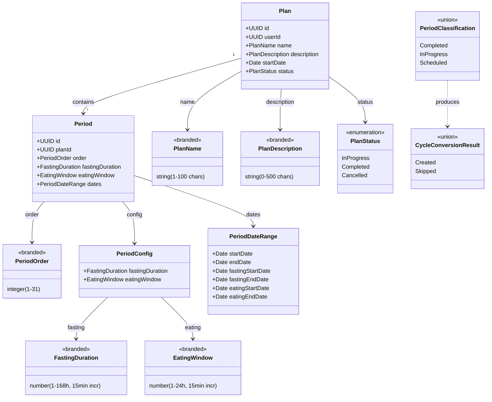

# Functional Domain Design: Plan

> **Source**: Plans Feature Domain Specification (`docs/plans-feature-spec.md`) | **Generated**: 2026-02-06 | **Status**: Pending Review

## 1. Executive Summary

The Plan domain models a structured, multi-period fasting schedule system. A Plan is a top-level entity containing 1-31 contiguous Periods, each consisting of a fasting phase followed by an eating window. The domain enforces strict lifecycle rules (InProgress → Completed/Cancelled), mutual exclusivity with standalone cycles, period contiguity invariants, and overlap prevention with existing cycles. When plans complete or are cancelled, fasting records are preserved as Cycles through an atomic period-to-cycle conversion process.

## 2. Design Principles

This design adheres to the following functional domain modeling principles:

### 2.1 Closed World Assumption

All possible states are explicitly modeled. The compiler enforces completeness.

| Principle               | Implementation                                                  |
| ----------------------- | --------------------------------------------------------------- |
| Exhaustive matching     | All pattern matches use `Match.exhaustive` - no `default` cases |
| No stringly-typed enums | All enums use `S.Literal` union, never `S.String`               |
| Compile-time safety     | Adding a variant causes compile errors at all switch sites      |
| No hidden states        | No `else` branches that hide bugs                               |

### 2.2 Functional Core / Imperative Shell

Separation of pure business logic from I/O operations.

| Layer                | Responsibility                         | Characteristics                                 |
| -------------------- | -------------------------------------- | ----------------------------------------------- |
| **Functional Core**  | Business logic, validations, decisions | Pure functions, no I/O, deterministic, testable |
| **Imperative Shell** | Database, HTTP, clock, external APIs   | Effect-based, dependency injection              |

**Core functions in this design**:

- `calculatePeriodDates` — compute all period timestamps from a start date and durations
- `validatePeriodContiguity` — ensure periods form a continuous timeline
- `validatePeriodPhaseInvariants` — enforce phase ordering within each period
- `classifyPeriodsForCancellation` — categorize periods as Completed/InProgress/Scheduled given a point in time
- `buildCycleFromPeriod` — create cycle data from a period's fasting phase, applying `min(fastingEndDate, now)` rule for in-progress periods
- `validatePeriodCount` — enforce 1-31 period range
- `validate15MinuteIncrement` — ensure duration is expressible in 15-minute steps
- `assertPlanIsInProgress` — guard that plan status is `InProgress` before any mutation (pure precondition check)

**Shell operations in this design**:

- `createPlan` — persist plan + periods in a transaction
- `cancelPlan` — atomically cancel plan + create cycles
- `completePlan` — atomically complete plan + create cycles
- `updatePlanPeriods` — atomically update periods with date recalculation
- `updatePlanMetadata` — update plan metadata + recalculate if startDate changes
- `checkCycleOverlap` — query existing cycles for overlap detection. **Uses the period's full date range (`period.startDate` → `period.endDate`)**, not just the fasting phase, as per spec §8.3
- `checkActivePlanOrCycle` — query for mutual exclusivity enforcement

### 2.3 Validation Layers

> "Validate at the boundary, trust inside"

The architecture defines **4 mandatory validation layers**:

| Layer                       | Location            | Responsibility                  | Validates                             |
| --------------------------- | ------------------- | ------------------------------- | ------------------------------------- |
| **1. Input Schema**         | Request Schema      | Parse & transform incoming JSON | INPUT (string → Date, number ranges, 15-min increments) |
| **2. Domain Validation**    | Functional Core     | Pure business rules             | LOGIC (contiguity, phase ordering, period count) |
| **3. Service Coordination** | Application Service | Orchestrate validation + repo   | FLOW (mutual exclusivity, overlap with cycles) |
| **4. Repository Output**    | Repository          | Validate DB returns             | OUTPUT (trust input, validate output) |

**Checklist**:

- [x] Request schema transforms and validates input before handler (requests.ts exists)
- [ ] Domain validation service contains pure business rules (testable) — **TO CREATE**
- [x] Application service coordinates validation + repository (plan.service.ts exists)
- [x] Repository validates output from DB, trusts input (schemas.ts exists)

### 2.4 Data Seams

Architectural boundaries where data transforms between layers.

| Seam             | From                  | To                    | Transformation          |
| ---------------- | --------------------- | --------------------- | ----------------------- |
| API → Domain     | CreatePlanRequest     | PlanData + PeriodConfig[] | Date parsing, period date calculation |
| Domain → Repo    | PlanData + PeriodData | SQL insert values     | Direct mapping (trusted) |
| Repo → Domain    | DB row (numeric strings) | PlanRecord / PeriodRecord | NumericFromString, DateFromSelf |
| Domain → API     | PlanRecord + PeriodRecord[] | PlanWithPeriodsResponse | Date serialization (Date → ISO string) |
| Period → Cycle   | PeriodRecord + cancellation time | CycleData | Phase extraction (fasting only). `endDate = min(fastingEndDate, now)` for in-progress periods (BR-03) |

## 3. Type Justification

Each type must declare its category and justification using the Decision Flowchart:

```
Is it a single primitive with constraints?
→ YES: Brand.refined (dm-create-branded-type)

Is it multiple fields that always go together?
→ YES: S.Class Value Object (dm-create-value-object)

Are all variants the same shape?
→ YES: S.Literal Enum (dm-create-literal-enum)

Do variants have different data?
→ YES: Data.TaggedEnum (dm-create-tagged-enum)

Does it need identity and lifecycle?
→ YES: S.Class Entity (dm-create-entity)
```

| Type | Category | Skill | Justification |
|------|----------|-------|---------------|
| `PlanStatus` | Literal Enum | `dm-create-literal-enum` | Finite set of labels (InProgress, Completed, Cancelled), all same structure |
| `PeriodPhase` | Value Object | `dm-create-value-object` | Multiple date fields (start, end) that always go together with cross-field validation |
| `PeriodConfig` | Value Object | `dm-create-value-object` | Fasting duration + eating window pair with 15-minute increment constraint |
| `PeriodDateRange` | Value Object | `dm-create-value-object` | Computed period dates (start, end, fasting phase, eating phase) with phase ordering invariants |
| `PeriodClassification` | Tagged Enum | `dm-create-tagged-enum` | Variants have different data: Completed(period), InProgress(period, now), Scheduled(period) |
| `CycleConversionResult` | Tagged Enum | `dm-create-tagged-enum` | Variants: Created(cycleData), Skipped(reason) — different data per variant |
| `PlanName` | Branded Type | `dm-create-branded-type` | Single string with length constraint (1-100 chars) |
| `PlanDescription` | Branded Type | `dm-create-branded-type` | Single string with length constraint (0-500 chars) |
| `FastingDuration` | Branded Type | `dm-create-branded-type` | Single number with range (1-168) and 15-min increment constraint |
| `EatingWindow` | Branded Type | `dm-create-branded-type` | Single number with range (1-24) and 15-min increment constraint |
| `PeriodOrder` | Branded Type | `dm-create-branded-type` | Single integer with range constraint (1-31) |
| `PeriodCount` | Branded Type | `dm-create-branded-type` | Single integer with range constraint (1-31) |

**Smart Constructors Required**:

Types with validation MUST have smart constructors (`dm-create-smart-constructors`):

| Type | Validation | Smart Constructor |
|------|------------|-------------------|
| `PlanName` | Length 1-100 | `create` (Effect) / `make` (Option) |
| `PlanDescription` | Length 0-500 | `create` (Effect) / `make` (Option) |
| `FastingDuration` | Range 1-168, 15-min increments | `create` (Effect) / `make` (Option) |
| `EatingWindow` | Range 1-24, 15-min increments | `create` (Effect) / `make` (Option) |
| `PeriodOrder` | Integer 1-31 | `create` (Effect) / `make` (Option) |
| `PeriodCount` | Integer 1-31 | `create` (Effect) / `make` (Option) |
| `PeriodConfig` | Cross-field: both durations valid | `create` (Effect) |
| `PeriodDateRange` | Cross-field: phase ordering | `create` (Effect) |

## 4. Domain Components

### 4.1 Entities

| Entity | ID Type | Fields | Notes |
|--------|---------|--------|-------|
| `Plan` | UUID | userId, name, description?, startDate, status, createdAt, updatedAt | Top-level aggregate. Already modeled as DB record + response schemas. Domain model captures pure invariants. |
| `Period` | UUID | planId, order, fastingDuration, eatingWindow, startDate, endDate, fastingStartDate, fastingEndDate, eatingStartDate, eatingEndDate, createdAt, updatedAt | Child of Plan. Dates computed from plan startDate + period configs. |

> **Note**: Plan and Period entities are already well-modeled via `PlanRecordSchema` and `PeriodRecordSchema`. The domain model will focus on **pure types** (value objects, enums, branded types) and **pure functions** (core logic) rather than duplicating the existing entity schemas.

### 4.2 Value Objects

| Value Object | Fields | Validation | Smart Constructor |
|--------------|--------|------------|-------------------|
| `PeriodConfig` | fastingDuration: FastingDuration, eatingWindow: EatingWindow | Both durations valid, total > 0 | Yes |
| `PeriodDateRange` | startDate, endDate, fastingStartDate, fastingEndDate, eatingStartDate, eatingEndDate | Phase ordering invariants (6 rules from spec §2.3) | Yes |

### 4.3 Enumerations

#### Literal Enums (same structure for all variants)

| Enum | Values | Metadata Shape | Notes |
|------|--------|----------------|-------|
| `PlanStatus` | `InProgress`, `Completed`, `Cancelled` | none | **Already exists** in `@ketone/shared`. Reuse, do not duplicate. |

#### Tagged Enums (different data per variant)

| Enum | Variants | Notes |
|------|----------|-------|
| `PeriodClassification` | Completed, InProgress, Scheduled | Classifies period state relative to current time for cancellation logic |
| `CycleConversionResult` | Created, Skipped | Result of period-to-cycle conversion attempt |

<details>
<summary>Tagged Enum Details</summary>

**PeriodClassification**:
- `Completed`: period: PeriodDateRange — all phases elapsed (`now >= period.endDate`)
- `InProgress`: period: PeriodDateRange, now: Date — currently executing (`now >= period.startDate && now < period.endDate`)
- `Scheduled`: period: PeriodDateRange — not yet started (`now < period.startDate`)

**Cycle conversion rules by classification** (spec §4.4):

| Classification | Cycle created? | `cycle.startDate` | `cycle.endDate` | Rationale |
|----------------|---------------|-------------------|-----------------|-----------|
| **Completed** | Yes | `period.fastingStartDate` | `period.fastingEndDate` | Full fasting phase recorded |
| **InProgress** | Yes | `period.fastingStartDate` | `min(period.fastingEndDate, now)` | If user is in eating window (`now >= fastingEndDate`), the full fasting is recorded. If still fasting (`now < fastingEndDate`), fasting is truncated at `now`. |
| **Scheduled** | No | — | — | Period not started; discarded |

**CycleConversionResult**:
- `Created`: startDate: Date, endDate: Date — fasting phase preserved as cycle. **`endDate` is always `min(period.fastingEndDate, now)` for InProgress periods, or `period.fastingEndDate` for Completed periods.**
- `Skipped`: reason: string — period was scheduled/not applicable

</details>

### 4.4 Domain Errors

| Error | Fields | Trigger |
|-------|--------|---------|
| `PlanAlreadyActiveError` | message, userId | User tries to create a plan when one is already InProgress |
| `ActiveCycleExistsError` | message, userId | User tries to create a plan while having an active standalone cycle |
| `PlanNotFoundError` | message, userId, planId | Plan doesn't exist or doesn't belong to user |
| `NoActivePlanError` | message, userId | User queries for active plan but none exists |
| `PlanInvalidStateError` | message, currentState, expectedState | Operation requires different plan state |
| `InvalidPeriodCountError` | message, periodCount, minPeriods, maxPeriods | Period count outside 1-31 range |
| `PeriodOverlapWithCycleError` | message, userId, overlappingCycleId, cycleStartDate, cycleEndDate | Plan periods overlap with existing cycle |
| `PeriodNotInPlanError` | message, planId, periodId | Period ID doesn't belong to target plan |
| `PeriodsNotCompletedError` | message, planId, completedCount, totalCount | Plan completion attempted before all periods elapsed |
| `PlanRepositoryError` | message | Internal database error (cause logged server-side) |

#### Cross-Feature Error (Cycle Domain, spec §7.2)

| Error | Fields | Trigger | Owner |
|-------|--------|---------|-------|
| `ActivePlanExistsError` | message, userId | User tries to start a standalone cycle while an active plan exists | **Cycle domain** (`api/src/features/cycle/domain/errors.ts`) |

> This error is defined in the Cycle domain, not the Plan domain. It enforces the bidirectional mutual exclusivity: Plan domain checks for active cycles (`ActiveCycleExistsError`), Cycle domain checks for active plans (`ActivePlanExistsError`). Both sides must be aware of this contract.

> **Note**: Domain errors already exist in `domain/errors.ts`. The code has `PeriodNotFoundError` which should be **renamed to `PeriodNotInPlanError`** to match the spec (spec §7.1). The error semantics are identical — a provided period ID doesn't belong to the target plan — so this is a naming consolidation, not a functional change.

### 4.5 Services

| Service | Layer | Methods | Dependencies | Notes |
|---------|-------|---------|--------------|-------|
| `PlanValidationService` | **Core** (pure) | validatePeriodCount, validate15MinIncrement, validatePeriodContiguity, validatePhaseInvariants, **assertPlanIsInProgress** | None (pure functions) | **TO CREATE** — extract pure validation logic |
| `PeriodCalculationService` | **Core** (pure) | calculatePeriodDates, recalculatePeriodDates | None (pure functions) | **TO CREATE** — extract date calculation logic |
| `PeriodClassificationService` | **Core** (pure) | classifyPeriods, buildCycleFromClassification | None (pure functions) | **TO CREATE** — period-to-cycle conversion logic |
| `PlanService` | **Shell** (coordinator) | createPlan, getActivePlan, getPlan, getAllPlans, cancelPlan, completePlan, updatePeriods, updateMetadata | PlanRepository, Core services | **EXISTS** — orchestrates I/O + core logic |
| `PlanRepository` | **Shell** (persistence) | 12+ methods | Database (Drizzle) | **EXISTS** — handles all DB operations |

### 4.6 Explicit Business Rules (Functional Core)

These rules MUST be declared as pure functions in the core, not buried in handlers/services/repositories.

#### BR-01: InProgress Guard (spec §4.2, §4.3, §4.4, §4.5)

> **All mutating operations require `plan.status === 'InProgress'`.**

| Operation | Requires InProgress | Error on violation |
|-----------|--------------------|--------------------|
| Update metadata (name, description, startDate) | Yes | `PlanInvalidStateError` |
| Update periods (add, remove, update durations) | Yes | `PlanInvalidStateError` |
| Cancel plan | Yes | `PlanInvalidStateError` |
| Complete plan | Yes | `PlanInvalidStateError` |

**Implementation**: `assertPlanIsInProgress(plan: { status: PlanStatus }): Effect<void, PlanInvalidStateError>` — pure precondition check. Called by the coordinator service before delegating to repository.

#### BR-02: Overlap Check Uses Full Period Range (spec §8.3)

> **The overlap check uses `period.startDate` → `period.endDate` (fasting + eating), NOT just the fasting phase.**

```
Period:  [=== Fasting ===|=== Eating ===]
         ^                              ^
    period.startDate              period.endDate
         ╰────── overlap range ─────────╯
```

This is validated during:
1. Plan creation — all calculated period dates checked against existing cycles
2. Period updates — recalculated dates checked after any modification
3. Start date changes — shifted period dates re-validated

#### BR-03: Cancellation Cycle Conversion (spec §4.4)

> **`cycle.endDate = min(period.fastingEndDate, now)` for in-progress periods.**

```
Case A: Still fasting (now < fastingEndDate)
  Period:  [=== Fasting ===|=== Eating ===]
                    ^ now
  Cycle:   [======]
           start   now (truncated)

Case B: In eating window (now >= fastingEndDate)
  Period:  [=== Fasting ===|=== Eating ===]
                                ^ now
  Cycle:   [===============]
           start          fastingEndDate (full fasting recorded)
```

### 4.7 Additional Components

#### Semantic Wrappers

Not applicable — the plan domain doesn't have a pipeline with stage transformations.

#### Boundary Mappers

| Mapper | External | Domain | Validation |
|--------|----------|--------|------------|
| `PeriodRecordMapper` | DB row (numeric strings for durations) | PeriodRecord (typed numbers) | `NumericFromString` transform at boundary |
| `PlanResponseMapper` | PlanRecord + PeriodRecord[] | PlanWithPeriodsResponse | Date → ISO string serialization |

> **Note**: These mappers already exist via Effect Schema transforms in `repositories/schemas.ts` and `shared/schemas/plan/responses.ts`.

#### Reified Decisions

| Decision | Variants | Context | Notes |
|----------|----------|---------|-------|
| `PeriodClassification` | Completed, InProgress, Scheduled | Used during cancellation to decide cycle creation | Pure function of (period, now) |
| `CycleConversionResult` | Created, Skipped | Result of period→cycle conversion | Follows from PeriodClassification |

#### Data Seams / Pipeline Stages

| Pipeline | Stages | Notes |
|----------|--------|-------|
| Plan Creation | ValidateInput → CalculateDates → CheckOverlap(full range) → Persist | Input validation is pure, overlap uses `period.startDate→endDate` (BR-02) |
| Plan Cancellation | AssertInProgress(BR-01) → LoadPlan → ClassifyPeriods → ConvertToCycles(BR-03: `min(fastingEndDate, now)`) → PersistAtomically | Classification is pure, persistence is transactional |
| Plan Completion | AssertInProgress(BR-01) → LoadPlan → ValidateAllComplete → ConvertToCycles → PersistAtomically | Validation + conversion are pure |
| Period Update | AssertInProgress(BR-01) → ValidateInput → RecalculateDates → CheckOverlap(full range, BR-02) → PersistAtomically | Date recalculation is pure |

## 5. Type Diagram



## 6. Architecture Phases

This design follows the **Functional Core / Imperative Shell** architecture. Implementation proceeds in phases, each building on the previous.

### Phase 1: Functional Core (Pure Logic)

> Domain types, pure services, ADTs, reified decisions

| Step | Component | Skill | File | Notes |
| ---- | --------- | ----- | ---- | ----- |
| 1.1 | `PlanStatus` | — | `@ketone/shared` | **Already exists**. Reuse. |
| 1.2 | `FastingDuration` | `dm-create-branded-type` | `domain/plan.model.ts` | Number 1-168, 15-min increments |
| 1.3 | `EatingWindow` | `dm-create-branded-type` | `domain/plan.model.ts` | Number 1-24, 15-min increments |
| 1.4 | `PeriodOrder` | `dm-create-branded-type` | `domain/plan.model.ts` | Integer 1-31 |
| 1.5 | `PeriodCount` | `dm-create-branded-type` | `domain/plan.model.ts` | Integer 1-31 (for total period validation) |
| 1.6 | `PlanName` | `dm-create-branded-type` | `domain/plan.model.ts` | String 1-100 chars |
| 1.7 | `PlanDescription` | `dm-create-branded-type` | `domain/plan.model.ts` | String 0-500 chars |
| 1.8 | `PeriodConfig` | `dm-create-value-object` | `domain/plan.model.ts` | FastingDuration + EatingWindow pair |
| 1.9 | `PeriodDateRange` | `dm-create-value-object` | `domain/plan.model.ts` | 6 date fields with phase ordering invariants |
| 1.10 | `PeriodClassification` | `dm-create-tagged-enum` | `domain/plan.model.ts` | Completed / InProgress / Scheduled |
| 1.11 | `CycleConversionResult` | `dm-create-tagged-enum` | `domain/plan.model.ts` | Created / Skipped |
| 1.12 | Domain Errors | — | `domain/errors.ts` | **Already exist**. Review for completeness. |
| 1.13 | `PlanValidationCore` | `dm-create-domain-service` | `domain/plan-validation.core.ts` | Pure validation functions (includes `assertPlanIsInProgress` — BR-01) |
| 1.14 | `PeriodCalculationCore` | `dm-create-domain-service` | `domain/period-calculation.core.ts` | Pure date calculation functions |
| 1.15 | `PeriodClassificationCore` | `dm-create-domain-service` | `domain/period-classification.core.ts` | Pure period→cycle conversion logic |

**Shared Types** (pass the Orphan Test — would still make sense if this module is deleted):

| Type | Location | Skill | Reason |
| ---- | -------- | ----- | ------ |
| `PlanStatus` | `@ketone/shared` | `dm-create-literal-enum` | Already shared between API and web |

**Command**: `"implement phase 1"`

### Phase 2: Shell APIs (HTTP Layer)

> Request/Response schemas, handlers, validation, boundary mappers

| Step | Component | Type | File | Notes |
| ---- | --------- | ---- | ---- | ----- |
| 2.1 | `CreatePlanRequestSchema` | Request Schema | `api/schemas/requests.ts` | **Already exists**. Review alignment with branded types. |
| 2.2 | `UpdatePeriodsRequestSchema` | Request Schema | `api/schemas/requests.ts` | **Already exists**. Review alignment. |
| 2.3 | `UpdatePlanMetadataRequestSchema` | Request Schema | `api/schemas/requests.ts` | **Already exists**. Review alignment. |
| 2.4 | Response Schemas | Response Schema | `@ketone/shared` | **Already exist**. PlanResponseSchema, PeriodResponseSchema, etc. |
| 2.5 | Error Schemas | Error Schema | `api/schemas/errors.ts` | **Already exist**. 10 error schemas. |
| 2.6 | `PlanApiGroup` | API Definition | `api/plan-api.ts` | **Already exists**. 8 endpoints. |
| 2.7 | `PlanApiLive` | Handler | `api/plan-api-handler.ts` | **Already exists**. Error mapping with `catchTags`. |

**Handler Error Mapping** (mandatory):

```typescript
// Domain errors (Data.TaggedError) → HTTP errors (S.TaggedError)
.pipe(Effect.catchTags({
  PlanAlreadyActiveError: (e) => Effect.fail(new PlanAlreadyActiveErrorSchema({ message: e.message, userId: e.userId })),
  ActiveCycleExistsError: (e) => Effect.fail(new ActiveCycleExistsErrorSchema({ message: e.message, userId: e.userId })),
  PlanNotFoundError: (e) => Effect.fail(new PlanNotFoundErrorSchema({ message: e.message })),
  // ... etc
}))
```

> **Status**: Phase 2 is **already implemented**. No new files needed. May need minor updates to align request schemas with new branded types from Phase 1.

**Command**: `"implement phase 2"`

### Phase 3: Persistence Layer (Repository)

> Database access, output validation, record schemas

| Step | Component | Type | File | Notes |
| ---- | --------- | ---- | ---- | ----- |
| 3.1 | `PlanRecordSchema` | Record Schema | `repositories/schemas.ts` | **Already exists**. Validates DB output. |
| 3.2 | `PeriodRecordSchema` | Record Schema | `repositories/schemas.ts` | **Already exists**. With NumericFromString + phase invariants. |
| 3.3 | `PlanRepository` | Repository | `repositories/plan.repository.postgres.ts` | **Already exists** (1346 lines). 12+ methods. |

> **Status**: Phase 3 is **already implemented**. No new files needed. Consider refactoring repository to use Core pure functions from Phase 1 (e.g., date calculation, period classification).

**Command**: `"implement phase 3"`

### Phase 4: Coordinator Layer (Orchestration)

> Application services, workflows, effect composition

| Step | Component | Type | File | Notes |
| ---- | --------- | ---- | ---- | ----- |
| 4.1 | `PlanService` | Application Service | `services/plan.service.ts` | **Already exists**. 7 methods. |

> **Status**: Phase 4 is **already implemented**. Consider refactoring to delegate pure logic to Core services from Phase 1.

**Command**: `"implement phase 4"`

### Implementation Order

```
Phase 1 (Core)     ──────────────────────────────────► NEW
                   Types, Errors, Pure Services

Phase 2 (API)      ──────────────────────────────────► EXISTS (review)
                   Schemas, Handlers

Phase 3 (Repo)     ──────────────────────────────────► EXISTS (review)
                   Repository

Phase 4 (Coord)    ──────────────────────────────────► EXISTS (refactor to use Core)
                   App Service
```

### Files to Create

```
plan/
├── domain/
│   ├── plan.model.ts                    # NEW: Branded types, Value Objects, Tagged Enums
│   ├── errors.ts                        # EXISTS: Domain Errors (review completeness)
│   ├── plan-validation.core.ts          # NEW: Pure validation functions
│   ├── period-calculation.core.ts       # NEW: Pure date calculation functions
│   ├── period-classification.core.ts    # NEW: Pure period→cycle conversion logic
│   └── index.ts                         # UPDATE: Export new modules
├── api/
│   ├── plan-api.ts                      # EXISTS
│   ├── plan-api-handler.ts              # EXISTS
│   └── schemas/
│       ├── requests.ts                  # EXISTS (review alignment)
│       ├── responses.ts                 # EXISTS (re-exports from shared)
│       └── errors.ts                    # EXISTS
├── repositories/
│   ├── schemas.ts                       # EXISTS
│   └── plan.repository.postgres.ts      # EXISTS (consider using Core)
└── services/
    └── plan.service.ts                  # EXISTS (refactor to use Core)
```

## 7. Closed World Checklist

Before implementation, verify:

- [x] All enums use `S.Literal` union (not `S.String`) — `PlanStatus` uses `S.Literal('InProgress', 'Completed', 'Cancelled')`
- [ ] All pattern matches use `Match.exhaustive` — **TO VERIFY** in service/handler code
- [ ] No `default` or `else` cases that hide bugs — **TO VERIFY**
- [ ] Adding a variant causes compile errors at all switch sites — enforced by `Match.exhaustive`
- [x] No optional fields that depend on other fields — Period phases are always present (not optional)
- [x] No boolean discriminators with optional fields — `PeriodClassification` uses Tagged Enum instead

## 8. FC/IS Implementation Checklist

When implementing each phase, verify:

- [x] **Request Schema** validates and transforms input (strings → typed values) — `requests.ts` exists
- [ ] **Domain Validation Service** contains pure business rules (no I/O) — **TO CREATE** (`plan-validation.core.ts`)
- [x] **Application Service** coordinates validation and repository, returns typed errors — `plan.service.ts` exists
- [x] **Repository** validates output from database, trusts input — `schemas.ts` with `PeriodRecordSchema` validation
- [x] **Handler** maps domain errors to HTTP errors with `catchTags` — `plan-api-handler.ts`
- [x] **Handler** serializes responses (Date → string, etc.) — via shared response schemas
- [x] **Response Schema** defines the response shape — in `@ketone/shared`

## 9. Warning Signs Detected

Patterns found in the existing implementation that should be addressed:

- [ ] **Mixed I/O and logic in repository**: Period date calculation (`calculatePeriodDates`) is currently inside the repository (1346 lines). Should be extracted to `period-calculation.core.ts` as a pure function for testability.
- [ ] **Period classification logic embedded in repository**: The cancellation logic that classifies periods as Completed/InProgress/Scheduled is inside the repository's transaction. The classification itself is pure and should be extracted to `period-classification.core.ts`. **Must include explicit `min(fastingEndDate, now)` rule (BR-03).**
- [ ] **Validation duplication**: 15-minute increment validation appears in both `requests.ts` and `repositories/schemas.ts`. Should be defined once in branded types and reused.
- [x] **`PeriodNotFoundError` → `PeriodNotInPlanError`**: Resolved. Rename to match spec §7.1. See Resolved Decisions in Section 10.
- [ ] **String-typed `currentState`/`expectedState`**: `PlanInvalidStateError` uses `string` for state fields. Should use `PlanStatus` type for compile-time safety.
- [ ] **InProgress guard not reified in core**: The `status === 'InProgress'` check for mutations is currently scattered across handler/service/repository. Should be a single pure function `assertPlanIsInProgress` in the validation core (BR-01).
- [ ] **Overlap range not documented in code**: The overlap check uses `period.startDate → period.endDate` (full range including eating), but this isn't explicitly documented in the repository code. Should be enforced via the core function with a clear comment referencing BR-02.

## 10. Open Questions

Decisions that require human input before implementation:

1. **Branded types scope**: Should branded types be used pervasively (updating request schemas, repository schemas, and service signatures) or only in the new domain core model? Pervasive adoption increases type safety but requires updating existing code.

2. **Core service granularity**: Three separate core files (`plan-validation.core.ts`, `period-calculation.core.ts`, `period-classification.core.ts`) or a single `plan.core.ts`? Three files follow single-responsibility; one file is simpler.

3. **Repository refactoring**: Should the existing repository be refactored to use Core pure functions (extract 200+ lines of pure logic), or should Core functions be added alongside for new code only?

### Resolved Decisions

| Decision | Resolution | Rationale |
|----------|-----------|-----------|
| `PeriodNotFoundError` vs `PeriodNotInPlanError` | **Rename to `PeriodNotInPlanError`** | Spec §7.1 defines `PeriodNotInPlanError`. The existing `PeriodNotFoundError` has identical semantics (period ID doesn't belong to plan). Consolidate to match spec naming. |
| `ActivePlanExistsError` cross-feature error | **Document, do not duplicate** | Error lives in Cycle domain (`cycle/domain/errors.ts`). Plan domain references it in mutual exclusivity documentation but does not own it. |

## 11. Next Steps

1. **Review** this document for correctness and completeness
2. **Verify** Type Justification table (Section 3) — each type has correct category
3. **Verify** Closed World Checklist (Section 7) — all items will be satisfied
4. **Verify** FC/IS Implementation Checklist (Section 8) — all layers covered
5. **Resolve** open questions (Section 10)
6. **Implement by phase**:
   - `"implement phase 1"` → Functional Core (branded types, value objects, tagged enums, pure services)
   - `"implement phase 2"` → Shell APIs (already exists — review alignment)
   - `"implement phase 3"` → Persistence Layer (already exists — review alignment)
   - `"implement phase 4"` → Coordinator Layer (refactor to use Core)
   - Or `"implement all"` / `"implement the plan"` → All phases in order

**Phase 1 is the primary new work.** Phases 2-4 already exist and may need minor updates to align with the new domain model types.

---

<details>
<summary>Analysis YAML (reference)</summary>

```yaml
module: Plan
source: docs/plans-feature-spec.md

entities:
  - name: Plan
    id_type: UUID
    fields:
      - { name: userId, type: UUID }
      - { name: name, type: PlanName }
      - { name: description, type: "PlanDescription | null" }
      - { name: startDate, type: Date }
      - { name: status, type: PlanStatus }
      - { name: createdAt, type: Date }
      - { name: updatedAt, type: Date }
    notes: Top-level aggregate. Already modeled in DB + response schemas.

  - name: Period
    id_type: UUID
    fields:
      - { name: planId, type: UUID }
      - { name: order, type: PeriodOrder }
      - { name: fastingDuration, type: FastingDuration }
      - { name: eatingWindow, type: EatingWindow }
      - { name: startDate, type: Date }
      - { name: endDate, type: Date }
      - { name: fastingStartDate, type: Date }
      - { name: fastingEndDate, type: Date }
      - { name: eatingStartDate, type: Date }
      - { name: eatingEndDate, type: Date }
      - { name: createdAt, type: Date }
      - { name: updatedAt, type: Date }
    notes: Child of Plan. Dates computed from plan startDate + period configs.

value_objects:
  - name: PeriodConfig
    fields: [fastingDuration: FastingDuration, eatingWindow: EatingWindow]
    validation: Both durations valid
  - name: PeriodDateRange
    fields: [startDate, endDate, fastingStartDate, fastingEndDate, eatingStartDate, eatingEndDate]
    validation: Phase ordering invariants (6 rules)

literal_enums:
  - name: PlanStatus
    values: [InProgress, Completed, Cancelled]
    location: "@ketone/shared"
    notes: Already exists

tagged_enums:
  - name: PeriodClassification
    variants:
      - { name: Completed, fields: { period: PeriodDateRange } }
      - { name: InProgress, fields: { period: PeriodDateRange, now: Date } }
      - { name: Scheduled, fields: { period: PeriodDateRange } }
  - name: CycleConversionResult
    variants:
      - { name: Created, fields: { startDate: Date, endDate: Date } }
      - { name: Skipped, fields: { reason: string } }

branded_types:
  - { name: PlanName, base: string, constraint: "length 1-100" }
  - { name: PlanDescription, base: string, constraint: "length 0-500" }
  - { name: FastingDuration, base: number, constraint: "1-168, 15-min increments" }
  - { name: EatingWindow, base: number, constraint: "1-24, 15-min increments" }
  - { name: PeriodOrder, base: number, constraint: "integer 1-31" }
  - { name: PeriodCount, base: number, constraint: "integer 1-31" }

domain_errors:
  - { name: PlanAlreadyActiveError, fields: [message, userId], trigger: "Duplicate active plan" }
  - { name: ActiveCycleExistsError, fields: [message, userId], trigger: "Active cycle blocks plan creation" }
  - { name: PlanNotFoundError, fields: [message, userId, planId], trigger: "Plan not found" }
  - { name: NoActivePlanError, fields: [message, userId], trigger: "No active plan" }
  - { name: PlanInvalidStateError, fields: [message, currentState, expectedState], trigger: "Wrong plan state" }
  - { name: InvalidPeriodCountError, fields: [message, periodCount, minPeriods, maxPeriods], trigger: "Period count out of range" }
  - { name: PeriodOverlapWithCycleError, fields: [message, userId, overlappingCycleId, cycleStartDate, cycleEndDate], trigger: "Periods overlap cycles" }
  - { name: PeriodNotInPlanError, fields: [message, planId, periodId], trigger: "Period doesn't belong to plan" }
  - { name: PeriodsNotCompletedError, fields: [message, planId, completedCount, totalCount], trigger: "Plan completed early" }
  - { name: PlanRepositoryError, fields: [message], trigger: "Database error" }

services:
  - name: PlanValidationCore
    layer: Core
    methods: [validatePeriodCount, validate15MinIncrement, validatePeriodContiguity, validatePhaseInvariants, assertPlanIsInProgress]
    dependencies: []
  - name: PeriodCalculationCore
    layer: Core
    methods: [calculatePeriodDates, recalculatePeriodDates]
    dependencies: []
  - name: PeriodClassificationCore
    layer: Core
    methods: [classifyPeriods, buildCycleFromClassification]
    dependencies: []
  - name: PlanService
    layer: Shell
    methods: [createPlan, getActivePlan, getPlan, getAllPlans, cancelPlan, completePlan, updatePeriods, updateMetadata]
    dependencies: [PlanRepository, Core services]

boundary_mappers:
  - name: PeriodRecordMapper
    external: "DB row (numeric strings)"
    domain: "PeriodRecord (typed numbers)"
    notes: "NumericFromString transform"
  - name: PlanResponseMapper
    external: "PlanRecord + PeriodRecord[]"
    domain: "PlanWithPeriodsResponse"
    notes: "Date → ISO string serialization"

data_seams:
  - { from: "API request", to: "Domain types", transformation: "Date parsing, branded validation" }
  - { from: "Domain types", to: "DB insert", transformation: "Direct mapping (trusted)" }
  - { from: "DB row", to: "Domain record", transformation: "NumericFromString, DateFromSelf" }
  - { from: "Domain record", to: "API response", transformation: "Date → ISO string" }
  - { from: "Period", to: "Cycle", transformation: "Extract fasting phase dates" }

warning_signs:
  - "Mixed I/O and logic in repository (period date calculation)"
  - "Period classification logic embedded in repository transaction"
  - "Validation duplication (15-min increment in requests + repo schemas)"
  - "PeriodNotFoundError vs PeriodNotInPlanError naming mismatch"
  - "String-typed currentState/expectedState in PlanInvalidStateError"
```

</details>

<details>
<summary>Plan YAML (reference)</summary>

```yaml
module: Plan
target_directory: api/src/features/plan/domain

shared_types:
  - name: PlanStatus
    location: "@ketone/shared"
    skill: dm-create-literal-enum
    reason: "Already exists and is shared between API and web"

steps:
  # Phase 1: Functional Core
  - step: 1.1
    skill: dm-create-branded-type
    file: domain/plan.model.ts
    args:
      name: FastingDuration
      base: number
      constraint: "1-168, Number.isInteger(value * 4)"
    reason: "Duration with range and 15-minute increment constraint"

  - step: 1.2
    skill: dm-create-branded-type
    file: domain/plan.model.ts
    args:
      name: EatingWindow
      base: number
      constraint: "1-24, Number.isInteger(value * 4)"
    reason: "Duration with range and 15-minute increment constraint"

  - step: 1.3
    skill: dm-create-branded-type
    file: domain/plan.model.ts
    args:
      name: PeriodOrder
      base: number
      constraint: "integer 1-31"
    reason: "Position constraint within plan"

  - step: 1.4
    skill: dm-create-branded-type
    file: domain/plan.model.ts
    args:
      name: PeriodCount
      base: number
      constraint: "integer 1-31"
    reason: "Total period count constraint"

  - step: 1.5
    skill: dm-create-branded-type
    file: domain/plan.model.ts
    args:
      name: PlanName
      base: string
      constraint: "length 1-100"
    reason: "Name length constraint"

  - step: 1.6
    skill: dm-create-branded-type
    file: domain/plan.model.ts
    args:
      name: PlanDescription
      base: string
      constraint: "length 0-500"
    reason: "Description length constraint"

  - step: 1.7
    skill: dm-create-value-object
    file: domain/plan.model.ts
    args:
      name: PeriodConfig
      fields: { fastingDuration: FastingDuration, eatingWindow: EatingWindow }
    reason: "Fasting+eating pair always travel together"

  - step: 1.8
    skill: dm-create-value-object
    file: domain/plan.model.ts
    args:
      name: PeriodDateRange
      fields: { startDate: Date, endDate: Date, fastingStartDate: Date, fastingEndDate: Date, eatingStartDate: Date, eatingEndDate: Date }
      validation: "Phase ordering invariants"
    reason: "6 dates with cross-field ordering invariants"

  - step: 1.9
    skill: dm-create-tagged-enum
    file: domain/plan.model.ts
    args:
      name: PeriodClassification
      variants:
        - Completed: { period: PeriodDateRange }
        - InProgress: { period: PeriodDateRange, now: Date }
        - Scheduled: { period: PeriodDateRange }
    reason: "Different data per period state during cancellation"

  - step: 1.10
    skill: dm-create-tagged-enum
    file: domain/plan.model.ts
    args:
      name: CycleConversionResult
      variants:
        - Created: { startDate: Date, endDate: Date }
        - Skipped: { reason: string }
    reason: "Period-to-cycle conversion outcome"

  - step: 1.11
    skill: dm-create-domain-service
    file: domain/plan-validation.core.ts
    args:
      name: PlanValidationCore
      methods: [validatePeriodCount, validate15MinIncrement, validatePeriodContiguity, validatePhaseInvariants, assertPlanIsInProgress]
    reason: "Pure validation functions, no I/O. Includes BR-01 InProgress guard."

  - step: 1.12
    skill: dm-create-domain-service
    file: domain/period-calculation.core.ts
    args:
      name: PeriodCalculationCore
      methods: [calculatePeriodDates, recalculatePeriodDates]
    reason: "Pure date calculation, no I/O"

  - step: 1.13
    skill: dm-create-domain-service
    file: domain/period-classification.core.ts
    args:
      name: PeriodClassificationCore
      methods: [classifyPeriods, buildCycleFromClassification]
    reason: "Pure period→cycle conversion logic. buildCycleFromClassification applies min(fastingEndDate, now) for InProgress (BR-03)."

  # Phase 2-4: Already implemented, review only
  - step: 2.1
    skill: review
    file: api/schemas/requests.ts
    reason: "Review alignment of request schemas with new branded types"

  - step: 3.1
    skill: review
    file: repositories/schemas.ts
    reason: "Review alignment of record schemas with new domain types"

  - step: 4.1
    skill: review
    file: services/plan.service.ts
    reason: "Consider refactoring to use Core pure functions"

dependencies:
  - "Steps 1.1-1.6 (branded types) have no dependencies"
  - "Steps 1.7-1.8 (value objects) depend on branded types"
  - "Steps 1.9-1.10 (tagged enums) depend on value objects"
  - "Steps 1.11-1.13 (core services) depend on all types"
  - "Steps 2.1-4.1 (review) depend on Phase 1 completion"

summary:
  new_files: 4
  files_to_create:
    - domain/plan.model.ts
    - domain/plan-validation.core.ts
    - domain/period-calculation.core.ts
    - domain/period-classification.core.ts
  files_to_update:
    - domain/index.ts
  files_to_review:
    - api/schemas/requests.ts
    - repositories/schemas.ts
    - services/plan.service.ts
  skills_used:
    - dm-create-branded-type (6x)
    - dm-create-value-object (2x)
    - dm-create-tagged-enum (2x)
    - dm-create-domain-service (3x)
```

</details>
