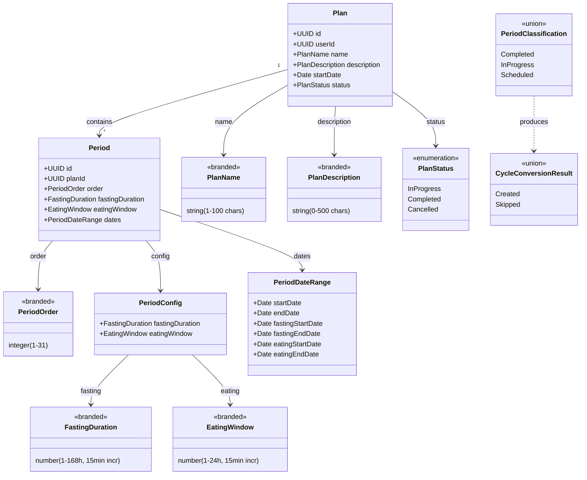

# Functional Domain Design: Plan

> **Source**: Plans Feature Domain Specification (`docs/plans-feature-spec.md`) | **Generated**: 2026-02-06 | **Status**: Pending Review

## 1. Executive Summary

The Plan domain models a structured, multi-period fasting schedule system. A Plan is a top-level entity containing 1-31 contiguous Periods, each consisting of a fasting phase followed by an eating window. The domain enforces strict lifecycle rules (InProgress → Completed/Cancelled), mutual exclusivity with standalone cycles, period contiguity invariants, and overlap prevention with existing cycles. When plans complete or are cancelled, fasting records are preserved as Cycles through an atomic period-to-cycle conversion process.

## 2. Design Principles

This design adheres to the following functional domain modeling principles:

### 2.1 Closed World Assumption

All possible states are explicitly modeled. The compiler enforces completeness.

| Principle               | Implementation                                                  |
| ----------------------- | --------------------------------------------------------------- |
| Exhaustive matching     | All pattern matches use `Match.exhaustive` - no `default` cases |
| No stringly-typed enums | All enums use `S.Literal` union, never `S.String`               |
| Compile-time safety     | Adding a variant causes compile errors at all switch sites      |
| No hidden states        | No `else` branches that hide bugs                               |

### 2.2 Functional Core / Imperative Shell

Separation of pure business logic from I/O operations.

| Layer                | Responsibility                         | Characteristics                                 |
| -------------------- | -------------------------------------- | ----------------------------------------------- |
| **Functional Core**  | Business logic, validations, decisions | Pure functions, no I/O, deterministic, testable |
| **Imperative Shell** | Database, HTTP, clock, external APIs   | Effect-based, dependency injection              |

**Core functions in this design**:

- `calculatePeriodDates` — compute all period timestamps from a start date and durations
- `validatePeriodContiguity` — ensure periods form a continuous timeline
- `validatePeriodPhaseInvariants` — enforce phase ordering within each period
- `classifyPeriodsForCancellation` — categorize periods as Completed/InProgress/Scheduled given a point in time
- `buildCycleFromPeriod` — create cycle data from a period's fasting phase, applying `min(fastingEndDate, now)` rule for in-progress periods
- `validatePeriodCount` — enforce 1-31 period range
- `FastingDuration` / `EatingWindow` branded types — 15-minute increment validation via `Number.isInteger(n * 4)` in `Brand.refined` predicate (no separate function needed)
- `assertPlanIsInProgress` — guard that plan status is `InProgress` before any mutation (pure precondition check)

**Shell operations in this design**:

- `createPlan` — persist plan + periods in a transaction
- `cancelPlan` — atomically cancel plan + create cycles
- `completePlan` — atomically complete plan + create cycles
- `updatePlanPeriods` — atomically update periods with date recalculation
- `updatePlanMetadata` — update plan metadata + recalculate if startDate changes
- `checkCycleOverlap` — query existing cycles for overlap detection. **Uses the period's full date range (`period.startDate` → `period.endDate`)**, not just the fasting phase, as per spec §8.3
- `checkActivePlanOrCycle` — query for mutual exclusivity enforcement

### 2.3 Validation Layers

> "Validate at the boundary, trust inside"

The architecture defines **4 mandatory validation layers**:

| Layer                       | Location            | Responsibility                  | Validates                                               |
| --------------------------- | ------------------- | ------------------------------- | ------------------------------------------------------- |
| **1. Input Schema**         | Request Schema      | Parse & transform incoming JSON | INPUT (string → Date, number ranges, 15-min increments) |
| **2. Domain Validation**    | Functional Core     | Pure business rules             | LOGIC (contiguity, phase ordering, period count)        |
| **3. Service Coordination** | Application Service | Orchestrate validation + repo   | FLOW (mutual exclusivity, overlap with cycles)          |
| **4. Repository Output**    | Repository          | Validate DB returns             | OUTPUT (trust input, validate output)                   |

**Checklist**:

- [x] Request schema transforms and validates input before handler (requests.ts exists)
- [ ] Domain validation service contains pure business rules (testable) — **TO CREATE**
- [x] Application service coordinates validation + repository (plan.service.ts exists)
- [x] Repository validates output from DB, trusts input (schemas.ts exists)

### 2.4 Data Seams

Architectural boundaries where data transforms between layers.

| Seam           | From                             | To                        | Transformation                                                                                        |
| -------------- | -------------------------------- | ------------------------- | ----------------------------------------------------------------------------------------------------- |
| API → Domain   | CreatePlanRequest                | PlanData + PeriodConfig[] | Date parsing, period date calculation                                                                 |
| Domain → Repo  | PlanData + PeriodData            | SQL insert values         | Direct mapping (trusted)                                                                              |
| Repo → Domain  | DB row (numeric strings)         | PlanRecord (DB DTO)       | Step 1: `NumericFromString`, `DateFromSelf` via `PeriodRecordSchema`                                  |
| DTO → Entity   | PlanRecord / PeriodRecord        | Plan / Period (entities)  | Step 2: `decodePlan`/`decodePeriod` — branded validation + phase ordering via `repositories/mappers.ts` |
| Domain → API   | Plan + Period[]                  | PlanWithPeriodsResponse   | Date serialization (Date → ISO string)                                                                |
| Period → Cycle | Period + cancellation time       | CycleData                 | Phase extraction (fasting only). `endDate = min(fastingEndDate, now)` for in-progress periods (BR-03) |

## 3. Type Justification

Each type must declare its category and justification using the Decision Flowchart:

```
Is it a single primitive with constraints?
→ YES: Brand.refined (dm-create-branded-type)

Is it multiple fields that always go together?
→ YES: S.Class Value Object (dm-create-value-object)

Are all variants the same shape?
→ YES: S.Literal Enum (dm-create-literal-enum)

Do variants have different data?
→ YES: Data.TaggedEnum (dm-create-tagged-enum)

Does it need identity and lifecycle?
→ YES: S.Class Entity (dm-create-entity)
```

| Type                       | Category               | Skill                    | Justification                                                                    |
| -------------------------- | ---------------------- | ------------------------ | -------------------------------------------------------------------------------- |
| `PlanStatus`               | Literal Enum           | `dm-create-literal-enum` | Finite set of labels (InProgress, Completed, Cancelled), all same structure      |
| `PlanId`                   | Branded Type           | `dm-create-branded-type` | Single string (UUID) with format constraint                                      |
| `PeriodId`                 | Branded Type           | `dm-create-branded-type` | Single string (UUID) with format constraint                                      |
| `FastingDuration`          | Branded Type           | `dm-create-branded-type` | Single number with range (1-168) and 15-min increment constraint                 |
| `EatingWindow`             | Branded Type           | `dm-create-branded-type` | Single number with range (1-24) and 15-min increment constraint                  |
| `PeriodOrder`              | Branded Type           | `dm-create-branded-type` | Single integer with range constraint (1-31)                                      |
| `PeriodCount`              | Branded Type           | `dm-create-branded-type` | Single integer with range constraint (1-31)                                      |
| `PlanName`                 | Branded Type           | `dm-create-branded-type` | Single string with length constraint (1-100 chars)                               |
| `PlanDescription`          | Branded Type           | `dm-create-branded-type` | Single string with length constraint (0-500 chars)                               |
| `PeriodDateRange`          | Value Object           | `dm-create-value-object` | Computed period dates (6 fields) with phase ordering invariants                  |
| `CancellationResult`       | Tagged Enum            | `dm-create-tagged-enum`  | 4 variants with different data per period outcome during cancellation            |
| `PeriodPhase`              | Tagged Enum            | `dm-create-tagged-enum`  | 4 variants with different data per phase (Scheduled, Fasting, Eating, Completed) |
| `PlanProgress`             | Tagged Enum            | `dm-create-tagged-enum`  | 3 variants for plan-level progress (NotStarted, InProgress, AllPeriodsCompleted) |
| `PlanCreationDecision`     | Tagged Enum (Contract) | `dm-create-contract`     | Decision ADT: CanCreate, BlockedByActiveCycle, BlockedByActivePlan               |
| `PlanCancellationDecision` | Tagged Enum (Contract) | `dm-create-contract`     | Decision ADT: Cancel (with cycle data), InvalidState                             |
| `PlanCompletionDecision`   | Tagged Enum (Contract) | `dm-create-contract`     | Decision ADT: CanComplete, PeriodsNotFinished, InvalidState                      |
| `PeriodUpdateDecision`     | Tagged Enum (Contract) | `dm-create-contract`     | Decision ADT: UpdatePeriods, NoChanges, BlockedByOverlap                         |

**Smart Constructors Required**:

Types with validation MUST have smart constructors (`dm-create-smart-constructors`):

| Type              | Validation                        | Smart Constructor                                                 | Status              |
| ----------------- | --------------------------------- | ----------------------------------------------------------------- | ------------------- |
| `PlanName`        | Length 1-100                      | `Brand.refined` + `S.fromBrand` (acts as create)                  | Covered by branding |
| `PlanDescription` | Length 0-500                      | `Brand.refined` + `S.fromBrand` (acts as create)                  | Covered by branding |
| `FastingDuration` | Range 1-168, 15-min increments    | `Brand.refined` + `S.fromBrand` (acts as create)                  | Covered by branding |
| `EatingWindow`    | Range 1-24, 15-min increments     | `Brand.refined` + `S.fromBrand` (acts as create)                  | Covered by branding |
| `PeriodOrder`     | Integer 1-31                      | `Brand.refined` + `S.fromBrand` (acts as create)                  | Covered by branding |
| `PeriodCount`     | Integer 1-31                      | `Brand.refined` + `S.fromBrand` (acts as create)                  | Covered by branding |
| `PeriodConfig`    | Cross-field: both durations valid | `create` (Effect)                                                 | Pending             |
| `PeriodDateRange` | Cross-field: phase ordering       | `createPeriodDateRange` (Effect) / `makePeriodDateRange` (Option) | DONE                |

## 4. Domain Components

### 4.1 Entities

| Entity            | ID Type  | Fields                                                                                                                                                   | Implementation     | Notes                                                                         |
| ----------------- | -------- | -------------------------------------------------------------------------------------------------------------------------------------------------------- | ------------------ | ----------------------------------------------------------------------------- |
| `Plan`            | `PlanId` | userId, name: PlanName, description: PlanDescription?, startDate, status: PlanStatus, createdAt, updatedAt                                               | `S.Class` entity   | Top-level aggregate with branded types. Source of truth for plan shape.        |
| `Period`          | `PeriodId` | planId: PlanId, order: PeriodOrder, fastingDuration: FastingDuration, eatingWindow: EatingWindow, 6 date fields, createdAt, updatedAt                  | `S.Class` entity   | Child of Plan. Includes `S.filter` for phase ordering invariants.             |
| `PlanWithPeriods` | —        | ...Plan.fields + periods: Period[]                                                                                                                       | `S.Class` aggregate | Aggregate root composing Plan + Period[]. Return type for full plan queries. |

> **Note**: Domain entities (`Plan`, `Period`, `PlanWithPeriods`) in `plan.model.ts` are the canonical types using branded fields. Repository schemas (`PlanRecordSchema`, `PeriodRecordSchema`) serve as DB DTOs handling format transforms (e.g., `NumericFromString`). Boundary mappers in `repositories/mappers.ts` bridge DB DTOs → domain entities.

### 4.2 Value Objects

| Value Object      | Fields                                                                               | Validation                                         | Smart Constructor | Status |
| ----------------- | ------------------------------------------------------------------------------------ | -------------------------------------------------- | ----------------- | ------ |
| `PeriodConfig`    | fastingDuration: FastingDuration, eatingWindow: EatingWindow                         | Both durations valid via branded types              | `S.Class`         | DONE   |
| `PeriodDateRange` | startDate, endDate, fastingStartDate, fastingEndDate, eatingStartDate, eatingEndDate | Phase ordering invariants (6 rules from spec §2.3) | Yes               | DONE   |

### 4.3 Enumerations

#### Literal Enums (same structure for all variants)

| Enum         | Values                                 | Metadata Shape | Notes                                                                                                    |
| ------------ | -------------------------------------- | -------------- | -------------------------------------------------------------------------------------------------------- |
| `PlanStatus` | `InProgress`, `Completed`, `Cancelled` | none           | Domain owns its own copy with `S.Literal` + `PlanStatusSchema`. Also exists in `@ketone/shared` for web. |

#### Tagged Enums (different data per variant)

| Enum                    | Variants                         | Notes                                                                   |
| ----------------------- | -------------------------------- | ----------------------------------------------------------------------- |
| `PeriodClassification`  | Completed, InProgress, Scheduled | Classifies period state relative to current time for cancellation logic |
| `CycleConversionResult` | Created, Skipped                 | Result of period-to-cycle conversion attempt                            |

<details>
<summary>Tagged Enum Details</summary>

**PeriodClassification**:

- `Completed`: period: PeriodDateRange — all phases elapsed (`now >= period.endDate`)
- `InProgress`: period: PeriodDateRange, now: Date — currently executing (`now >= period.startDate && now < period.endDate`)
- `Scheduled`: period: PeriodDateRange — not yet started (`now < period.startDate`)

**Cycle conversion rules by classification** (spec §4.4):

| Classification | Cycle created? | `cycle.startDate`         | `cycle.endDate`                   | Rationale                                                                                                                                                      |
| -------------- | -------------- | ------------------------- | --------------------------------- | -------------------------------------------------------------------------------------------------------------------------------------------------------------- |
| **Completed**  | Yes            | `period.fastingStartDate` | `period.fastingEndDate`           | Full fasting phase recorded                                                                                                                                    |
| **InProgress** | Yes            | `period.fastingStartDate` | `min(period.fastingEndDate, now)` | If user is in eating window (`now >= fastingEndDate`), the full fasting is recorded. If still fasting (`now < fastingEndDate`), fasting is truncated at `now`. |
| **Scheduled**  | No             | —                         | —                                 | Period not started; discarded                                                                                                                                  |

**CycleConversionResult**:

- `Created`: startDate: Date, endDate: Date — fasting phase preserved as cycle. **`endDate` is always `min(period.fastingEndDate, now)` for InProgress periods, or `period.fastingEndDate` for Completed periods.**
- `Skipped`: reason: string — period was scheduled/not applicable

</details>

### 4.4 Domain Errors

| Error                         | Fields                                                                       | Trigger                                                             |
| ----------------------------- | ---------------------------------------------------------------------------- | ------------------------------------------------------------------- |
| `PlanAlreadyActiveError`      | message, userId                                                              | User tries to create a plan when one is already InProgress          |
| `ActiveCycleExistsError`      | message, userId                                                              | User tries to create a plan while having an active standalone cycle |
| `PlanNotFoundError`           | message, userId, planId                                                      | Plan doesn't exist or doesn't belong to user                        |
| `NoActivePlanError`           | message, userId                                                              | User queries for active plan but none exists                        |
| `PlanInvalidStateError`       | message, currentState: PlanStatus, expectedState: PlanStatus                 | Operation requires different plan state                             |
| `InvalidPeriodCountError`     | message, periodCount, minPeriods, maxPeriods                                 | Period count outside 1-31 range                                     |
| `PeriodOverlapWithCycleError` | message, userId, overlappingCycleId, cycleStartDate, cycleEndDate            | Plan periods overlap with existing cycle                            |
| `PeriodNotInPlanError`        | message, planId, periodId                                                    | Period ID doesn't belong to target plan                             |
| `DuplicatePeriodIdError`      | message, planId, periodId                                                    | Input contains duplicate period IDs in update request               |
| `PeriodsNotCompletedError`    | message, planId, completedCount, totalCount                                  | Plan completion attempted before all periods elapsed                |
| `PlanRepositoryError`         | message                                                                      | Internal database error (cause logged server-side)                  |

#### Cross-Feature Error (Cycle Domain, spec §7.2)

| Error                   | Fields          | Trigger                                                            | Owner                                                        |
| ----------------------- | --------------- | ------------------------------------------------------------------ | ------------------------------------------------------------ |
| `ActivePlanExistsError` | message, userId | User tries to start a standalone cycle while an active plan exists | **Cycle domain** (`api/src/features/cycle/domain/errors.ts`) |

> This error is defined in the Cycle domain, not the Plan domain. It enforces the bidirectional mutual exclusivity: Plan domain checks for active cycles (`ActiveCycleExistsError`), Cycle domain checks for active plans (`ActivePlanExistsError`). Both sides must be aware of this contract.

> **Note**: Domain errors exist in `domain/errors.ts`. `PeriodNotFoundError` was removed (dead code). `PeriodNotInPlanError` is the canonical error for "period doesn't belong to plan" (spec §7.1).

### 4.5 Contracts (Use-Case Interfaces)

Each mutating use case has a contract defining input, output, and decision ADT.

| Contract          | Input Type                | Decision ADT               | Skill                | File                                    |
| ----------------- | ------------------------- | -------------------------- | -------------------- | --------------------------------------- |
| Plan Creation     | `CreatePlanInput`         | `PlanCreationDecision`     | `dm-create-contract` | `domain/contracts/plan-creation.ts`     |
| Plan Cancellation | `CancelPlanInput`         | `PlanCancellationDecision` | `dm-create-contract` | `domain/contracts/plan-cancellation.ts` |
| Plan Completion   | `CompletePlanInput`       | `PlanCompletionDecision`   | `dm-create-contract` | `domain/contracts/plan-completion.ts`   |
| Period Update     | `DomainPeriodUpdateInput` | `PeriodUpdateDecision`     | `dm-create-contract` | `domain/contracts/period-update.ts`     |

<details>
<summary>Contract Details</summary>

**PlanCreationDecision**:

- `CanCreate`: plan can be created (no blockers)
- `BlockedByActiveCycle`: user has an active standalone cycle
- `BlockedByActivePlan`: user already has an InProgress plan
- `InvalidPeriodCount`: period count outside valid range

**PlanCancellationDecision**:

- `Cancel`: results: CancellationResult[], completedFastingDates, inProgressFastingDates
- `InvalidState`: planId, currentStatus: PlanStatus

**PlanCompletionDecision**:

- `CanComplete`: cyclesToCreate: CycleCreateInput[]
- `PeriodsNotFinished`: completedCount, totalCount
- `InvalidState`: planId, currentStatus: PlanStatus

**PeriodUpdateDecision**:

- `CanUpdate`: planId, periodsToWrite: PeriodWriteData[]
- `InvalidPeriodCount`: periodCount, minPeriods, maxPeriods
- `DuplicatePeriodId`: planId, periodId
- `PeriodNotInPlan`: planId, periodId

</details>

> **Status**: Contracts are **implemented** in `domain/contracts/`.

### 4.6 Services

#### Validation Services (Core — pure business rules)

| Service                 | Methods                                                                                                                | Skill                          | File                                         | Notes                                                   |
| ----------------------- | ---------------------------------------------------------------------------------------------------------------------- | ------------------------------ | -------------------------------------------- | ------------------------------------------------------- |
| `PlanValidationService` | assertPlanIsInProgress, decidePlanCreation | `dm-create-validation-service` | `domain/services/plan-validation.service.ts` | BR-01 InProgress guard + creation decision ADT |

#### Domain Services (Core — pure logic, Effect.Service wrapper)

| Service                    | Methods                                                                                     | Skill                      | File                                            | Notes                                                     |
| -------------------------- | ------------------------------------------------------------------------------------------- | -------------------------- | ----------------------------------------------- | --------------------------------------------------------- |
| `PeriodCalculationService` | calculatePeriodDates, recalculatePeriodDates, assessPeriodPhase, assessPlanProgress         | `dm-create-domain-service` | `domain/services/period-calculation.service.ts` | Pure date calculation + progress assessment               |
| `PlanCancellationService`  | determinePeriodOutcome, processCancellation, decideCancellation, **decidePlanCancellation** | `dm-create-domain-service` | `domain/services/plan-cancellation.service.ts`  | 4-variant CancellationResult, BR-03 + contract ADT        |
| `PlanCompletionService`    | **decidePlanCompletion**                                                                    | `dm-create-domain-service` | `domain/services/plan-completion.service.ts`    | Completion decision using PlanCompletionDecision contract |

#### Application Services (Shell — orchestration)

| Service          | Methods                                                                                                  | Dependencies                  | Notes                                      |
| ---------------- | -------------------------------------------------------------------------------------------------------- | ----------------------------- | ------------------------------------------ |
| `PlanService`    | createPlan, getActivePlan, getPlan, getAllPlans, cancelPlan, completePlan, updatePeriods, updateMetadata | PlanRepository, Core services | **EXISTS** — orchestrates I/O + core logic |
| `PlanRepository` | 12+ methods                                                                                              | Database (Drizzle)            | **EXISTS** — handles all DB operations     |

> **Status**: All domain services are **implemented** in `domain/services/`. Application service and repository already exist.

### 4.6 Explicit Business Rules (Functional Core)

These rules MUST be declared as pure functions in the core, not buried in handlers/services/repositories.

#### BR-01: InProgress Guard (spec §4.2, §4.3, §4.4, §4.5)

> **All mutating operations require `plan.status === 'InProgress'`.**

| Operation                                      | Requires InProgress | Error on violation      |
| ---------------------------------------------- | ------------------- | ----------------------- |
| Update metadata (name, description, startDate) | Yes                 | `PlanInvalidStateError` |
| Update periods (add, remove, update durations) | Yes                 | `PlanInvalidStateError` |
| Cancel plan                                    | Yes                 | `PlanInvalidStateError` |
| Complete plan                                  | Yes                 | `PlanInvalidStateError` |

**Implementation**: `assertPlanIsInProgress(plan: { status: PlanStatus }): Effect<void, PlanInvalidStateError>` — pure precondition check. Called by the coordinator service before delegating to repository.

#### BR-02: Overlap Check Uses Full Period Range (spec §8.3)

> **The overlap check uses `period.startDate` → `period.endDate` (fasting + eating), NOT just the fasting phase.**

```
Period:  [=== Fasting ===|=== Eating ===]
         ^                              ^
    period.startDate              period.endDate
         ╰────── overlap range ─────────╯
```

This is validated during:

1. Plan creation — all calculated period dates checked against existing cycles
2. Period updates — recalculated dates checked after any modification
3. Start date changes — shifted period dates re-validated

#### BR-03: Cancellation Cycle Conversion (spec §4.4)

> **`cycle.endDate = min(period.fastingEndDate, now)` for in-progress periods.**

```
Case A: Still fasting (now < fastingEndDate)
  Period:  [=== Fasting ===|=== Eating ===]
                    ^ now
  Cycle:   [======]
           start   now (truncated)

Case B: In eating window (now >= fastingEndDate)
  Period:  [=== Fasting ===|=== Eating ===]
                                ^ now
  Cycle:   [===============]
           start          fastingEndDate (full fasting recorded)
```

### 4.8 Functional Core Flows (Three Phases)

Each operation that involves I/O → Logic → I/O documents its Three Phases pattern.

| Flow            | Collection (Shell)                    | Logic (Core)                                                                       | Persistence (Shell)                   | Contract ADT Used          | Status                                 |
| --------------- | ------------------------------------- | ---------------------------------------------------------------------------------- | ------------------------------------- | -------------------------- | -------------------------------------- |
| `createPlan`    | `hasActivePlanOrCycle` → IDs          | `decidePlanCreation` → `PlanCreationDecision` (CanCreate / Blocked\*)              | `calculatePeriodDates` + `createPlan` | `PlanCreationDecision`     | **Wired**                              |
| `cancelPlan`    | `getPlanWithPeriods` → plan + periods | `decidePlanCancellation` → `PlanCancellationDecision` (Cancel / InvalidState)      | `cancelPlanWithCyclePreservation`     | `PlanCancellationDecision` | **Wired**                              |
| `completePlan`  | `getPlanWithPeriods` → plan + periods | `decidePlanCompletion` → `PlanCompletionDecision` (CanComplete / NotFinished / \*) | `completePlanWithValidation`          | `PlanCompletionDecision`   | **Wired**                              |
| `updatePeriods` | Load plan + periods from DB           | `recalculatePeriodDates`, check overlap (BR-02)                                    | Update periods atomically             | `PeriodUpdateDecision`     | Not wired — overlap check requires I/O |

### 4.9 Additional Components

#### Boundary Mappers

| Mapper                  | External                               | Domain                        | File                        | Notes                                                                 |
| ----------------------- | -------------------------------------- | ----------------------------- | --------------------------- | --------------------------------------------------------------------- |
| `decodePlan`            | PlanRecord (DB DTO)                    | Plan (domain entity)          | `repositories/mappers.ts`   | `S.decodeUnknown(Plan)` with PlanRepositoryError wrapping             |
| `decodePeriod`          | PeriodRecord (DB DTO)                  | Period (domain entity)        | `repositories/mappers.ts`   | `S.decodeUnknown(Period)` with branded validation + phase ordering    |
| `decodePlanWithPeriods` | PlanRecord + PeriodRecord[]            | PlanWithPeriods (aggregate)   | `repositories/mappers.ts`   | Composes Plan + Period[] into aggregate via `S.decodeUnknown`         |
| `PeriodRecordSchema`    | DB row (numeric strings for durations) | PeriodRecord (typed numbers)  | `repositories/schemas.ts`   | `NumericFromString` transform at boundary (DB DTO, format only)       |
| `PlanResponseMapper`    | Plan + Period[]                        | PlanWithPeriodsResponse       | `@ketone/shared`            | Date → ISO string serialization                                       |

> **Note**: Two-step decode pipeline: DB row → `PeriodRecordSchema` (format transforms like `NumericFromString`) → `decodePeriod` (branded validation + phase ordering). Repository schemas are DB DTOs; domain entities are the canonical types.

#### Reified Decisions

| Decision                   | Variants                                                                              | Context                                | Notes                          |
| -------------------------- | ------------------------------------------------------------------------------------- | -------------------------------------- | ------------------------------ |
| `CancellationResult`       | CompletedPeriod, PartialFastingPeriod, CompletedFastingInEatingPhase, DiscardedPeriod | Per-period outcome during cancellation | Pure function of (period, now) |
| `PeriodPhase`              | Scheduled, Fasting, Eating, Completed                                                 | Current phase assessment of a period   | Pure function of (period, now) |
| `PlanProgress`             | NotStarted, InProgress, AllPeriodsCompleted                                           | Overall plan progress assessment       | Aggregates period phases       |
| `PlanCreationDecision`     | CanCreate, BlockedByActiveCycle, BlockedByActivePlan, InvalidPeriodCount               | Creation precondition check            | Contract decision ADT          |
| `PlanCancellationDecision` | Cancel, InvalidState                                                                  | Cancellation decision                  | Contract decision ADT          |
| `PlanCompletionDecision`   | CanComplete, PeriodsNotFinished, InvalidState                                         | Completion decision                    | Contract decision ADT          |
| `PeriodUpdateDecision`     | CanUpdate, InvalidPeriodCount, DuplicatePeriodId, PeriodNotInPlan                     | Period update decision                 | Contract decision ADT          |

#### Data Seams / Pipeline Stages

| Pipeline          | Stages                                                                                                                        | Notes                                                                     |
| ----------------- | ----------------------------------------------------------------------------------------------------------------------------- | ------------------------------------------------------------------------- |
| Plan Creation     | ValidateInput → CalculateDates → CheckOverlap(full range) → Persist                                                           | Input validation is pure, overlap uses `period.startDate→endDate` (BR-02) |
| Plan Cancellation | AssertInProgress(BR-01) → LoadPlan → ClassifyPeriods → ConvertToCycles(BR-03: `min(fastingEndDate, now)`) → PersistAtomically | Classification is pure, persistence is transactional                      |
| Plan Completion   | AssertInProgress(BR-01) → LoadPlan → ValidateAllComplete → ConvertToCycles → PersistAtomically                                | Validation + conversion are pure                                          |
| Period Update     | AssertInProgress(BR-01) → ValidateInput → RecalculateDates → CheckOverlap(full range, BR-02) → PersistAtomically              | Date recalculation is pure                                                |

## 5. Type Diagram



## 6. Architecture Phases

This design follows the **Functional Core / Imperative Shell** architecture. Implementation proceeds in phases, each building on the previous.

### Phase 1: Functional Core (Pure Logic)

> Domain types, pure services, ADTs, contracts, reified decisions

Phase 1 steps follow the Implementation Protocol order (constants → branded → value objects → enums → errors → contracts → services):

| Step                          | Component                          | Skill                          | File                                            | Status | Notes                                                                                           |
| ----------------------------- | ---------------------------------- | ------------------------------ | ----------------------------------------------- | ------ | ----------------------------------------------------------------------------------------------- |
| **Constants + Branded Types** |                                    |                                |                                                 |        |                                                                                                 |
| 1.1                           | `PlanStatus` (literal enum)        | `dm-create-literal-enum`       | `domain/plan.model.ts`                          | DONE   | Own PlanStatus with `S.Literal` + `PlanStatusSchema`                                            |
| 1.2                           | `PlanId`, `PeriodId` (branded IDs) | `dm-create-branded-type`       | `domain/plan.model.ts`                          | DONE   | `S.UUID.pipe(S.brand('PlanId'))`                                                                |
| 1.3                           | `FastingDuration`                  | `dm-create-branded-type`       | `domain/plan.model.ts`                          | DONE   | MIN/MAX constants + 15-min increments + `FastingDurationSchema`                                 |
| 1.4                           | `EatingWindow`                     | `dm-create-branded-type`       | `domain/plan.model.ts`                          | DONE   | MIN/MAX constants + 15-min increments + `EatingWindowSchema`                                    |
| 1.5                           | `PeriodOrder`                      | `dm-create-branded-type`       | `domain/plan.model.ts`                          | DONE   | Integer 1-31 + `PeriodOrderSchema`                                                              |
| 1.6                           | `PeriodCount`                      | `dm-create-branded-type`       | `domain/plan.model.ts`                          | DONE   | Integer 1-31 + `PeriodCountSchema`                                                              |
| 1.7                           | `PlanName`                         | `dm-create-branded-type`       | `domain/plan.model.ts`                          | DONE   | String 1-100 + `PlanNameSchema`                                                                 |
| 1.8                           | `PlanDescription`                  | `dm-create-branded-type`       | `domain/plan.model.ts`                          | DONE   | String 0-500 + `PlanDescriptionSchema`                                                          |
| **Value Objects**             |                                    |                                |                                                 |        |                                                                                                 |
| 1.9                           | `PeriodDateRange`                  | `dm-create-value-object`       | `domain/plan.model.ts`                          | DONE   | 6 date fields + `isValidPeriodDateRange` validator                                              |
| **Tagged Enums**              |                                    |                                |                                                 |        |                                                                                                 |
| 1.10                          | `CancellationResult`               | `dm-create-tagged-enum`        | `domain/plan.model.ts`                          | DONE   | CompletedPeriod, PartialFastingPeriod, CompletedFastingInEatingPhase, DiscardedPeriod           |
| 1.11                          | `PeriodPhase`                      | `dm-create-tagged-enum`        | `domain/plan.model.ts`                          | DONE   | Scheduled, Fasting, Eating, Completed                                                           |
| 1.12                          | `PlanProgress`                     | `dm-create-tagged-enum`        | `domain/plan.model.ts`                          | DONE   | NotStarted, InProgress, AllPeriodsCompleted                                                     |
| **Domain Errors**             |                                    |                                |                                                 |        |                                                                                                 |
| 1.13                          | Domain Errors                      | `dm-create-domain-error`       | `domain/errors.ts`                              | DONE   | 10 errors (see Section 4.4)                                                                     |
| **Contracts**                 |                                    |                                |                                                 |        |                                                                                                 |
| 1.14                          | Plan Creation Contract             | `dm-create-contract`           | `domain/contracts/plan-creation.ts`             | DONE   | `PlanCreationDecision` (CanCreate, BlockedByActiveCycle, BlockedByActivePlan)                   |
| 1.15                          | Plan Cancellation Contract         | `dm-create-contract`           | `domain/contracts/plan-cancellation.ts`         | DONE   | `PlanCancellationDecision` (Cancel, InvalidState)                                               |
| 1.16                          | Plan Completion Contract           | `dm-create-contract`           | `domain/contracts/plan-completion.ts`           | DONE   | `PlanCompletionDecision` (CanComplete, PeriodsNotFinished, InvalidState) + `CycleCreateInput`   |
| 1.17                          | Period Update Contract             | `dm-create-contract`           | `domain/contracts/period-update.ts`             | DONE   | `PeriodUpdateDecision` (UpdatePeriods, NoChanges, BlockedByOverlap)                             |
| **Validation Services**       |                                    |                                |                                                 |        |                                                                                                 |
| 1.18                          | `PlanValidationService`            | `dm-create-validation-service` | `domain/services/plan-validation.service.ts`    | DONE   | assertPlanIsInProgress (BR-01), validatePeriodCount, validatePeriodContiguity                   |
| **Domain Services**           |                                    |                                |                                                 |        |                                                                                                 |
| 1.19                          | `PeriodCalculationService`         | `dm-create-domain-service`     | `domain/services/period-calculation.service.ts` | DONE   | calculatePeriodDates, recalculatePeriodDates, assessPeriodPhase, assessPlanProgress             |
| 1.20                          | `PlanCancellationService`          | `dm-create-domain-service`     | `domain/services/plan-cancellation.service.ts`  | DONE   | determinePeriodOutcome, processCancellation, decideCancellation, decidePlanCancellation (BR-03) |
| 1.21                          | `PlanCompletionService`            | `dm-create-domain-service`     | `domain/services/plan-completion.service.ts`    | DONE   | decidePlanCompletion (PC-01)                                                                    |

**Shared Types** (pass the Orphan Test — would still make sense if this module is deleted):

| Type         | Location                 | Skill                    | Reason                                                |
| ------------ | ------------------------ | ------------------------ | ----------------------------------------------------- |
| `PlanStatus` | Also in `@ketone/shared` | `dm-create-literal-enum` | Shared between API and web (domain owns its own copy) |

**Command**: `"implement phase 1"`

### Phase 2: Shell APIs (HTTP Layer)

> Request/Response schemas, handlers, validation, boundary mappers

| Step | Component                         | Type            | File                      | Notes                                                             |
| ---- | --------------------------------- | --------------- | ------------------------- | ----------------------------------------------------------------- |
| 2.1  | `CreatePlanRequestSchema`         | Request Schema  | `api/schemas/requests.ts` | **Already exists**. Review alignment with branded types.          |
| 2.2  | `UpdatePeriodsRequestSchema`      | Request Schema  | `api/schemas/requests.ts` | **Already exists**. Review alignment.                             |
| 2.3  | `UpdatePlanMetadataRequestSchema` | Request Schema  | `api/schemas/requests.ts` | **Already exists**. Review alignment.                             |
| 2.4  | Response Schemas                  | Response Schema | `@ketone/shared`          | **Already exist**. PlanResponseSchema, PeriodResponseSchema, etc. |
| 2.5  | Error Schemas                     | Error Schema    | `api/schemas/errors.ts`   | **Already exist**. 10 error schemas.                              |
| 2.6  | `PlanApiGroup`                    | API Definition  | `api/plan-api.ts`         | **Already exists**. 8 endpoints.                                  |
| 2.7  | `PlanApiLive`                     | Handler         | `api/plan-api-handler.ts` | **Already exists**. Error mapping with `catchTags`.               |

**Handler Error Mapping** (mandatory):

```typescript
// Domain errors (Data.TaggedError) → HTTP errors (S.TaggedError)
.pipe(Effect.catchTags({
  PlanAlreadyActiveError: (e) => Effect.fail(new PlanAlreadyActiveErrorSchema({ message: e.message, userId: e.userId })),
  ActiveCycleExistsError: (e) => Effect.fail(new ActiveCycleExistsErrorSchema({ message: e.message, userId: e.userId })),
  PlanNotFoundError: (e) => Effect.fail(new PlanNotFoundErrorSchema({ message: e.message })),
  // ... etc
}))
```

> **Status**: Phase 2 is **already implemented**. No new files needed. May need minor updates to align request schemas with new branded types from Phase 1.

**Command**: `"implement phase 2"`

### Phase 3: Persistence Layer (Repository)

> Database access, output validation, record schemas

| Step | Component            | Type          | File                                       | Notes                                                          |
| ---- | -------------------- | ------------- | ------------------------------------------ | -------------------------------------------------------------- |
| 3.1  | `PlanRecordSchema`   | Record Schema | `repositories/schemas.ts`                  | **Already exists**. Validates DB output.                       |
| 3.2  | `PeriodRecordSchema` | Record Schema | `repositories/schemas.ts`                  | **Already exists**. With NumericFromString + phase invariants. |
| 3.3  | `PlanRepository`     | Repository    | `repositories/plan.repository.postgres.ts` | **Already exists** (1346 lines). 12+ methods.                  |

> **Status**: Phase 3 is **already implemented**. No new files needed. Consider refactoring repository to use Core pure functions from Phase 1 (e.g., date calculation, period classification).

**Command**: `"implement phase 3"`

### Phase 4: Coordinator Layer (Orchestration)

> Application services, workflows, effect composition

| Step | Component     | Type                | File                       | Notes                          |
| ---- | ------------- | ------------------- | -------------------------- | ------------------------------ |
| 4.1  | `PlanService` | Application Service | `services/plan.service.ts` | **Already exists**. 7 methods. |

> **Status**: Phase 4 is **already implemented**. Consider refactoring to delegate pure logic to Core services from Phase 1.

**Command**: `"implement phase 4"`

### Implementation Order

```
Phase 1 (Core)     ──────────────────────────────────► DONE
                   Constants, Branded Types, Value Objects, Tagged Enums,
                   Contracts, Validation Services, Domain Services

Phase 2 (API)      ──────────────────────────────────► EXISTS (review)
                   Schemas, Handlers

Phase 3 (Repo)     ──────────────────────────────────► EXISTS (review)
                   Repository

Phase 4 (Coord)    ──────────────────────────────────► EXISTS (refactor to use Core)
                   App Service
```

### Files (Current Structure)

```
plan/
├── domain/
│   ├── plan.model.ts                    # Constants, Branded IDs, Branded Types, Value Objects, Tagged Enums
│   ├── errors.ts                        # Domain Errors (Data.TaggedError)
│   ├── index.ts                         # Barrel: model + errors + contracts + services
│   ├── contracts/
│   │   ├── index.ts                     # Barrel for all contracts
│   │   ├── plan-creation.ts             # PlanCreationDecision
│   │   ├── plan-cancellation.ts         # PlanCancellationDecision
│   │   ├── plan-completion.ts           # PlanCompletionDecision + CycleCreateInput
│   │   └── period-update.ts             # PeriodUpdateDecision + DomainPeriodUpdateInput
│   └── services/
│       ├── index.ts                     # Barrel for all domain services
│       ├── plan-validation.service.ts   # PlanValidationService (Effect.Service)
│       ├── period-calculation.service.ts # PeriodCalculationService (Effect.Service)
│       ├── plan-cancellation.service.ts # PlanCancellationService (Effect.Service)
│       └── plan-completion.service.ts   # PlanCompletionService (Effect.Service)
├── api/
│   ├── plan-api.ts                      # EXISTS: 8 endpoints
│   ├── plan-api-handler.ts              # EXISTS: catchTags error mapping
│   └── schemas/
│       ├── requests.ts                  # EXISTS (review alignment with branded types)
│       ├── responses.ts                 # EXISTS (re-exports from shared)
│       └── errors.ts                    # EXISTS: 10 error schemas
├── repositories/
│   ├── schemas.ts                       # EXISTS: PlanRecordSchema, PeriodRecordSchema (DB DTOs)
│   ├── mappers.ts                       # NEW: Boundary mappers (decodePlan, decodePeriod, decodePlanWithPeriods)
│   ├── plan.repository.interface.ts     # EXISTS: Repository interface (returns domain entities)
│   └── plan.repository.postgres.ts      # EXISTS: 12+ methods (uses Core pure functions + mappers)
└── services/
    └── plan.service.ts                  # EXISTS: Coordinator (Collection → Logic → Persistence)
```

## 7. Closed World Checklist

Before implementation, verify:

- [x] All enums use `S.Literal` union (not `S.String`) — `PlanStatus` uses `S.Literal('InProgress', 'Completed', 'Cancelled')`
- [x] All pattern matches use exhaustive matching — `$match` from `Data.TaggedEnum` and `matchCancellationResult` used throughout services and handlers
- [x] No `default` or `else` cases that hide bugs — verified in service/handler code
- [x] Adding a variant causes compile errors at all switch sites — enforced by `$match` exhaustive matching
- [x] No optional fields that depend on other fields — Period phases are always present (not optional)
- [x] No boolean discriminators with optional fields — `PeriodClassification` uses Tagged Enum instead

## 8. FC/IS Implementation Checklist

**Phase 1 — Functional Core:**

- [x] **Constants** live in model file alongside branded types (no magic numbers) — `plan.model.ts` has `MIN_FASTING_DURATION`, etc.
- [x] **Branded types** reference named constants in predicates and error messages
- [x] **Contracts** exist for each use case with input types and decision ADTs — 4 contracts in `domain/contracts/`. 3 of 4 wired into PlanService (creation, cancellation, completion). `PeriodUpdateDecision` not wired — overlap check requires I/O.
- [x] **Domain services** include `FUNCTIONAL CORE` documentation header with Three Phases context
- [x] **Domain services** export pure functions both as standalone AND inside Effect.Service wrapper
- [x] **Validation service** is separate from domain services — `plan-validation.service.ts`

**Phase 2 — Shell APIs:**

- [x] **Request Schema** validates and transforms input (strings → typed values) — `requests.ts` exists
- [x] **Handler** maps domain errors to HTTP errors with `catchTags` — `plan-api-handler.ts`
- [x] **Handler** serializes responses (Date → string, etc.) — via shared response schemas
- [x] **Response Schema** defines the response shape — in `@ketone/shared`

**Phase 3 — Persistence:**

- [x] **Repository** validates output from database, trusts input — `schemas.ts` with `PeriodRecordSchema` validation

**Phase 4 — Orchestration:**

- [x] **Application Service** coordinates validation and repository, returns typed errors — `plan.service.ts` exists
- [x] **Application Service** follows Three Phases pattern (Collection → Logic → Persistence) — `createPlan`, `cancelPlan`, `completePlan` use contract decision ADTs; `updatePeriods` defers to repository (overlap requires I/O)

## 9. Warning Signs Detected

Patterns found in the existing implementation that should be addressed:

- [x] **Mixed I/O and logic in repository**: Period date calculation extracted to `PeriodCalculationService` (pure). Repository imports standalone functions.
- [x] **Period classification logic embedded in repository**: Extracted to `PlanCancellationService` with 4-variant `CancellationResult` enum. Includes `decideCancellation` with `min(fastingEndDate, now)` rule (BR-03).
- [ ] **Validation duplication**: 15-minute increment validation appears in both `requests.ts` and `repositories/schemas.ts`. Now defined in branded types (`FastingDuration`, `EatingWindow`). Consider reusing `FastingDurationSchema`/`EatingWindowSchema` in those locations.
- [x] **`PeriodNotFoundError` → `PeriodNotInPlanError`**: Resolved. Rename to match spec §7.1. See Resolved Decisions in Section 10.
- [x] **String-typed `currentState`/`expectedState`**: Resolved. `PlanInvalidStateError` now uses `PlanStatus` type for both `currentState` and `expectedState`. Contract ADTs (`PlanCancellationDecision.InvalidState`, `PlanCompletionDecision.InvalidState`) also use `PlanStatus` for `currentStatus`.
- [x] **InProgress guard not reified in core**: Extracted to `PlanValidationService.assertPlanIsInProgress` — pure precondition check (BR-01). Applied in all mutating operations (`cancelPlan`, `completePlan`, `updatePlanPeriods`, `updatePlanMetadata`).
- [ ] **Overlap range not documented in code**: The overlap check uses `period.startDate → period.endDate` (full range including eating), but this isn't explicitly documented in the repository code. Should be enforced via the core function with a clear comment referencing BR-02.

## 10. Open Questions

### Remaining Questions

1. **Overlap range validation**: Should the overlap check be extracted from the repository into a pure core function, or is it acceptable as a SQL-level check since it requires querying existing cycles?

### Resolved Decisions

| Decision                                        | Resolution                                                                   | Rationale                                                                                                                                                                  |
| ----------------------------------------------- | ---------------------------------------------------------------------------- | -------------------------------------------------------------------------------------------------------------------------------------------------------------------------- |
| `PeriodNotFoundError` vs `PeriodNotInPlanError` | **Rename to `PeriodNotInPlanError`**                                         | Spec §7.1 defines `PeriodNotInPlanError`. The existing `PeriodNotFoundError` has identical semantics (period ID doesn't belong to plan). Consolidate to match spec naming. |
| `ActivePlanExistsError` cross-feature error     | **Document, do not duplicate**                                               | Error lives in Cycle domain (`cycle/domain/errors.ts`). Plan domain references it in mutual exclusivity documentation but does not own it.                                 |
| Core service granularity                        | **Three separate files in `domain/services/`**                               | `plan-validation.service.ts`, `period-calculation.service.ts`, `plan-cancellation.service.ts` — single responsibility, each with Effect.Service wrapper                    |
| Repository refactoring                          | **Repository imports Core standalone functions**                             | Pure functions exported both standalone (for repo) and inside Effect.Service (for DI consumers). Dual export pattern.                                                      |
| PlanStatus ownership                            | **Domain owns its own copy**                                                 | `plan.model.ts` defines `PlanStatus` as literal enum with `PlanStatusSchema`. No longer re-exports from `@ketone/shared`.                                                  |
| Tagged enum evolution                           | **CancellationResult replaces PeriodClassification + CycleConversionResult** | Single 4-variant enum instead of two-step classify→convert. Also added `PeriodPhase` and `PlanProgress` enums.                                                             |
| Branded types scope                             | **Pervasive in domain entities; repo schemas are DB DTOs; mappers bridge**   | Domain entities (`Plan`, `Period`, `PlanWithPeriods`) use branded types as canonical shape. Repository schemas (`PlanRecordSchema`, `PeriodRecordSchema`) remain as DB DTOs handling format transforms (`NumericFromString`). Boundary mappers (`repositories/mappers.ts`) decode DB DTOs → domain entities with branded validation. Repository interface returns domain entities. |
| String-typed error state fields                 | **Changed to `PlanStatus` type**                                             | `PlanInvalidStateError.currentState` and `.expectedState` now use `PlanStatus`. Contract ADT `InvalidState` variants also use `PlanStatus` for `currentStatus`.            |
| `DuplicatePeriodIdError` missing                | **Added as dedicated error type**                                            | Previously mapped incorrectly to `PeriodNotInPlanError`. Now has its own `DuplicatePeriodIdError` (domain) and `DuplicatePeriodIdErrorSchema` (API).                       |
| Double `processCancellation` computation        | **Fixed by refactoring `decideCancellation` signature**                      | `decideCancellation` now accepts pre-computed `results: ReadonlyArray<CancellationResult>` instead of recomputing. `decidePlanCancellation` computes once, passes to both. |

## 11. Next Steps

**Domain entity alignment is COMPLETE.** Summary of completed work:

- [x] Domain entities (`Plan`, `Period`, `PeriodConfig`, `PlanWithPeriods`) created as `S.Class` with branded types
- [x] Boundary mappers (`repositories/mappers.ts`) bridge DB DTOs → domain entities
- [x] Repository interface and postgres implementation return domain entities
- [x] Service layer uses domain entity types
- [x] BR-01 guard applied to all mutating operations (`updatePlanPeriods`, `updatePlanMetadata`)
- [x] Contract types use `PlanStatus` instead of `string`
- [x] `DuplicatePeriodIdError` added as dedicated error type
- [x] Dead code (`PlanServiceError`) removed
- [x] Double `processCancellation` computation eliminated
- [x] Exhaustive matching (`matchCancellationResult`) replaces `switch` on `_tag`

**Remaining work:**

1. [ ] **Review alignment** of request schemas (`api/schemas/requests.ts`) with new branded types — consider reusing `FastingDurationSchema`/`EatingWindowSchema`
2. [ ] **Fix validation duplication**: 15-min increment validation exists in both `requests.ts` and branded types
3. [ ] **Document overlap range in code**: Add explicit comment referencing BR-02 in repository overlap check

---

<details>
<summary>Analysis YAML (reference)</summary>

```yaml
module: Plan
source: docs/plans-feature-spec.md

entities:
  - name: Plan
    id_type: UUID
    fields:
      - { name: userId, type: UUID }
      - { name: name, type: PlanName }
      - { name: description, type: 'PlanDescription | null' }
      - { name: startDate, type: Date }
      - { name: status, type: PlanStatus }
      - { name: createdAt, type: Date }
      - { name: updatedAt, type: Date }
    notes: Top-level aggregate. Already modeled in DB + response schemas.

  - name: Period
    id_type: UUID
    fields:
      - { name: planId, type: UUID }
      - { name: order, type: PeriodOrder }
      - { name: fastingDuration, type: FastingDuration }
      - { name: eatingWindow, type: EatingWindow }
      - { name: startDate, type: Date }
      - { name: endDate, type: Date }
      - { name: fastingStartDate, type: Date }
      - { name: fastingEndDate, type: Date }
      - { name: eatingStartDate, type: Date }
      - { name: eatingEndDate, type: Date }
      - { name: createdAt, type: Date }
      - { name: updatedAt, type: Date }
    notes: Child of Plan. Dates computed from plan startDate + period configs.

value_objects:
  - name: PeriodConfig
    fields: [fastingDuration: FastingDuration, eatingWindow: EatingWindow]
    validation: Both durations valid
  - name: PeriodDateRange
    fields: [startDate, endDate, fastingStartDate, fastingEndDate, eatingStartDate, eatingEndDate]
    validation: Phase ordering invariants (6 rules)

literal_enums:
  - name: PlanStatus
    values: [InProgress, Completed, Cancelled]
    location: '@ketone/shared'
    notes: Already exists

tagged_enums:
  - name: CancellationResult
    variants:
      - { name: CompletedPeriod, fields: { fastingStartDate: Date, fastingEndDate: Date } }
      - {
          name: PartialFastingPeriod,
          fields: { fastingStartDate: Date, fastingEndDate: Date, originalFastingEndDate: Date },
        }
      - { name: CompletedFastingInEatingPhase, fields: { fastingStartDate: Date, fastingEndDate: Date } }
      - { name: DiscardedPeriod, fields: {} }
  - name: PeriodPhase
    variants:
      - { name: Scheduled, fields: { startsInMs: number } }
      - { name: Fasting, fields: { elapsedMs: number, remainingMs: number, percentage: number } }
      - { name: Eating, fields: { fastingCompletedMs: number, eatingElapsedMs: number, eatingRemainingMs: number } }
      - { name: Completed, fields: { fastingDurationMs: number, eatingDurationMs: number } }
  - name: PlanProgress
    variants:
      - { name: NotStarted, fields: { startsInMs: number, totalPeriods: number } }
      - {
          name: InProgress,
          fields:
            {
              currentPeriodIndex: number,
              totalPeriods: number,
              completedPeriods: number,
              currentPeriodPhase: PeriodPhase,
            },
        }
      - { name: AllPeriodsCompleted, fields: { totalPeriods: number, totalFastingTimeMs: number } }

branded_types:
  - { name: PlanName, base: string, constraint: 'length 1-100' }
  - { name: PlanDescription, base: string, constraint: 'length 0-500' }
  - { name: FastingDuration, base: number, constraint: '1-168, 15-min increments' }
  - { name: EatingWindow, base: number, constraint: '1-24, 15-min increments' }
  - { name: PeriodOrder, base: number, constraint: 'integer 1-31' }
  - { name: PeriodCount, base: number, constraint: 'integer 1-31' }

domain_errors:
  - { name: PlanAlreadyActiveError, fields: [message, userId], trigger: 'Duplicate active plan' }
  - { name: ActiveCycleExistsError, fields: [message, userId], trigger: 'Active cycle blocks plan creation' }
  - { name: PlanNotFoundError, fields: [message, userId, planId], trigger: 'Plan not found' }
  - { name: NoActivePlanError, fields: [message, userId], trigger: 'No active plan' }
  - { name: PlanInvalidStateError, fields: [message, currentState, expectedState], trigger: 'Wrong plan state' }
  - {
      name: InvalidPeriodCountError,
      fields: [message, periodCount, minPeriods, maxPeriods],
      trigger: 'Period count out of range',
    }
  - {
      name: PeriodOverlapWithCycleError,
      fields: [message, userId, overlappingCycleId, cycleStartDate, cycleEndDate],
      trigger: 'Periods overlap cycles',
    }
  - { name: PeriodNotInPlanError, fields: [message, planId, periodId], trigger: "Period doesn't belong to plan" }
  - {
      name: PeriodsNotCompletedError,
      fields: [message, planId, completedCount, totalCount],
      trigger: 'Plan completed early',
    }
  - { name: PlanRepositoryError, fields: [message], trigger: 'Database error' }

contracts:
  - name: PlanCreationDecision
    file: domain/contracts/plan-creation.ts
    variants: [CanCreate, BlockedByActiveCycle, BlockedByActivePlan]
  - name: PlanCancellationDecision
    file: domain/contracts/plan-cancellation.ts
    variants: [Cancel, InvalidState]
  - name: PlanCompletionDecision
    file: domain/contracts/plan-completion.ts
    variants: [CanComplete, PeriodsNotFinished, InvalidState]
  - name: PeriodUpdateDecision
    file: domain/contracts/period-update.ts
    variants: [UpdatePeriods, NoChanges, BlockedByOverlap]

services:
  - name: PlanValidationService
    layer: Core
    skill: dm-create-validation-service
    file: domain/services/plan-validation.service.ts
    methods: [assertPlanIsInProgress, validatePeriodCount, validatePeriodContiguity, validatePhaseInvariants]
    dependencies: []
  - name: PeriodCalculationService
    layer: Core
    skill: dm-create-domain-service
    file: domain/services/period-calculation.service.ts
    methods: [calculatePeriodDates, recalculatePeriodDates, assessPeriodPhase, assessPlanProgress]
    dependencies: []
  - name: PlanCancellationService
    layer: Core
    skill: dm-create-domain-service
    file: domain/services/plan-cancellation.service.ts
    methods: [determinePeriodOutcome, processCancellation, decideCancellation]
    dependencies: []
  - name: PlanService
    layer: Shell
    file: services/plan.service.ts
    methods: [createPlan, getActivePlan, getPlan, getAllPlans, cancelPlan, completePlan, updatePeriods, updateMetadata]
    dependencies: [PlanRepository, Core services]

boundary_mappers:
  - name: PeriodRecordMapper
    external: 'DB row (numeric strings)'
    domain: 'PeriodRecord (typed numbers)'
    notes: 'NumericFromString transform'
  - name: PlanResponseMapper
    external: 'PlanRecord + PeriodRecord[]'
    domain: 'PlanWithPeriodsResponse'
    notes: 'Date → ISO string serialization'

data_seams:
  - { from: 'API request', to: 'Domain types', transformation: 'Date parsing, branded validation' }
  - { from: 'Domain types', to: 'DB insert', transformation: 'Direct mapping (trusted)' }
  - { from: 'DB row', to: 'Domain record', transformation: 'NumericFromString, DateFromSelf' }
  - { from: 'Domain record', to: 'API response', transformation: 'Date → ISO string' }
  - { from: 'Period', to: 'Cycle', transformation: 'Extract fasting phase dates' }

warning_signs:
  - 'Mixed I/O and logic in repository (period date calculation)'
  - 'Period classification logic embedded in repository transaction'
  - 'Validation duplication (15-min increment in requests + repo schemas)'
  - 'PeriodNotFoundError vs PeriodNotInPlanError naming mismatch'
  - 'String-typed currentState/expectedState in PlanInvalidStateError'
```

</details>

<details>
<summary>Plan YAML (reference)</summary>

```yaml
module: Plan
target_directory: api/src/features/plan/domain

shared_types:
  - name: PlanStatus
    location: 'domain/plan.model.ts (own copy, also in @ketone/shared)'
    skill: dm-create-literal-enum
    reason: 'Domain owns its own PlanStatus with PlanStatusSchema'

steps:
  # Phase 1: Functional Core (follows Implementation Protocol order)

  # 1. Constants + Branded Types
  - step: 1.1
    skill: dm-create-literal-enum
    file: domain/plan.model.ts
    args: { name: PlanStatus, values: [InProgress, Completed, Cancelled] }
    reason: 'Own PlanStatus with S.Literal + PlanStatusSchema'
    status: DONE

  - step: 1.2
    skill: dm-create-branded-type
    file: domain/plan.model.ts
    args: { name: PlanId, base: string, constraint: UUID }
    reason: 'Branded plan identifier'
    status: DONE

  - step: 1.3
    skill: dm-create-branded-type
    file: domain/plan.model.ts
    args:
      {
        name: FastingDuration,
        base: number,
        constraint: 'MIN_FASTING_DURATION-MAX_FASTING_DURATION, 15-min increments',
      }
    reason: 'Duration with named constants and 15-minute increment constraint'
    status: DONE

  - step: 1.4
    skill: dm-create-branded-type
    file: domain/plan.model.ts
    args: { name: EatingWindow, base: number, constraint: 'MIN_EATING_WINDOW-MAX_EATING_WINDOW, 15-min increments' }
    reason: 'Duration with named constants and 15-minute increment constraint'
    status: DONE

  - step: 1.5
    skill: dm-create-branded-type
    file: domain/plan.model.ts
    args: { name: PeriodOrder, base: number, constraint: 'integer MIN_PERIODS-MAX_PERIODS' }
    reason: 'Position constraint within plan'
    status: DONE

  - step: 1.6
    skill: dm-create-branded-type
    file: domain/plan.model.ts
    args: { name: PeriodCount, base: number, constraint: 'integer MIN_PERIODS-MAX_PERIODS' }
    reason: 'Total period count constraint'
    status: DONE

  - step: 1.7
    skill: dm-create-branded-type
    file: domain/plan.model.ts
    args: { name: PlanName, base: string, constraint: 'length MIN_PLAN_NAME_LENGTH-MAX_PLAN_NAME_LENGTH' }
    reason: 'Name length constraint'
    status: DONE

  - step: 1.8
    skill: dm-create-branded-type
    file: domain/plan.model.ts
    args: { name: PlanDescription, base: string, constraint: 'length 0-MAX_PLAN_DESCRIPTION_LENGTH' }
    reason: 'Description length constraint'
    status: DONE

  # 2. Value Objects
  - step: 1.9
    skill: dm-create-value-object
    file: domain/plan.model.ts
    args:
      name: PeriodDateRange
      fields:
        {
          startDate: Date,
          endDate: Date,
          fastingStartDate: Date,
          fastingEndDate: Date,
          eatingStartDate: Date,
          eatingEndDate: Date,
        }
      validation: 'Phase ordering invariants (isValidPeriodDateRange)'
    reason: '6 dates with cross-field ordering invariants'
    status: DONE

  # 3. Tagged Enums
  - step: 1.10
    skill: dm-create-tagged-enum
    file: domain/plan.model.ts
    args:
      name: CancellationResult
      variants:
        - CompletedPeriod: { fastingStartDate: Date, fastingEndDate: Date }
        - PartialFastingPeriod: { fastingStartDate: Date, fastingEndDate: Date, originalFastingEndDate: Date }
        - CompletedFastingInEatingPhase: { fastingStartDate: Date, fastingEndDate: Date }
        - DiscardedPeriod: {}
    reason: '4-variant period outcome during cancellation (replaces PeriodClassification + CycleConversionResult)'
    status: DONE

  - step: 1.11
    skill: dm-create-tagged-enum
    file: domain/plan.model.ts
    args:
      name: PeriodPhase
      variants:
        - Scheduled: { startsInMs: number }
        - Fasting: { elapsedMs: number, remainingMs: number, percentage: number }
        - Eating: { fastingCompletedMs: number, eatingElapsedMs: number, eatingRemainingMs: number }
        - Completed: { fastingDurationMs: number, eatingDurationMs: number }
    reason: 'Current phase assessment of a period relative to now'
    status: DONE

  - step: 1.12
    skill: dm-create-tagged-enum
    file: domain/plan.model.ts
    args:
      name: PlanProgress
      variants:
        - NotStarted: { startsInMs: number, totalPeriods: number }
        - InProgress:
            {
              currentPeriodIndex: number,
              totalPeriods: number,
              completedPeriods: number,
              currentPeriodPhase: PeriodPhase,
            }
        - AllPeriodsCompleted: { totalPeriods: number, totalFastingTimeMs: number }
    reason: 'Overall plan progress assessment aggregating period phases'
    status: DONE

  # 4. Contracts
  - step: 1.13
    skill: dm-create-contract
    file: domain/contracts/plan-creation.ts
    args: { name: PlanCreationDecision, variants: [CanCreate, BlockedByActiveCycle, BlockedByActivePlan] }
    reason: 'Plan creation precondition decision'
    status: DONE

  - step: 1.14
    skill: dm-create-contract
    file: domain/contracts/plan-cancellation.ts
    args: { name: PlanCancellationDecision, variants: [Cancel, InvalidState] }
    reason: 'Plan cancellation decision with cycle data'
    status: DONE

  - step: 1.15
    skill: dm-create-contract
    file: domain/contracts/plan-completion.ts
    args: { name: PlanCompletionDecision, variants: [CanComplete, PeriodsNotFinished, InvalidState] }
    reason: 'Plan completion decision + CycleCreateInput'
    status: DONE

  - step: 1.16
    skill: dm-create-contract
    file: domain/contracts/period-update.ts
    args: { name: PeriodUpdateDecision, variants: [UpdatePeriods, NoChanges, BlockedByOverlap] }
    reason: 'Period update decision'
    status: DONE

  # 5. Validation Services
  - step: 1.17
    skill: dm-create-validation-service
    file: domain/services/plan-validation.service.ts
    args:
      name: PlanValidationService
      methods: [assertPlanIsInProgress, validatePeriodCount, validatePeriodContiguity, validatePhaseInvariants]
    reason: 'Pure validation functions (BR-01 InProgress guard). Effect.Service + standalone export.'
    status: DONE

  # 6. Domain Services
  - step: 1.18
    skill: dm-create-domain-service
    file: domain/services/period-calculation.service.ts
    args:
      name: PeriodCalculationService
      methods: [calculatePeriodDates, recalculatePeriodDates, assessPeriodPhase, assessPlanProgress]
    reason: 'Pure date calculation + progress assessment. Three Phases: Logic phase.'
    status: DONE

  - step: 1.19
    skill: dm-create-domain-service
    file: domain/services/plan-cancellation.service.ts
    args:
      name: PlanCancellationService
      methods: [determinePeriodOutcome, processCancellation, decideCancellation]
    reason: 'Pure cancellation logic (BR-03). Uses CancellationResult enum. Three Phases: Logic phase.'
    status: DONE

  # Phase 2-4: Already implemented, review only
  - step: 2.1
    skill: review
    file: api/schemas/requests.ts
    reason: 'Review alignment of request schemas with new branded types'

  - step: 3.1
    skill: review
    file: repositories/schemas.ts
    reason: 'Review alignment of record schemas with new domain types'

  - step: 4.1
    skill: review
    file: services/plan.service.ts
    reason: 'Consider refactoring to use Core services via DI'

dependencies:
  - 'Steps 1.1-1.8 (constants + branded types) have no dependencies'
  - 'Step 1.9 (PeriodDateRange) depends on branded types'
  - 'Steps 1.10-1.12 (tagged enums) depend on value objects'
  - 'Steps 1.13-1.16 (contracts) depend on tagged enums'
  - 'Step 1.17 (validation service) depends on model types + errors'
  - 'Steps 1.18-1.19 (domain services) depend on all types + tagged enums'
  - 'Steps 2.1-4.1 (review) depend on Phase 1 completion'

summary:
  new_files: 12
  files_created:
    - domain/plan.model.ts
    - domain/contracts/index.ts
    - domain/contracts/plan-creation.ts
    - domain/contracts/plan-cancellation.ts
    - domain/contracts/plan-completion.ts
    - domain/contracts/period-update.ts
    - domain/services/index.ts
    - domain/services/plan-validation.service.ts
    - domain/services/period-calculation.service.ts
    - domain/services/plan-cancellation.service.ts
  files_updated:
    - domain/index.ts
  files_to_review:
    - api/schemas/requests.ts
    - repositories/schemas.ts
    - services/plan.service.ts
  skills_used:
    - dm-create-literal-enum (1x)
    - dm-create-branded-type (7x)
    - dm-create-value-object (1x)
    - dm-create-tagged-enum (3x)
    - dm-create-contract (4x)
    - dm-create-validation-service (1x)
    - dm-create-domain-service (2x)
```

</details>
