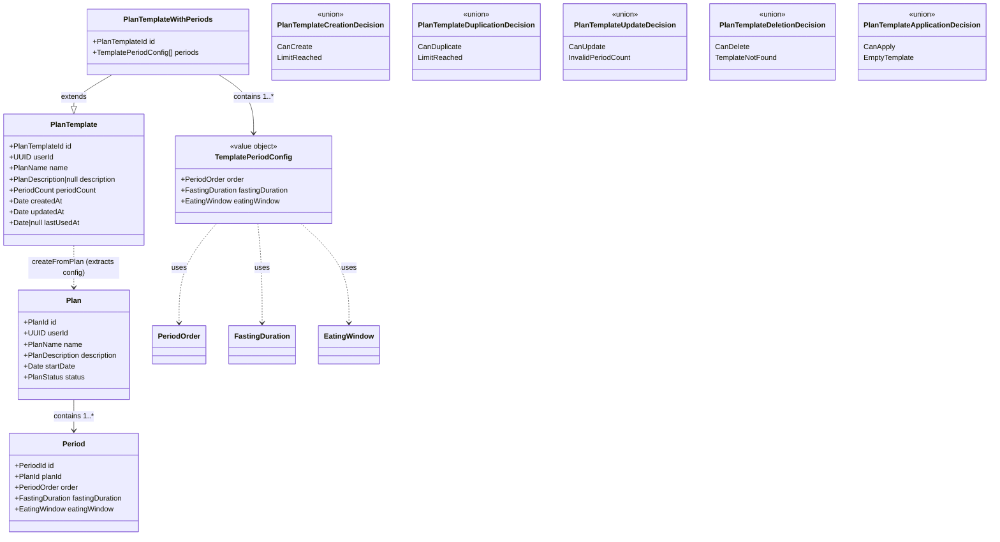

# Functional Domain Design: Plan Templates

> **Source**: Saved Plans Feature Specification | **Generated**: 2026-02-08 | **Status**: Pending Review

## 1. Executive Summary

Plan Templates allows users to persist customized fasting plan configurations as reusable blueprints. A template captures the structural blueprint of a plan — name, description, and period configurations (fasting duration + eating window per period) — without dates or status. When a user wants to start a new plan from a template, the system combines the template's period configs with a chosen start date to calculate all period dates, effectively creating a new Plan from the blueprint. Once a plan is created from a template, the two are completely independent — the plan can be freely edited without affecting the template.

This feature introduces a new `PlanTemplate` aggregate (with `TemplatePeriodConfig` children) that is independent of the existing `Plan` lifecycle. Templates are created from existing plans via a "Save as Template" action, and can be managed (renamed, edited, duplicated, deleted) independently.

## 2. Design Principles

This design adheres to the following functional domain modeling principles:

### 2.1 Closed World Assumption

All possible states are explicitly modeled. The compiler enforces completeness.

| Principle               | Implementation                                                  |
| ----------------------- | --------------------------------------------------------------- |
| Exhaustive matching     | All pattern matches use `Match.exhaustive` - no `default` cases |
| No stringly-typed enums | All enums use `S.Literal` union, never `S.String`               |
| Compile-time safety     | Adding a variant causes compile errors at all switch sites      |
| No hidden states        | No `else` branches that hide bugs                               |

### 2.2 Functional Core / Imperative Shell

Separation of pure business logic from I/O operations.

| Layer                | Responsibility                         | Characteristics                                 |
| -------------------- | -------------------------------------- | ----------------------------------------------- |
| **Functional Core**  | Business logic, validations, decisions | Pure functions, no I/O, deterministic, testable |
| **Imperative Shell** | Database, HTTP, clock, external APIs   | Effect-based, dependency injection              |

> **Clock Rule**: Shell code that needs the current time MUST use `Clock.currentTimeMillis` from Effect,
> never `new Date()`. `new Date()` is an implicit side effect that breaks testability (cannot be controlled
> with `TestClock`). Core functions receive `now: Date` as a parameter — they never access the clock directly.

**Core functions in this design**:

- `decidePlanTemplateCreation` — validates whether a template can be created (limit check)
- `decidePlanTemplateDuplication` — validates whether a template can be duplicated (limit check)
- `decidePlanTemplateUpdate` — validates period count for template edits
- `decidePlanTemplateDeletion` — validates existence/ownership for deletion
- `decidePlanTemplateApplication` — validates template has period configs before apply
- `extractTemplateFromPlan` — pure extraction of period configs from a plan's periods
- `buildDuplicateName` — generates "Copy of {name}" with truncation to max length

**Shell operations in this design**:

- `getPlanTemplateCount` — count user's templates from DB
- `getPlanTemplateWithPeriods` — load template from DB
- `getPlanWithPeriods` — load source plan from DB (existing repo)
- `persistPlanTemplate` — write template + periods to DB
- `deletePlanTemplate` — remove template from DB
- `updatePlanTemplate` — update template metadata/periods in DB
- `touchPlanTemplate` — update `lastUsedAt` timestamp when template is applied

### 2.3 Validation Layers

> "Validate at the boundary, trust inside"

The architecture defines **4 mandatory validation layers**:

| Layer                       | Location            | Responsibility                  | Validates                             |
| --------------------------- | ------------------- | ------------------------------- | ------------------------------------- |
| **1. Input Schema**         | Request Schema      | Parse & transform incoming JSON | INPUT (string → Date, etc.)           |
| **2. Domain Validation**    | Functional Core     | Pure business rules             | LOGIC (no I/O)                        |
| **3. Service Coordination** | Application Service | Orchestrate validation + repo   | FLOW (returns typed errors)           |
| **4. Repository Output**    | Repository          | Validate DB returns             | OUTPUT (trust input, validate output) |

**Checklist**:

- [ ] Request schema transforms and validates input before handler
- [ ] Domain service (`PlanTemplateDomainService`) contains pure business rules (testable)
- [ ] Application service coordinates validation + repository
- [ ] Repository validates output from DB, trusts input from service

### 2.4 Data Seams

Architectural boundaries where data transforms between layers.

| Seam            | From                    | To                      | Transformation              |
| --------------- | ----------------------- | ----------------------- | --------------------------- |
| API → Domain    | Request JSON            | PlanTemplateCreation    | Schema validation + brands  |
| Domain → DB     | PlanTemplate + periods  | DB insert rows          | Domain → record schemas     |
| DB → Domain     | DB result rows          | PlanTemplate + periods  | Record → domain decode      |
| Plan → Template | PlanWithPeriods         | Template period configs | Extract configs, drop dates |

## 3. Type Justification

Each type must declare its category and justification using the Decision Flowchart:

```
Is it a single primitive with constraints?
→ YES: Brand.refined (dm-create-branded-type)

Is it multiple fields that always go together?
→ YES: S.Class Value Object (dm-create-value-object)

Are all variants the same shape?
→ YES: S.Literal Enum (dm-create-literal-enum)

Do variants have different data?
→ YES: Data.TaggedEnum (dm-create-tagged-enum)

Does it need identity and lifecycle?
→ YES: S.Class Entity (dm-create-entity)
```

| Type                              | Category     | Skill                    | Justification                                                                        |
| --------------------------------- | ------------ | ------------------------ | ------------------------------------------------------------------------------------ |
| `PlanTemplateId`                  | Brand        | `dm-create-branded-type` | Single primitive (UUID string) with format constraint — identifies a plan template   |
| `TemplatePeriodConfig`            | Value Object | `dm-create-value-object` | Multiple fields (order, fastingDuration, eatingWindow) that always go together — no identity needed (pure config) |
| `PlanTemplate`                    | Entity       | `dm-create-entity`       | Has identity (PlanTemplateId) and lifecycle (create, edit, delete, use)               |
| `PlanTemplateWithPeriods`         | Entity       | `dm-create-entity`       | Aggregate root — PlanTemplate with its child TemplatePeriodConfig collection         |
| `PlanTemplateCreationDecision`    | Tagged Enum  | `dm-create-tagged-enum`  | Variants have different data: CanCreate vs LimitReached                              |
| `PlanTemplateDuplicationDecision` | Tagged Enum  | `dm-create-tagged-enum`  | Variants have different data: CanDuplicate vs LimitReached                           |
| `PlanTemplateUpdateDecision`      | Tagged Enum  | `dm-create-tagged-enum`  | Variants have different data: CanUpdate vs InvalidPeriodCount                         |
| `PlanTemplateDeletionDecision`    | Tagged Enum  | `dm-create-tagged-enum`  | Variants have different data: CanDelete vs TemplateNotFound                           |
| `PlanTemplateApplicationDecision` | Tagged Enum  | `dm-create-tagged-enum`  | Variants have different data: CanApply vs EmptyTemplate                               |

**Reused Types** (from existing plan domain):

| Type              | Source          | Justification                          |
| ----------------- | --------------- | -------------------------------------- |
| `PlanName`        | `plan.model.ts` | Same name constraint (1-100 chars)     |
| `PlanDescription` | `plan.model.ts` | Same description constraint (0-500 chars) |
| `PeriodOrder`     | `plan.model.ts` | Same ordering constraint (1-31)        |
| `PeriodCount`     | `plan.model.ts` | Same count constraint (1-31)           |
| `FastingDuration` | `plan.model.ts` | Same duration constraint (1-168h, 15-min increments) |
| `EatingWindow`    | `plan.model.ts` | Same window constraint (1-24h, 15-min increments) |

**Branded Type Pattern**:

> The codebase uses **two branding patterns**: UUID IDs use `S.UUID.pipe(S.brand('Name'))` (schema-based branding — `S.UUID` already validates format, so `Brand.refined` would be redundant). Value types with custom validation (e.g., `FastingDuration`, `PlanName`) use `Brand.refined<T>(predicate, errorFn)`. This is an established convention — see `PlanId`/`PeriodId` vs `FastingDuration`/`EatingWindow` in `plan.model.ts`.

**Smart Constructors**: Not needed for this module. UUID-branded IDs inherit validation from `S.UUID`. The `TemplatePeriodConfig` VO has no cross-field validation. Smart constructors (`dm-create-smart-constructors`) are reserved for types with complex validation logic (e.g., `PeriodDateRange` with 6 phase-ordering invariants).

## 4. Domain Components

### 4.1 Entities

| Entity                    | ID Type          | Fields                                                                                                                                                         | Notes                        |
| ------------------------- | ---------------- | -------------------------------------------------------------------------------------------------------------------------------------------------------------- | ---------------------------- |
| `PlanTemplate`            | `PlanTemplateId` | `id`, `userId` (UUID), `name` (PlanName), `description` (PlanDescription \| null), `periodCount` (PeriodCount), `createdAt`, `updatedAt`, `lastUsedAt` (Date \| null) | Root aggregate for templates |
| `PlanTemplateWithPeriods` | `PlanTemplateId` | All `PlanTemplate` fields + `periods: TemplatePeriodConfig[]`                                                                                                  | Aggregate with child periods |

> **Design decision**: Templates are pure blueprints — they do not reference the source plan they were created from. Once created, a template stands on its own. Similarly, when a plan is created from a template, the plan does not reference the template. This keeps both entities independent and avoids stale references.

### 4.2 Value Objects

| Value Object           | Fields                                                                   | Validation                            | Smart Constructor              |
| ---------------------- | ------------------------------------------------------------------------ | ------------------------------------- | ------------------------------ |
| `TemplatePeriodConfig` | `order` (PeriodOrder), `fastingDuration` (FastingDuration), `eatingWindow` (EatingWindow) | All fields use existing branded types | No (each field self-validates) |

> **Design decision**: `TemplatePeriodConfig` has **no identity field** — it is a pure value object identified by its `order` position within the parent aggregate. The DB table has an auto-generated `id` PK (persistence concern), but the domain model doesn't expose it. This follows the Decision Flowchart: no identity + no lifecycle = Value Object. Compare with `PeriodConfig` in `plan.model.ts` which similarly only has `fastingDuration` + `eatingWindow`.

### 4.3 Enumerations

#### Literal Enums (same structure for all variants)

No new literal enums needed. Templates have no status lifecycle (unlike Plans with InProgress/Completed/Cancelled).

#### Tagged Enums (different data per variant)

| Enum                                | Variants                                 | Notes                              |
| ----------------------------------- | ---------------------------------------- | ---------------------------------- |
| `PlanTemplateCreationDecision`      | `CanCreate`, `LimitReached`              | Controls "Save as Template" action |
| `PlanTemplateDuplicationDecision`   | `CanDuplicate`, `LimitReached`           | Controls "Duplicate" action        |
| `PlanTemplateUpdateDecision`        | `CanUpdate`, `InvalidPeriodCount`        | Controls "Edit" action             |
| `PlanTemplateDeletionDecision`      | `CanDelete`, `TemplateNotFound`          | Controls "Delete" action           |
| `PlanTemplateApplicationDecision`   | `CanApply`, `EmptyTemplate`              | Controls "Apply" action            |

<details>
<summary>Tagged Enum Details</summary>

**PlanTemplateCreationDecision**:

- `CanCreate`: `{}` — no additional data needed, proceed with creation
- `LimitReached`: `{ currentCount: number, maxTemplates: number }` — user has hit the limit

**PlanTemplateDuplicationDecision**:

- `CanDuplicate`: `{}` — no additional data needed, proceed with duplication
- `LimitReached`: `{ currentCount: number, maxTemplates: number }` — user has hit the limit

**PlanTemplateUpdateDecision**:

- `CanUpdate`: `{}` — period count within valid range, proceed with update
- `InvalidPeriodCount`: `{ periodCount: number, minPeriods: number, maxPeriods: number }` — count out of 1-31 bounds

**PlanTemplateDeletionDecision**:

- `CanDelete`: `{}` — template exists and belongs to user, proceed
- `TemplateNotFound`: `{ planTemplateId: PlanTemplateId }` — template does not exist or is not owned by user

**PlanTemplateApplicationDecision**:

- `CanApply`: `{ periodConfigs: TemplatePeriodConfig[] }` — template valid, carries configs for downstream plan creation
- `EmptyTemplate`: `{ planTemplateId: PlanTemplateId }` — template has no period configs

</details>

### 4.4 Domain Errors

| Error                                 | Fields                                               | Trigger                                        |
| ------------------------------------- | ---------------------------------------------------- | ---------------------------------------------- |
| `PlanTemplateNotFoundError`           | `message`, `userId`, `planTemplateId`                | Template not found or not owned by user        |
| `PlanTemplateLimitReachedError`       | `message`, `currentCount`, `maxTemplates`            | User tries to create/duplicate beyond 20 limit |
| `PlanTemplateInvalidPeriodCountError` | `message`, `periodCount`, `minPeriods`, `maxPeriods` | Period count out of 1-31 range                 |

### 4.5 Contracts (Use-Case Interfaces)

Every use case that mutates state MUST have a contract (Rule 6). Read-only operations (`getPlanTemplate`, `listPlanTemplates`) do not need contracts.

> **Input Type Rule**: Contract inputs MUST use `S.Struct` with branded types.

| Contract                            | Input Type                       | Decision ADT                        | Skill                | File                                              |
| ----------------------------------- | -------------------------------- | ----------------------------------- | -------------------- | ------------------------------------------------- |
| `PlanTemplateCreationContract`      | `PlanTemplateCreationInput`      | `PlanTemplateCreationDecision`      | `dm-create-contract` | `domain/contracts/plan-template-creation.ts`      |
| `PlanTemplateDuplicationContract`   | `PlanTemplateDuplicationInput`   | `PlanTemplateDuplicationDecision`   | `dm-create-contract` | `domain/contracts/plan-template-duplication.ts`   |
| `PlanTemplateUpdateContract`        | `PlanTemplateUpdateInput`        | `PlanTemplateUpdateDecision`        | `dm-create-contract` | `domain/contracts/plan-template-update.ts`        |
| `PlanTemplateDeletionContract`      | `PlanTemplateDeletionInput`      | `PlanTemplateDeletionDecision`      | `dm-create-contract` | `domain/contracts/plan-template-deletion.ts`      |
| `PlanTemplateApplicationContract`   | `PlanTemplateApplicationInput`   | `PlanTemplateApplicationDecision`   | `dm-create-contract` | `domain/contracts/plan-template-application.ts`   |

<details>
<summary>Contract Details</summary>

**PlanTemplateCreationContract**:

- Input: `PlanTemplateCreationInput` — `currentTemplateCount: S.Number`, `maxTemplates: S.Number`
- Decision variants:
  - `CanCreate`: `{}` — limit not reached, proceed
  - `LimitReached`: `{ currentCount: number, maxTemplates: number }` — at or over limit

**PlanTemplateDuplicationContract**:

- Input: `PlanTemplateDuplicationInput` — `currentTemplateCount: S.Number`, `maxTemplates: S.Number`
- Decision variants:
  - `CanDuplicate`: `{}` — limit not reached, proceed
  - `LimitReached`: `{ currentCount: number, maxTemplates: number }` — at or over limit

**PlanTemplateUpdateContract**:

- Input: `PlanTemplateUpdateInput` — `periodCount: S.Number`
- Decision variants:
  - `CanUpdate`: `{}` — period count within valid range
  - `InvalidPeriodCount`: `{ periodCount: number, minPeriods: number, maxPeriods: number }` — count out of 1-31 bounds

**PlanTemplateDeletionContract**:

- Input: `PlanTemplateDeletionInput` — `planTemplateId: PlanTemplateId`
- Decision variants:
  - `CanDelete`: `{}` — template exists and belongs to user, proceed
  - `TemplateNotFound`: `{ planTemplateId: PlanTemplateId }` — template does not exist or is not owned by user
- Notes: Thin contract — existence is verified in collection phase, but the contract formalizes the operation boundary per Rule 6.

**PlanTemplateApplicationContract**:

- Input: `PlanTemplateApplicationInput` — `planTemplateId: PlanTemplateId`, `periodConfigs: S.Array(TemplatePeriodConfig)`
- Decision variants:
  - `CanApply`: `{ periodConfigs: TemplatePeriodConfig[] }` — template valid, carries configs for downstream plan creation
  - `EmptyTemplate`: `{ planTemplateId: PlanTemplateId }` — template has no period configs
- Notes: `startDate` is passed directly to `PlanService.createPlan` in the shell; it is not needed to decide template validity. Plan creation rules (active plan limit, cycle conflict) are evaluated downstream by existing `PlanCreationDecision` in `PlanService`.

</details>

### 4.6 Services

#### Domain Services (Core — pure logic)

| Service                     | Methods                                                                                                                        | Skill                      | Notes                             |
| --------------------------- | ------------------------------------------------------------------------------------------------------------------------------ | -------------------------- | --------------------------------- |
| `PlanTemplateDomainService` | `decidePlanTemplateCreation`, `decidePlanTemplateDuplication`, `decidePlanTemplateUpdate`, `decidePlanTemplateDeletion`, `decidePlanTemplateApplication`, `extractTemplateFromPlan`, `buildDuplicateName` | `dm-create-domain-service` | All pure functions in one service |

> **Why one service instead of two?** The `dm-create-validation-service` skill produces `Effect<void, DomainError>` methods, but our `decide*` methods return ADTs (pure, no Effect). This matches the existing `PlanValidationService` pattern which also uses pure functions wrapped in `Effect.Service`. With 7 pure functions total, splitting into two services would be over-engineering. The `decide*` methods and utility functions live together following the `dm-create-domain-service` pattern.

#### Application Services (Shell — orchestration)

| Service               | Methods                                                                                                                                       | Dependencies                                                                        | Notes                     |
| --------------------- | --------------------------------------------------------------------------------------------------------------------------------------------- | ----------------------------------------------------------------------------------- | ------------------------- |
| `PlanTemplateService` | `createFromPlan`, `getPlanTemplate`, `listPlanTemplates`, `updatePlanTemplate`, `deletePlanTemplate`, `duplicatePlanTemplate`, `applyPlanTemplate` | `PlanTemplateRepository`, `PlanTemplateDomainService`, `PlanService` | Three Phases orchestrator |

### 4.7 Functional Core Flows (Three Phases)

Each operation that involves I/O → Logic → I/O MUST document its Three Phases pattern.

| Flow                    | Collection (Shell)                                  | Logic (Core)                                                    | Persistence (Shell)                                        | Skill                            |
| ----------------------- | --------------------------------------------------- | --------------------------------------------------------------- | ---------------------------------------------------------- | -------------------------------- |
| `createFromPlan`        | Load plan with periods + count templates            | `decidePlanTemplateCreation` + `extractTemplateFromPlan`        | Persist plan template + periods                            | `dm-create-functional-core-flow` |
| `duplicatePlanTemplate` | Load plan template with periods + count templates   | `decidePlanTemplateDuplication` + `buildDuplicateName`          | Persist duplicate template + periods                       | `dm-create-functional-core-flow` |
| `updatePlanTemplate`    | Load plan template                                  | `decidePlanTemplateUpdate`                                      | Persist updated template + periods                         | `dm-create-functional-core-flow` |
| `deletePlanTemplate`    | Load plan template (verify exists)                  | `decidePlanTemplateDeletion`                                    | Delete template (cascade deletes periods)                  | `dm-create-functional-core-flow` |
| `applyPlanTemplate`     | Load plan template with periods                     | `decidePlanTemplateApplication` → delegate to `PlanService`     | Touch `lastUsedAt` + create plan via existing flow         | `dm-create-functional-core-flow` |

### 4.8 Additional Components

#### Semantic Wrappers

None needed — templates don't go through pipeline stages.

#### Boundary Mappers

| Mapper                          | Direction    | External                                        | Domain                    | Notes                 |
| ------------------------------- | ------------ | ----------------------------------------------- | ------------------------- | --------------------- |
| `decodePlanTemplate`            | DB → Domain  | `PlanTemplateRecord` (DB DTO)                   | `PlanTemplate`            | Validates output      |
| `decodeTemplatePeriodConfig`    | DB → Domain  | `TemplatePeriodRecord` (DB DTO)                 | `TemplatePeriodConfig`    | Strips DB id/FK       |
| `decodePlanTemplateWithPeriods` | DB → Domain  | `PlanTemplateRecord` + `TemplatePeriodRecord[]` | `PlanTemplateWithPeriods` | Aggregate decode      |

> **Why decode-only (no `toExternal`)?** The `dm-create-boundary-mapper` skill defines bidirectional mappers (`fromExternal` + `toExternal`). However, the existing codebase only implements the decode direction (DB → Domain). Domain → DB conversion is handled implicitly by Drizzle in the repository layer (repositories write domain values directly to insert/update statements). Adding explicit `toExternal` mappers would be inconsistent with the established `mappers.ts` pattern — see `decodePlan`, `decodePeriod`, `decodePlanWithPeriods` in the existing plan repository.

#### Data Seams / Pipeline Stages

| Pipeline         | Stages (Loader→Core→Persist)                             | Notes                           |
| ---------------- | -------------------------------------------------------- | ------------------------------- |
| Create from Plan | LoadPlan → ExtractTemplate → PersistPlanTemplate         | Plan periods → template configs |
| Apply Template   | LoadTemplate → CreatePlan (existing) → TouchTemplate     | Template → new active plan      |

## 5. Type Diagram



## 6. Architecture Phases

This design follows the **Functional Core / Imperative Shell** architecture. Implementation proceeds in phases, each building on the previous.

### Phase 1: Functional Core (Pure Logic)

> Domain types, pure services, ADTs, contracts, reified decisions

Phase 1 steps MUST follow this order (dependencies flow top-to-bottom):

| Step | Component                                                                                                            | Skill                          | File                                                  | Notes                                                                                                                     |
| ---- | -------------------------------------------------------------------------------------------------------------------- | ------------------------------ | ----------------------------------------------------- | ------------------------------------------------------------------------------------------------------------------------- |
| 1.a  | Constants (`MAX_PLAN_TEMPLATES`) + Branded Type (`PlanTemplateId`)                                                   | `dm-create-branded-type`       | `domain/plan-template.model.ts`                       | Reuse `PlanName`, `PlanDescription`, `PeriodOrder`, `FastingDuration`, `EatingWindow`, `PeriodCount` from `plan.model.ts`. UUID ID uses `S.UUID.pipe(S.brand(...))` pattern. |
| 1.b  | Value Object (`TemplatePeriodConfig`)                                                                                | `dm-create-value-object`       | `domain/plan-template.model.ts`                       | Pure VO: `order` + `fastingDuration` + `eatingWindow` — no ID field (DB `id` is a persistence concern)                   |
| 1.c  | Entity (`PlanTemplate`, `PlanTemplateWithPeriods`)                                                                   | `dm-create-entity`             | `domain/plan-template.model.ts`                       | Root aggregate + aggregate with children                                                                                  |
| 1.d  | Tagged Enums (`PlanTemplateCreationDecision`, `PlanTemplateDuplicationDecision`, `PlanTemplateUpdateDecision`, `PlanTemplateDeletionDecision`, `PlanTemplateApplicationDecision`) | `dm-create-tagged-enum` | `domain/plan-template.model.ts` | Decision ADTs for all mutating use cases |
| 1.e  | Domain Errors (`PlanTemplateNotFoundError`, `PlanTemplateLimitReachedError`, `PlanTemplateInvalidPeriodCountError`)  | `dm-create-domain-error`       | `domain/errors.ts`                                    | Add to existing errors file                                                                                               |
| 1.f  | Contract: `PlanTemplateCreationContract`                                                                             | `dm-create-contract`           | `domain/contracts/plan-template-creation.ts`          | Limit check decision                                                                                                      |
| 1.g  | Contract: `PlanTemplateDuplicationContract`                                                                          | `dm-create-contract`           | `domain/contracts/plan-template-duplication.ts`       | Limit check decision                                                                                                      |
| 1.h  | Contract: `PlanTemplateUpdateContract`                                                                               | `dm-create-contract`           | `domain/contracts/plan-template-update.ts`            | Period count validation decision                                                                                          |
| 1.i  | Contract: `PlanTemplateDeletionContract`                                                                             | `dm-create-contract`           | `domain/contracts/plan-template-deletion.ts`          | Existence check decision (thin contract per Rule 6)                                                                       |
| 1.j  | Contract: `PlanTemplateApplicationContract`                                                                          | `dm-create-contract`           | `domain/contracts/plan-template-application.ts`       | Template validity decision; plan creation delegated to existing `PlanCreationDecision`                                     |
| 1.k  | Domain Service: `PlanTemplateDomainService`                                                                          | `dm-create-domain-service`     | `domain/services/plan-template.service.ts`            | All pure functions: `decidePlanTemplateCreation`, `decidePlanTemplateDuplication`, `decidePlanTemplateUpdate`, `decidePlanTemplateDeletion`, `decidePlanTemplateApplication`, `extractTemplateFromPlan`, `buildDuplicateName` |

**Shared Types** (reused from existing plan domain — pass the Orphan Test):

| Type              | Location        | Skill | Reason                                               |
| ----------------- | --------------- | ----- | ---------------------------------------------------- |
| `PlanName`        | `plan.model.ts` | —     | Same name constraint (1-100 chars)                   |
| `PlanDescription` | `plan.model.ts` | —     | Same description constraint (0-500 chars)            |
| `PeriodOrder`     | `plan.model.ts` | —     | Same ordering constraint (1-31)                      |
| `PeriodCount`     | `plan.model.ts` | —     | Same count constraint (1-31)                         |
| `FastingDuration` | `plan.model.ts` | —     | Same duration constraint (1-168h, 15-min increments) |
| `EatingWindow`    | `plan.model.ts` | —     | Same window constraint (1-24h, 15-min increments)    |

**Command**: `"implement phase 1"`

### Phase 2: Shell APIs (HTTP Layer)

> Request/Response schemas, handlers, validation, boundary mappers

| Step | Component                                                                                                                   | Type            | File                                    | Notes                                                                           |
| ---- | --------------------------------------------------------------------------------------------------------------------------- | --------------- | --------------------------------------- | ------------------------------------------------------------------------------- |
| 2.1  | `CreatePlanTemplateRequestSchema`                                                                                           | Request Schema  | `api/schemas/requests.ts`               | `planId: UUID` (source plan to save as template)                                |
| 2.2  | `UpdatePlanTemplateRequestSchema`                                                                                           | Request Schema  | `api/schemas/requests.ts`               | `name?`, `description?`, `periods?`                                             |
| 2.3  | `ApplyPlanTemplateRequestSchema`                                                                                            | Request Schema  | `api/schemas/requests.ts`               | `startDate: Date`                                                               |
| 2.4  | `PlanTemplateResponseSchema`                                                                                                | Response Schema | shared or `api/schemas/responses.ts`    | Card data: id, name, description, periodCount, lastUsedAt, createdAt, updatedAt |
| 2.5  | `PlanTemplateWithPeriodsResponseSchema`                                                                                     | Response Schema | shared or `api/schemas/responses.ts`    | Full detail: includes period configs                                            |
| 2.6  | `PlanTemplateNotFoundErrorSchema`, `PlanTemplateLimitReachedErrorSchema`, `PlanTemplateInvalidPeriodCountErrorSchema`        | Error Schema    | `api/schemas/errors.ts`                 | HTTP error responses                                                            |
| 2.7  | `PlanTemplateApiGroup`                                                                                                      | API Definition  | `api/plan-template-api.ts`              | Endpoint definitions (see below)                                                |
| 2.8  | `PlanTemplateApiLive`                                                                                                       | Handler         | `api/plan-template-api-handler.ts`      | Error mapping with `catchTags`                                                  |

**Endpoints**:

| Method   | Path                                | Handler                | Description                                                           |
| -------- | ----------------------------------- | ---------------------- | --------------------------------------------------------------------- |
| `POST`   | `/v1/plan-templates`                | `createPlanTemplate`   | Save a plan as template (from existing plan ID)                       |
| `GET`    | `/v1/plan-templates`                | `listPlanTemplates`    | List all plan templates (card data, ordered by lastUsedAt/updatedAt)  |
| `GET`    | `/v1/plan-templates/:id`            | `getPlanTemplate`      | Get plan template with period configs                                 |
| `PATCH`  | `/v1/plan-templates/:id`            | `updatePlanTemplate`   | Update name, description, and/or periods                              |
| `DELETE` | `/v1/plan-templates/:id`            | `deletePlanTemplate`   | Delete a plan template                                                |
| `POST`   | `/v1/plan-templates/:id/duplicate`  | `duplicatePlanTemplate`| Duplicate a plan template                                             |
| `POST`   | `/v1/plan-templates/:id/apply`      | `applyPlanTemplate`    | Create a new active plan from this template                           |

**Handler Error Mapping** (mandatory):

```typescript
.pipe(Effect.catchTags({
  PlanTemplateNotFoundError: (e) => Effect.fail(new PlanTemplateNotFoundErrorSchema({ message: e.message })),
  PlanTemplateLimitReachedError: (e) => Effect.fail(new PlanTemplateLimitReachedErrorSchema({ message: e.message })),
  PlanTemplateInvalidPeriodCountError: (e) => Effect.fail(new PlanTemplateInvalidPeriodCountErrorSchema({ message: e.message })),
  // Pass through existing plan errors when applying template:
  PlanAlreadyActiveError: (e) => Effect.fail(new PlanAlreadyActiveErrorSchema({ message: e.message })),
  ActiveCycleExistsError: (e) => Effect.fail(new ActiveCycleExistsErrorSchema({ message: e.message })),
}))
```

**Command**: `"implement phase 2"`

### Phase 3: Persistence Layer (Repository)

> Database access, output validation, record schemas

| Step | Component                                                   | Type              | File                                       | Notes                                                                             |
| ---- | ----------------------------------------------------------- | ----------------- | ------------------------------------------ | --------------------------------------------------------------------------------- |
| 3.1  | DB Schema: `planTemplatesTable`, `templatePeriodsTable`     | Drizzle schema    | `db/schema.ts`                             | New tables (see below)                                                            |
| 3.2  | Migration                                                   | Drizzle migration | Generated                                  | `bun run db:generate`                                                             |
| 3.3  | `PlanTemplateRecordSchema`, `TemplatePeriodRecordSchema`    | Record Schema     | `repositories/schemas.ts`                  | DB output validation                                                              |
| 3.4  | Boundary Mappers                                            | Mapper functions  | `repositories/mappers.ts`                  | `decodePlanTemplate`, `decodeTemplatePeriodConfig`, `decodePlanTemplateWithPeriods`|
| 3.5  | `PlanTemplateRepository`                                    | Repository        | `repositories/plan-template.repository.ts` | CRUD + count + touch                                                              |

**Database Tables**:

```sql
-- plan_templates table
CREATE TABLE plan_templates (
  id UUID PRIMARY KEY DEFAULT gen_random_uuid(),
  user_id UUID NOT NULL REFERENCES users(id),
  name VARCHAR(100) NOT NULL,
  description VARCHAR(500),
  period_count INTEGER NOT NULL,
  created_at TIMESTAMPTZ NOT NULL DEFAULT NOW(),
  updated_at TIMESTAMPTZ NOT NULL DEFAULT NOW(),
  last_used_at TIMESTAMPTZ,

  -- Indexes
  INDEX idx_plan_templates_user_id ON (user_id),

  -- Constraints
  CHECK chk_plan_template_period_count: period_count >= 1 AND period_count <= 31
);

-- template_periods table
CREATE TABLE template_periods (
  id UUID PRIMARY KEY DEFAULT gen_random_uuid(),
  plan_template_id UUID NOT NULL REFERENCES plan_templates(id) ON DELETE CASCADE,
  "order" INTEGER NOT NULL,
  fasting_duration NUMERIC(5,2) NOT NULL,
  eating_window NUMERIC(5,2) NOT NULL,
  created_at TIMESTAMPTZ NOT NULL DEFAULT NOW(),
  updated_at TIMESTAMPTZ NOT NULL DEFAULT NOW(),

  -- Indexes
  UNIQUE INDEX idx_template_periods_plan_order ON (plan_template_id, "order"),

  -- Constraints
  CHECK chk_template_period_order_range: "order" >= 1 AND "order" <= 31,
  CHECK chk_template_fasting_duration_range: fasting_duration >= 1 AND fasting_duration <= 168,
  CHECK chk_template_eating_window_range: eating_window >= 1 AND eating_window <= 24
);
```

**Repository Methods**:

| Method                                                              | Returns                                                               | Notes                                                |
| ------------------------------------------------------------------- | --------------------------------------------------------------------- | ---------------------------------------------------- |
| `createPlanTemplate(userId, name, description, periods)`            | `Effect<PlanTemplateWithPeriods, PlanTemplateRepositoryError>`        | Insert in transaction                                |
| `getPlanTemplateById(userId, planTemplateId)`                       | `Effect<Option<PlanTemplate>, PlanTemplateRepositoryError>`           | With ownership check                                 |
| `getPlanTemplateWithPeriods(userId, planTemplateId)`                | `Effect<Option<PlanTemplateWithPeriods>, PlanTemplateRepositoryError>`| Full aggregate                                       |
| `getAllPlanTemplates(userId)`                                       | `Effect<PlanTemplate[], PlanTemplateRepositoryError>`                 | Ordered by `COALESCE(last_used_at, updated_at) DESC` |
| `countPlanTemplates(userId)`                                        | `Effect<number, PlanTemplateRepositoryError>`                         | For limit check                                      |
| `updatePlanTemplate(userId, planTemplateId, updates, periods?)`     | `Effect<PlanTemplateWithPeriods, PlanTemplateRepositoryError>`        | Partial update + optional period replacement         |
| `deletePlanTemplate(userId, planTemplateId)`                        | `Effect<void, PlanTemplateRepositoryError>`                           | Cascade deletes periods                              |
| `touchLastUsedAt(planTemplateId)`                                   | `Effect<void, PlanTemplateRepositoryError>`                           | Update `last_used_at` to now                         |
| `deleteAllByUserId(userId)`                                         | `Effect<void, PlanTemplateRepositoryError>`                           | For account deletion                                 |

**Command**: `"implement phase 3"`

### Phase 4: Coordinator Layer (Orchestration)

> Application services, workflows, Three Phases composition

| Step | Component             | Skill                            | File                                | Notes                                          |
| ---- | --------------------- | -------------------------------- | ----------------------------------- | ---------------------------------------------- |
| 4.1  | `PlanTemplateService` | `dm-create-functional-core-flow` | `services/plan-template.service.ts` | Three Phases: Collection → Logic → Persistence |

**Application Service Methods**:

| Method                                                  | Three Phases                                                                     | Notes                          |
| ------------------------------------------------------- | -------------------------------------------------------------------------------- | ------------------------------ |
| `createFromPlan(userId, planId)`                        | Load plan + count → decidePlanTemplateCreation + extractTemplate → persist       | Save existing plan as template |
| `getPlanTemplate(userId, planTemplateId)`               | Load from repo → (none) → (none)                                                 | Simple read                    |
| `listPlanTemplates(userId)`                             | Load all from repo → (none) → (none)                                             | List with ordering             |
| `updatePlanTemplate(userId, planTemplateId, updates)`   | Load existing → `decidePlanTemplateUpdate` → persist updates                     | Edit template                  |
| `deletePlanTemplate(userId, planTemplateId)`            | Load existing → `decidePlanTemplateDeletion` → delete                             | Remove template                |
| `duplicatePlanTemplate(userId, planTemplateId)`         | Load source + count → decideDuplication + buildDuplicateName → persist copy      | Duplicate template             |
| `applyPlanTemplate(userId, planTemplateId, startDate)`  | Load template → `decidePlanTemplateApplication` → delegate to `PlanService` + touch lastUsedAt | Create plan from template      |

**Command**: `"implement phase 4"`

### Implementation Order

```
Phase 1 (Core)     ──────────────────────────────────►
                   Types, Errors, Pure Services

Phase 2 (API)      ──────────────────────────────────►
                   Schemas, Handlers (depends on Core types)

Phase 3 (Repo)     ──────────────────────────────────►
                   DB Tables, Repository (depends on Core types)

Phase 4 (Coord)    ──────────────────────────────────►
                   App Service (depends on Core + Repo)
```

### Files to Create

```
api/src/features/plan/
├── domain/
│   ├── plan-template.model.ts                       # NEW: Constants, PlanTemplateId, TemplatePeriodConfig (VO), PlanTemplate, PlanTemplateWithPeriods, Decision ADTs
│   ├── errors.ts                                    # EDIT: Add PlanTemplateNotFoundError, PlanTemplateLimitReachedError, PlanTemplateInvalidPeriodCountError
│   ├── index.ts                                     # EDIT: Re-export plan-template model + new contracts + new service
│   ├── contracts/
│   │   ├── index.ts                                 # EDIT: Re-export new contracts
│   │   ├── plan-template-creation.ts                # NEW: PlanTemplateCreationInput + PlanTemplateCreationDecision
│   │   ├── plan-template-duplication.ts             # NEW: PlanTemplateDuplicationInput + PlanTemplateDuplicationDecision
│   │   ├── plan-template-update.ts                  # NEW: PlanTemplateUpdateInput + PlanTemplateUpdateDecision
│   │   ├── plan-template-deletion.ts                # NEW: PlanTemplateDeletionInput + PlanTemplateDeletionDecision
│   │   └── plan-template-application.ts             # NEW: PlanTemplateApplicationInput + PlanTemplateApplicationDecision
│   └── services/
│       ├── index.ts                                 # EDIT: Re-export new service
│       └── plan-template.service.ts                 # NEW: All pure functions (decide*, extractTemplate, buildDuplicateName)
├── api/
│   ├── plan-template-api.ts                         # NEW: PlanTemplateApiGroup endpoint definitions
│   ├── plan-template-api-handler.ts                 # NEW: Handler implementations
│   └── schemas/
│       ├── requests.ts                              # EDIT: Add plan template request schemas
│       ├── responses.ts                             # EDIT: Add plan template response schemas
│       └── errors.ts                                # EDIT: Add plan template error schemas
├── repositories/
│   ├── schemas.ts                                   # EDIT: Add PlanTemplateRecordSchema, TemplatePeriodRecordSchema
│   ├── mappers.ts                                   # EDIT: Add decodePlanTemplate, decodeTemplatePeriodConfig, decodePlanTemplateWithPeriods
│   ├── plan-template.repository.interface.ts        # NEW: Repository interface
│   └── plan-template.repository.ts                  # NEW: Repository implementation
└── services/
    └── plan-template.service.ts                     # NEW: Application service (Three Phases orchestrator)
```

Additionally:

```
api/src/db/schema.ts                                 # EDIT: Add planTemplatesTable, templatePeriodsTable
shared/src/schemas/plan/responses.ts                 # EDIT: Add PlanTemplateResponseSchema, PlanTemplateWithPeriodsResponseSchema (if shared)
```

## 7. Closed World Checklist

Before implementation, verify:

- [x] All enums use `S.Literal` union (not `S.String`) — no new literal enums needed; reusing existing
- [x] All pattern matches use `Match.exhaustive` — decision ADTs matched exhaustively in Shell
- [x] No `default` or `else` cases that hide bugs — exhaustive matching enforced
- [x] Adding a variant causes compile errors at all switch sites — TaggedEnum enforces this
- [x] No optional fields that depend on other fields — `description` and `lastUsedAt` are nullable but independent
- [x] No boolean discriminators with optional fields — none present

## 8. FC/IS Implementation Checklist

When implementing each phase, verify:

**Phase 1 — Functional Core:**

- [ ] **Constants** live in model file (`MAX_PLAN_TEMPLATES = 20`)
- [ ] **Branded type** `PlanTemplateId` follows `S.UUID.pipe(S.brand(...))` pattern (same as `PlanId`)
- [ ] **Value Object** `TemplatePeriodConfig` has NO identity field (order + fastingDuration + eatingWindow only)
- [ ] **Contracts** exist for all 5 mutating use cases: `creation`, `duplication`, `update`, `deletion`, `application`
- [ ] **Contract inputs** use `S.Struct` with `S.Number` fields (counts are plain numbers, not branded)
- [ ] **Contract ADT variants** use `number` for counts (not branded — they're not entity IDs)
- [ ] **Domain service** (`PlanTemplateDomainService`) includes `FUNCTIONAL CORE` documentation header with Three Phases context
- [ ] **Domain service** exports pure functions both as standalone AND inside Effect.Service wrapper
- [ ] **Domain service** decide methods return TaggedEnum ADTs (CanCreate/LimitReached) — not `Effect<void, DomainError>`

**Phase 2 — Shell APIs:**

- [ ] **Request Schema** validates and transforms input (planId as UUID, periods as typed array)
- [ ] **Handler** maps domain errors to HTTP errors with `catchTags`
- [ ] **Handler** passes through existing plan errors (PlanAlreadyActiveError, ActiveCycleExistsError) when applying template
- [ ] **Response Schema** includes `periodCount` and `lastUsedAt` for card display

**Phase 3 — Persistence:**

- [ ] **Repository** validates output from database, trusts input
- [ ] **Repository** handles `NumericFromString` for fasting_duration and eating_window columns
- [ ] **Repository** ordering uses `COALESCE(last_used_at, updated_at) DESC`
- [ ] **Repository** includes `deleteAllByUserId` for account deletion cascade

**Phase 4 — Orchestration:**

- [ ] **Application Service** coordinates validation and repository, returns typed errors
- [ ] **Application Service** follows Three Phases pattern (Collection → Logic → Persistence)
- [ ] **Application Service** uses `Clock.currentTimeMillis` for `touchLastUsedAt`
- [ ] **Application Service** injects `PlanTemplateDomainService` via `yield*`
- [ ] **Application Service** `applyPlanTemplate` delegates to existing `PlanService.createPlan` for plan creation
- [ ] **Application Service** `dependencies` array includes all domain service `.Default` layers

## 9. Warning Signs Detected

- [x] **Limit message inconsistency**: Spec originally said "50 saved plans" but the intended limit is 20. **Resolution**: Use `MAX_PLAN_TEMPLATES = 20` as the constant; the error message should reference the actual limit.
- [x] **Ordering field**: Using `COALESCE(last_used_at, updated_at)` as a virtual sort key avoids needing a dedicated `sort_position` column.
- [x] **No status lifecycle**: Templates have no status (unlike Plans with InProgress/Completed/Cancelled). This simplifies the model — templates are always "active" until deleted.
- [x] **Template-Plan independence**: Templates are pure blueprints with no back-reference to source plans or forward-reference to created plans. This avoids stale FK references and keeps both entities independent.

## 10. Resolved Questions

1. **~~"In use" badge~~**: Templates are pure blueprints — agnostic to whether a user has an active plan. Once a plan is created from a template, the two are completely independent (the user can edit the plan freely). No "in use" tracking needed.

2. **"Apply" action and existing plan errors**: Pass through existing plan errors (`PlanAlreadyActiveError`, `ActiveCycleExistsError`) — the client already handles them.

3. **Edit periods scope**: Allow full period replacement — user sends the complete new period array (same pattern as plan period update).

4. **Account deletion**: `deleteAllByUserId` added to `PlanTemplateRepository` — will be called from the account deletion flow.

## 11. Next Steps

1. **Review** this document for correctness and completeness
2. **Verify** Type Justification table (Section 3) - each type has correct category
3. **Verify** Closed World Checklist (Section 7) - all items will be satisfied
4. **Verify** FC/IS Implementation Checklist (Section 8) - all layers covered
5. **Implement by phase**:
   - `"implement phase 1"` → Functional Core
   - `"implement phase 2"` → Shell APIs
   - `"implement phase 3"` → Persistence Layer
   - `"implement phase 4"` → Coordinator Layer
   - Or `"implement all"` / `"implement the plan"` → All phases in order

Each phase builds on the previous. Phase 1 (Core) should be implemented first as it defines the domain types used by all other phases.

## 12. Testing Strategy

Each skill template includes test patterns. Tests will be added alongside implementation in each phase:

**Phase 1 — Domain tests** (`domain/__tests__/`):
- `plan-template.model.test.ts`: Branded type validation (`PlanTemplateId`), VO construction (`TemplatePeriodConfig`), entity schema validation, ADT exhaustive matching
- `plan-template.service.test.ts`: Pure function unit tests — `decidePlanTemplateCreation` (CanCreate/LimitReached), `decidePlanTemplateDuplication`, `decidePlanTemplateUpdate` (InvalidPeriodCount), `decidePlanTemplateDeletion` (TemplateNotFound), `decidePlanTemplateApplication` (EmptyTemplate), `extractTemplateFromPlan` (strips dates, preserves order/config), `buildDuplicateName` (truncation at max length)

**Phase 2-4 — Integration tests** (`api/__tests__/`):
- `plan-template-api.test.ts`: Full HTTP lifecycle tests (create, list, get, update, delete, duplicate, apply) against a real database — same pattern as existing `plan-api.test.ts`

> **Core tests are pure** — no mocks needed. Domain service functions are deterministic and testable by direct invocation. Integration tests cover the Shell (API + Repository) end-to-end.

## 13. Collection Phase Data Types

For complex Three Phases flows, the Collection phase output can be modeled as a data carrier type to make the interface between Collection → Logic explicit:

| Flow                    | Collection Output                                                     | Notes                                                  |
| ----------------------- | --------------------------------------------------------------------- | ------------------------------------------------------ |
| `createFromPlan`        | `{ plan: PlanWithPeriods, currentCount: number }`                     | Plan data + template count for limit check             |
| `duplicatePlanTemplate` | `{ template: PlanTemplateWithPeriods, currentCount: number }`         | Source template + template count for limit check       |

> These data carriers are **not formal domain types** — they are local types within the application service, defined inline or as simple interfaces. They make the Three Phases boundary explicit without adding domain model bloat. Simple flows (get, list, delete) pass values directly without a carrier.

---

<details>
<summary>Analysis YAML (reference)</summary>

```yaml
domain_analysis:
  module: PlanTemplates
  description: >
    Plan Templates feature - allows users to save customized
    fasting plan configurations as reusable blueprints.

  entities:
    - name: PlanTemplate
      id_type: PlanTemplateId (UUID branded)
      fields:
        - id: PlanTemplateId
        - userId: UUID
        - name: PlanName (reuse)
        - description: PlanDescription | null (reuse)
        - periodCount: PeriodCount (reuse)
        - createdAt: Date
        - updatedAt: Date
        - lastUsedAt: Date | null
      notes: Root aggregate for templates, no status lifecycle, no source plan reference

    - name: PlanTemplateWithPeriods
      id_type: PlanTemplateId
      fields: PlanTemplate fields + periods: TemplatePeriodConfig[]
      notes: Aggregate with child period configs

  value_objects:
    - name: TemplatePeriodConfig
      fields:
        - order: PeriodOrder (reuse)
        - fastingDuration: FastingDuration (reuse)
        - eatingWindow: EatingWindow (reuse)
      validation: Each field self-validates via branded types
      notes: Pure VO — no identity field. DB id is a persistence concern, not exposed in domain.

  branded_types:
    - name: PlanTemplateId
      base: string (UUID)
      constraint: UUID format (via S.UUID.pipe(S.brand(...)))
      skill: dm-create-branded-type
      notes: Uses schema branding pattern, not Brand.refined (UUID validation inherited from S.UUID)

  tagged_enums:
    - name: PlanTemplateCreationDecision
      variants:
        - CanCreate: {}
        - LimitReached: { currentCount: number, maxTemplates: number }
      skill: dm-create-tagged-enum

    - name: PlanTemplateDuplicationDecision
      variants:
        - CanDuplicate: {}
        - LimitReached: { currentCount: number, maxTemplates: number }
      skill: dm-create-tagged-enum

    - name: PlanTemplateUpdateDecision
      variants:
        - CanUpdate: {}
        - InvalidPeriodCount: { periodCount: number, minPeriods: number, maxPeriods: number }
      skill: dm-create-tagged-enum

    - name: PlanTemplateDeletionDecision
      variants:
        - CanDelete: {}
        - TemplateNotFound: { planTemplateId: PlanTemplateId }
      skill: dm-create-tagged-enum
      notes: Thin contract — existence verified in collection phase

    - name: PlanTemplateApplicationDecision
      variants:
        - CanApply: { periodConfigs: TemplatePeriodConfig[] }
        - EmptyTemplate: { planTemplateId: PlanTemplateId }
      skill: dm-create-tagged-enum
      notes: Plan creation rules delegated to existing PlanCreationDecision

  domain_errors:
    - name: PlanTemplateNotFoundError
      fields: { message: string, userId: string, planTemplateId: PlanTemplateId }
      trigger: Template not found or not owned by user

    - name: PlanTemplateLimitReachedError
      fields: { message: string, currentCount: number, maxTemplates: number }
      trigger: User exceeds 20 template limit

    - name: PlanTemplateInvalidPeriodCountError
      fields: { message: string, periodCount: number, minPeriods: number, maxPeriods: number }
      trigger: Period count out of 1-31 range

  contracts:
    - name: PlanTemplateCreationContract
      input: PlanTemplateCreationInput { currentTemplateCount: number, maxTemplates: number }
      decision: PlanTemplateCreationDecision
      file: domain/contracts/plan-template-creation.ts

    - name: PlanTemplateDuplicationContract
      input: PlanTemplateDuplicationInput { currentTemplateCount: number, maxTemplates: number }
      decision: PlanTemplateDuplicationDecision
      file: domain/contracts/plan-template-duplication.ts

    - name: PlanTemplateUpdateContract
      input: PlanTemplateUpdateInput { periodCount: number }
      decision: PlanTemplateUpdateDecision
      file: domain/contracts/plan-template-update.ts

    - name: PlanTemplateDeletionContract
      input: PlanTemplateDeletionInput { planTemplateId: PlanTemplateId }
      decision: PlanTemplateDeletionDecision
      file: domain/contracts/plan-template-deletion.ts
      notes: Thin contract per Rule 6

    - name: PlanTemplateApplicationContract
      input: PlanTemplateApplicationInput { planTemplateId: PlanTemplateId, periodConfigs: TemplatePeriodConfig[] }
      decision: PlanTemplateApplicationDecision
      file: domain/contracts/plan-template-application.ts
      notes: Plan creation rules delegated to PlanCreationDecision

  services:
    domain:
      - name: PlanTemplateDomainService
        methods:
          - decidePlanTemplateCreation(input) → PlanTemplateCreationDecision
          - decidePlanTemplateDuplication(input) → PlanTemplateDuplicationDecision
          - decidePlanTemplateUpdate(input) → PlanTemplateUpdateDecision
          - decidePlanTemplateDeletion(input) → PlanTemplateDeletionDecision
          - decidePlanTemplateApplication(input) → PlanTemplateApplicationDecision
          - extractTemplateFromPlan(plan: PlanWithPeriods) → { name, description, periods: TemplatePeriodConfig[] }
          - buildDuplicateName(name: PlanName) → PlanName
        skill: dm-create-domain-service
        notes: Single service with all pure functions (decide* return ADTs, not Effect<void, DomainError>)

    application:
      - name: PlanTemplateService
        methods:
          - createFromPlan(userId, planId)
          - getPlanTemplate(userId, planTemplateId)
          - listPlanTemplates(userId)
          - updatePlanTemplate(userId, planTemplateId, updates)
          - deletePlanTemplate(userId, planTemplateId)
          - duplicatePlanTemplate(userId, planTemplateId)
          - applyPlanTemplate(userId, planTemplateId, startDate)
        dependencies: [PlanTemplateRepository, PlanTemplateDomainService, PlanService]

  shared_types:
    - type: PlanName
      location: plan.model.ts
      reason: Same name constraint (1-100 chars)
    - type: PlanDescription
      location: plan.model.ts
      reason: Same description constraint (0-500 chars)
    - type: PeriodOrder
      location: plan.model.ts
      reason: Same ordering constraint (1-31)
    - type: PeriodCount
      location: plan.model.ts
      reason: Same count constraint (1-31)
    - type: FastingDuration
      location: plan.model.ts
      reason: Same duration constraint (1-168h, 15-min increments)
    - type: EatingWindow
      location: plan.model.ts
      reason: Same window constraint (1-24h, 15-min increments)

  constants:
    - name: MAX_PLAN_TEMPLATES
      value: 20
      location: domain/plan-template.model.ts
      notes: Soft invisible limit per user

  boundary_mappers:
    - name: decodePlanTemplate
      direction: decode-only (DB → Domain)
      external: PlanTemplateRecord (DB DTO)
      domain: PlanTemplate
      notes: Consistent with existing plan mappers; Drizzle handles writes natively
    - name: decodeTemplatePeriodConfig
      direction: decode-only (DB → Domain)
      external: TemplatePeriodRecord (DB DTO)
      domain: TemplatePeriodConfig
      notes: NumericFromString for fasting/eating, then branded type decode
    - name: decodePlanTemplateWithPeriods
      direction: decode-only (DB → Domain)
      external: PlanTemplateRecord + TemplatePeriodRecord[]
      domain: PlanTemplateWithPeriods
      notes: Composes decodePlanTemplate + decodeTemplatePeriodConfig

  data_seams:
    - from: Plan periods (with dates)
      to: TemplatePeriodConfig (without dates)
      transformation: Drop date fields + id, keep order + fasting + eating
    - from: PlanTemplateRecord (DB)
      to: PlanTemplate (domain)
      transformation: NumericFromString for durations, branded type decode

  warning_signs:
    - "Limit corrected to 20 per user"
    - "No status lifecycle needed - simpler than Plan"
    - "Template-Plan independence: no FK references between them"
    - "TemplatePeriodConfig is a pure VO (no id) - verify insert strategy uses DB-generated UUIDs"
    - "Decode-only mappers - no toExternal needed (Drizzle handles writes)"
```

</details>

<details>
<summary>Plan YAML (reference)</summary>

```yaml
implementation_plan:
  module: PlanTemplates
  base_path: api/src/features/plan

  shared_types:
    - type: PlanName
      location: domain/plan.model.ts
      reason: Reuse existing name brand
    - type: PlanDescription
      location: domain/plan.model.ts
      reason: Reuse existing description brand
    - type: PeriodOrder
      location: domain/plan.model.ts
      reason: Reuse existing order brand
    - type: PeriodCount
      location: domain/plan.model.ts
      reason: Reuse existing count brand
    - type: FastingDuration
      location: domain/plan.model.ts
      reason: Reuse existing duration brand
    - type: EatingWindow
      location: domain/plan.model.ts
      reason: Reuse existing window brand

  phases:
    phase_1:
      name: Functional Core
      steps:
        - step: 1.a
          skill: dm-create-branded-type
          file: domain/plan-template.model.ts
          args:
            constants: { MAX_PLAN_TEMPLATES: 20 }
            types:
              - { name: PlanTemplateId, base: UUID, pattern: "S.UUID.pipe(S.brand(...))" }
          reason: ID for template entity + limit constant. Uses schema branding (not Brand.refined).

        - step: 1.b
          skill: dm-create-value-object
          file: domain/plan-template.model.ts
          args:
            name: TemplatePeriodConfig
            fields:
              - { name: order, type: PeriodOrder }
              - { name: fastingDuration, type: FastingDuration }
              - { name: eatingWindow, type: EatingWindow }
          reason: Pure VO — no identity field. DB id is persistence concern.

        - step: 1.c
          skill: dm-create-entity
          file: domain/plan-template.model.ts
          args:
            entities:
              - name: PlanTemplate
                id_field: PlanTemplateId
                fields: [userId, name, description, periodCount, createdAt, updatedAt, lastUsedAt]
              - name: PlanTemplateWithPeriods
                extends: PlanTemplate
                additional: ["periods: TemplatePeriodConfig[]"]
          reason: Root aggregate and aggregate-with-children. No sourcePlanId — templates are independent blueprints.

        - step: 1.d
          skill: dm-create-tagged-enum
          file: domain/plan-template.model.ts
          args:
            enums:
              - name: PlanTemplateCreationDecision
                variants: [CanCreate, LimitReached]
              - name: PlanTemplateDuplicationDecision
                variants: [CanDuplicate, LimitReached]
              - name: PlanTemplateUpdateDecision
                variants: [CanUpdate, InvalidPeriodCount]
              - name: PlanTemplateDeletionDecision
                variants: [CanDelete, TemplateNotFound]
              - name: PlanTemplateApplicationDecision
                variants: [CanApply, EmptyTemplate]
          reason: Decision ADTs for all mutating use cases (Rule 6)

        - step: 1.e
          skill: dm-create-domain-error
          file: domain/errors.ts
          args:
            errors:
              - { name: PlanTemplateNotFoundError, fields: [message, userId, planTemplateId] }
              - { name: PlanTemplateLimitReachedError, fields: [message, currentCount, maxTemplates] }
              - { name: PlanTemplateInvalidPeriodCountError, fields: [message, periodCount, minPeriods, maxPeriods] }
          reason: Business rule violation errors

        - step: 1.f
          skill: dm-create-contract
          file: domain/contracts/plan-template-creation.ts
          args:
            input: PlanTemplateCreationInput
            decision: PlanTemplateCreationDecision
          reason: Create-from-plan use case boundary

        - step: 1.g
          skill: dm-create-contract
          file: domain/contracts/plan-template-duplication.ts
          args:
            input: PlanTemplateDuplicationInput
            decision: PlanTemplateDuplicationDecision
          reason: Duplicate use case boundary

        - step: 1.h
          skill: dm-create-contract
          file: domain/contracts/plan-template-update.ts
          args:
            input: PlanTemplateUpdateInput
            decision: PlanTemplateUpdateDecision
          reason: Update use case boundary (period count validation)

        - step: 1.i
          skill: dm-create-contract
          file: domain/contracts/plan-template-deletion.ts
          args:
            input: PlanTemplateDeletionInput
            decision: PlanTemplateDeletionDecision
          reason: Delete use case boundary (thin contract per Rule 6)

        - step: 1.j
          skill: dm-create-contract
          file: domain/contracts/plan-template-application.ts
          args:
            input: PlanTemplateApplicationInput
            decision: PlanTemplateApplicationDecision
          reason: Apply use case boundary (plan creation delegated to existing PlanCreationDecision)

        - step: 1.k
          skill: dm-create-domain-service
          file: domain/services/plan-template.service.ts
          args:
            name: PlanTemplateDomainService
            methods: [decidePlanTemplateCreation, decidePlanTemplateDuplication, decidePlanTemplateUpdate, decidePlanTemplateDeletion, decidePlanTemplateApplication, extractTemplateFromPlan, buildDuplicateName]
          reason: All pure functions in one service (decide* return ADTs, not Effect<void, DomainError>)

    phase_2:
      name: Shell APIs
      steps:
        - step: 2.1-2.3
          type: request-schemas
          file: api/schemas/requests.ts
          schemas: [CreatePlanTemplateRequestSchema, UpdatePlanTemplateRequestSchema, ApplyPlanTemplateRequestSchema]

        - step: 2.4-2.5
          type: response-schemas
          file: api/schemas/responses.ts (or shared)
          schemas: [PlanTemplateResponseSchema, PlanTemplateWithPeriodsResponseSchema]

        - step: 2.6
          type: error-schemas
          file: api/schemas/errors.ts
          schemas: [PlanTemplateNotFoundErrorSchema, PlanTemplateLimitReachedErrorSchema, PlanTemplateInvalidPeriodCountErrorSchema]

        - step: 2.7
          type: api-group
          file: api/plan-template-api.ts
          endpoints: 7

        - step: 2.8
          type: handler
          file: api/plan-template-api-handler.ts

    phase_3:
      name: Persistence Layer
      steps:
        - step: 3.1
          type: db-schema
          file: db/schema.ts
          tables: [planTemplatesTable, templatePeriodsTable]

        - step: 3.2
          type: migration
          command: bun run db:generate

        - step: 3.3
          type: record-schemas
          file: repositories/schemas.ts
          schemas: [PlanTemplateRecordSchema, TemplatePeriodRecordSchema]

        - step: 3.4
          type: boundary-mappers
          file: repositories/mappers.ts
          mappers: [decodePlanTemplate, decodeTemplatePeriodConfig, decodePlanTemplateWithPeriods]

        - step: 3.5
          type: repository
          file: repositories/plan-template.repository.ts

    phase_4:
      name: Coordinator Layer
      steps:
        - step: 4.1
          skill: dm-create-functional-core-flow
          file: services/plan-template.service.ts
          args:
            name: PlanTemplateService
            flows: [createFromPlan, getPlanTemplate, listPlanTemplates, updatePlanTemplate, deletePlanTemplate, duplicatePlanTemplate, applyPlanTemplate]

  summary:
    total_new_files: 12
    total_edited_files: 7
    skills_used:
      - dm-create-branded-type
      - dm-create-value-object
      - dm-create-entity
      - dm-create-tagged-enum
      - dm-create-domain-error
      - dm-create-contract
      - dm-create-domain-service
      - dm-create-functional-core-flow
```

</details>
