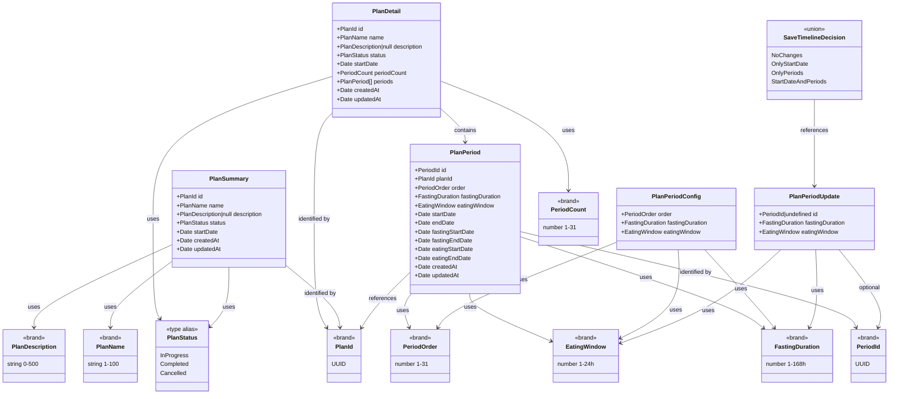

# Functional Domain Design (Web): Plan

> **Source**: `web/docs/plans-and-templates.md` | **Generated**: 2026-02-12 | **Status**: All Phases Complete

## 1. Executive Summary

The Plan web domain models the fasting plan lifecycle: creating plans from presets or templates, editing plan metadata and timeline, tracking active plan progress, and cancelling plans. Currently the plan feature uses `plan.service.ts` with raw DTOs from `@ketone/shared` in actor context, no gateway boundary, no input validation, `new Date()` in views, business logic in components, and `Match.orElse` for error handling. This design brings the plan feature into full FC/IS compliance matching the planTemplates reference implementation.

**Three flows to align**:

1. **Create Plan** — preset selection → configure → review → start plan
2. **Edit Plan** — load plan → edit metadata/timeline → save
3. **Manage Plan** — load active plan → view progress → cancel/complete

## 2. Design Principles

This design adheres to the following functional domain modeling principles:

### 2.1 Closed World Assumption

All possible states are explicitly modeled. The compiler enforces completeness.

| Principle               | Implementation                                                  |
| ----------------------- | --------------------------------------------------------------- |
| Exhaustive matching     | All pattern matches use `Match.exhaustive` - no `default` cases |
| No stringly-typed enums | All enums use `S.Literal` union, never `S.String`               |
| Compile-time safety     | Adding a variant causes compile errors at all switch sites      |
| No hidden states        | No `else` branches that hide bugs                               |

### 2.2 Functional Core / Imperative Shell (Web)

Separation of pure business logic from I/O and UI operations. The web adaptation has 4 shell types:

| Layer                    | Responsibility                                               | Characteristics                                                       |
| ------------------------ | ------------------------------------------------------------ | --------------------------------------------------------------------- |
| **Functional Core**      | Business logic, validations, decisions                       | Pure functions, no I/O, deterministic, testable                       |
| **Shell: Gateway**       | HTTP services, API DTO → Domain mapping                      | Effect-based, boundary mappers, domain error mapping                  |
| **Shell: Input**         | User input → Domain types, schema validation                 | Composable validates before actor receives input                      |
| **Shell: Application**   | Three Phases coordination (Collection → Logic → Persistence) | Effect.Service, composes API Client + FC, single entrypoint for actor |
| **Shell: State Machine** | State transitions, invoke application service programs       | XState actor, FC guards, domain-typed context, emissions              |
| **Shell: View Model**    | Domain → UI translation, computed derivations                | Composable exposes FC as computeds, validates input                   |

> **Clock Rule**: Shell code that needs the current time MUST use `DateTime.nowAsDate` from Effect,
> never `new Date()`. `new Date()` is an implicit side effect that breaks testability (cannot be controlled
> with `TestClock`). Core functions receive `now: Date` as a parameter — they never access the clock directly.

**Core functions in this design**:

- `calculatePeriodDates(startDate, periodConfigs)` — compute period start/end dates from durations
- `decideSaveTimeline(originalPlan, currentStartDate, currentPeriods)` — ADT decision for what changed
- `isValidStartDate(date, lastCycleEndDate)` — boolean predicate for start date constraint
- `shiftPeriodDates(periods, newStartDate)` — pure date shift when start time changes

**Shell operations in this design**:

- Gateway: `getActivePlan`, `getPlan`, `listPlans`, `createPlan`, `cancelPlan`, `completePlan`, `updateMetadata`, `updatePeriods`
- Application Service: `programGetActivePlan`, `programGetPlan`, `programListPlans`, `programCreatePlan`, `programCancelPlan`, `programCompletePlan`, `programUpdatePlanMetadata`, `programUpdatePlanPeriods`, `programSaveTimeline` (Three Phases)
- Input validations: `validateCreatePlanInput`, `validateUpdateMetadataInput`, `validateUpdatePeriodsInput`, `validateSaveTimelineInput`
- Actor orchestrations: `plan.actor` (create/cancel/manage), `planEdit.actor` (load/edit metadata/timeline)
- View Model derivations: `periodConfigs` (from domain), `hasTimelineChanges`, `canSaveTimeline`

### 2.3 Validation Layers (Web)

> "Validate at the boundary, trust inside"

The web architecture defines **4 mandatory validation layers**:

| Layer                      | Location                                  | Responsibility                                           | Validates                          |
| -------------------------- | ----------------------------------------- | -------------------------------------------------------- | ---------------------------------- |
| **1. Input Schema**        | `domain/schemas/*.schema.ts`              | Validate user input → domain types, expose errors for UI | INPUT (raw form → branded types)   |
| **2. Domain Validation**   | `domain/services/*-validation.service.ts` | Pure business rules (no I/O)                             | LOGIC (can save? what changed?)    |
| **3. Application Service** | `services/*-application.service.ts`       | Coordinate FC + API client, domain error handling        | FLOW (returns typed domain errors) |
| **4. Gateway Output**      | `services/*-api-client.service.ts`        | Validate API response → domain types (decode)            | OUTPUT (DTO → domain, may fail)    |

**Checklist**:

- [ ] Input schema validates raw form data before composable sends to actor
- [ ] Domain validation service contains pure business rules (testable)
- [ ] Application service coordinates API client + FC; actor invokes application service programs
- [ ] Gateway boundary mappers decode API DTOs into domain types

### 2.4 Data Seams

Architectural boundaries where data transforms between layers.

| Seam                     | From                                    | To                                    | Transformation                                             |
| ------------------------ | --------------------------------------- | ------------------------------------- | ---------------------------------------------------------- |
| API Client → Application | `PlanWithPeriodsResponse` (DTO)         | `PlanDetail` / `PlanSummary` (domain) | `fromPlanWithPeriodsResponse()` / `fromPlanResponse()`     |
| Application → API Client | Domain types                            | API payload                           | `toCreatePlanPayload()` / `toUpdatePeriodsPayload()`       |
| Actor → Application      | Domain events                           | Program input                         | Actor passes domain-typed input to `programXxx()`          |
| Application → FC         | Domain types                            | Decision ADTs                         | Application service calls `decideSaveTimeline()` for logic |
| Component → Composable   | Raw form input (strings, numbers, Date) | Domain types (branded)                | Input schema validation in composable                      |
| Composable → Actor       | Domain types                            | Domain events                         | `actorRef.send()` after validation                         |
| Actor → Composable       | Domain state                            | UI state                              | Computed derivation via selectors                          |

## 3. Type Justification

Each type declares its category and justification using the Decision Flowchart:

```
Is it a single primitive with constraints?
→ YES: Brand.refined (dm-create-branded-type)

Is it multiple fields that always go together?
→ YES: S.Class Value Object (dm-create-value-object)

Are all variants the same shape?
→ YES: S.Literal Enum (dm-create-literal-enum)

Do variants have different data?
→ YES: Data.TaggedEnum (dm-create-tagged-enum)

Does it need identity and lifecycle?
→ YES: S.Class Entity (dm-create-entity)
```

| Type                   | Category     | Skill                    | Justification                                                                                              |
| ---------------------- | ------------ | ------------------------ | ---------------------------------------------------------------------------------------------------------- |
| `PlanId`               | Brand        | `dm-create-branded-type` | Single primitive (string) with UUID constraint                                                             |
| `PeriodId`             | Brand        | `dm-create-branded-type` | Single primitive (string) with UUID constraint                                                             |
| `PlanName`             | Brand        | `dm-create-branded-type` | Single primitive (string) with length 1-100                                                                |
| `PlanDescription`      | Brand        | `dm-create-branded-type` | Single primitive (string) with max length 500                                                              |
| `FastingDuration`      | Brand        | `dm-create-branded-type` | Single primitive (number) with range 1-168h + 15-min increment constraint                                  |
| `EatingWindow`         | Brand        | `dm-create-branded-type` | Single primitive (number) with range 1-24h + 15-min increment constraint                                   |
| `PeriodOrder`          | Brand        | `dm-create-branded-type` | Single primitive (number) with integer range 1-31                                                          |
| `PeriodCount`          | Brand        | `dm-create-branded-type` | Single primitive (number) with integer range 1-31                                                          |
| `PlanStatus`           | Type Alias   | (from `@ketone/shared`)  | `'InProgress' \| 'Completed' \| 'Cancelled'` — closed literal union from `PlanStatusSchema`                |
| `PlanPeriodConfig`     | Value Object | `dm-create-value-object` | Multiple fields (order, fastingDuration, eatingWindow) always together — for plan creation                 |
| `PlanPeriodUpdate`     | Value Object | `dm-create-value-object` | Multiple fields (id?, fastingDuration, eatingWindow) — for period updates (id is optional for new periods) |
| `PlanPeriod`           | Value Object | `dm-create-value-object` | Multiple fields (id, order, durations, all date phases) always together — decoded from API                 |
| `PlanSummary`          | Value Object | `dm-create-value-object` | Multiple fields for list display (id, name, status, dates, updatedAt)                                      |
| `PlanDetail`           | Value Object | `dm-create-value-object` | Full plan with child periods, periodCount, updatedAt for edit/view screens                                 |
| `SaveTimelineDecision` | Tagged Enum  | `dm-create-tagged-enum`  | Variants have different data: what changed in timeline (4 possible outcomes)                               |

**Smart Constructors Required**:

| Type       | Validation  | Smart Constructor                                   |
| ---------- | ----------- | --------------------------------------------------- |
| `PlanId`   | UUID format | `createPlanId` (Effect) / `makePlanId` (Option)     |
| `PeriodId` | UUID format | `createPeriodId` (Effect) / `makePeriodId` (Option) |

## 4. Domain Components

### 4.1 Entities

No entities in the plan web domain. `PlanDetail` is a Value Object — identity is meaningful only in the API layer (lifecycle managed server-side).

### 4.2 Value Objects

| Value Object       | Fields                                                                                                                                                                                                                                                                                               | Validation         | Smart Constructor |
| ------------------ | ---------------------------------------------------------------------------------------------------------------------------------------------------------------------------------------------------------------------------------------------------------------------------------------------------- | ------------------ | ----------------- |
| `PlanPeriodConfig` | order: `PeriodOrder`, fastingDuration: `FastingDuration`, eatingWindow: `EatingWindow`                                                                                                                                                                                                               | All fields branded | No                |
| `PlanPeriodUpdate` | id: `PeriodId \| undefined`, fastingDuration: `FastingDuration`, eatingWindow: `EatingWindow`                                                                                                                                                                                                        | All fields branded | No                |
| `PlanPeriod`       | id: `PeriodId`, planId: `PlanId`, order: `PeriodOrder`, fastingDuration: `FastingDuration`, eatingWindow: `EatingWindow`, startDate: `Date`, fastingStartDate: `Date`, fastingEndDate: `Date`, eatingStartDate: `Date`, eatingEndDate: `Date`, endDate: `Date`, createdAt: `Date`, updatedAt: `Date` | Via S.Class        | No                |
| `PlanSummary`      | id: `PlanId`, name: `PlanName`, description: `PlanDescription \| null`, status: `PlanStatus`, startDate: `Date`, createdAt: `Date`, updatedAt: `Date`                                                                                                                                                | Via S.Class        | No                |
| `PlanDetail`       | id: `PlanId`, name: `PlanName`, description: `PlanDescription \| null`, status: `PlanStatus`, startDate: `Date`, periodCount: `PeriodCount`, periods: `PlanPeriod[]`, createdAt: `Date`, updatedAt: `Date`                                                                                           | Via S.Class        | No                |

> **Note on PlanSummary**: The API `PlanResponseSchema` does NOT include `endDate` or `periodCount`. Those can be derived from `PlanDetail.periods` when available. `PlanSummary` maps 1:1 with the list API response.
>
> **Note on PlanStatus**: Typed as `PlanStatus` = `'InProgress' | 'Completed' | 'Cancelled'`, derived from `PlanStatusSchema` in `@ketone/shared`. This is a type alias (not a branded type) since the values come from the API wire format.

### 4.3 Enumerations

#### Literal Enums (same structure for all variants)

| Enum               | Values                                       | Location         | Notes                                                |
| ------------------ | -------------------------------------------- | ---------------- | ---------------------------------------------------- |
| `PlanStatusSchema` | `'InProgress'`, `'Completed'`, `'Cancelled'` | `@ketone/shared` | Part of API wire format, not redefined in web domain |

#### Tagged Enums (different data per variant)

| Enum                   | Variants                                                           | Notes                                                |
| ---------------------- | ------------------------------------------------------------------ | ---------------------------------------------------- |
| `SaveTimelineDecision` | `NoChanges`, `OnlyStartDate`, `OnlyPeriods`, `StartDateAndPeriods` | Decision ADT for the save timeline flow in plan edit |

<details>
<summary>Tagged Enum Details</summary>

**SaveTimelineDecision**:

- `NoChanges`: (empty — nothing to save)
- `OnlyStartDate`: `startDate: Date`
- `OnlyPeriods`: `periods: ReadonlyArray<PlanPeriodUpdate>`
- `StartDateAndPeriods`: `startDate: Date, periods: ReadonlyArray<PlanPeriodUpdate>`

</details>

### 4.4 Domain Errors

| Error                         | Fields                                               | Trigger                                          |
| ----------------------------- | ---------------------------------------------------- | ------------------------------------------------ |
| `PlanNotFoundError`           | message, planId: `PlanId`                            | Accessing non-existent plan (HTTP 404)           |
| `NoActivePlanError`           | message                                              | Loading active plan when none exists             |
| `PlanAlreadyActiveError`      | message                                              | Creating plan when one is already active         |
| `ActiveCycleExistsError`      | message                                              | Creating plan when a cycle is in progress        |
| `PlanInvalidStateError`       | message, currentState: string, expectedState: string | Operating on plan in wrong state                 |
| `InvalidPeriodCountError`     | message, periodCount, minPeriods, maxPeriods         | Periods outside 1-31 range                       |
| `PeriodsMismatchError`        | message, expectedCount, receivedCount                | Period count doesn't match plan                  |
| `PeriodNotInPlanError`        | message, planId: `PlanId`, periodId: `PeriodId`      | Referenced period not in plan                    |
| `PeriodOverlapWithCycleError` | message, overlappingCycleId: string                  | Plan periods overlap with existing cycle records |
| `PeriodsNotCompletedError`    | message, completedCount, totalCount                  | Completing plan before all periods finish        |
| `PlanServiceError`            | message                                              | Generic gateway/HTTP failure                     |

### 4.5 Contracts (Use-Case Interfaces)

| Contract              | Input Type                                                              | Decision ADT            | Skill                | File                                           |
| --------------------- | ----------------------------------------------------------------------- | ----------------------- | -------------------- | ---------------------------------------------- |
| `CreatePlanInput`     | `S.Struct { name, description, startDate, periods[] }`                  | None (server validates) | `dm-create-contract` | `domain/contracts/create-plan.contract.ts`     |
| `UpdateMetadataInput` | `S.Struct { planId, name?, description?, startDate? }`                  | None                    | `dm-create-contract` | `domain/contracts/update-metadata.contract.ts` |
| `UpdatePeriodsInput`  | `S.Struct { planId, periods[] }`                                        | None                    | `dm-create-contract` | `domain/contracts/update-periods.contract.ts`  |
| `SaveTimelineInput`   | `S.Struct { planId, originalPlan, currentStartDate?, currentPeriods? }` | `SaveTimelineDecision`  | `dm-create-contract` | `domain/contracts/save-timeline.contract.ts`   |
| `CancelPlanInput`     | `S.Struct { planId }`                                                   | None (unconditional)    | `dm-create-contract` | `domain/contracts/cancel-plan.contract.ts`     |
| `CompletePlanInput`   | `S.Struct { planId }`                                                   | None (server validates) | `dm-create-contract` | `domain/contracts/complete-plan.contract.ts`   |

<details>
<summary>Contract Details</summary>

**CreatePlanInput**:

- Input: `{ name: PlanName, description: PlanDescription | null, startDate: S.DateFromSelf, periods: ReadonlyArray<{ fastingDuration: FastingDuration, eatingWindow: EatingWindow }> }`
- No client-side decision ADT — server validates exclusivity (active plan, active cycle, overlap)

**UpdateMetadataInput**:

- Input: `{ planId: PlanId, name: PlanName | undefined, description: PlanDescription | null | undefined, startDate: S.DateFromSelf | undefined }`
- No decision ADT — partial update, server validates state

**UpdatePeriodsInput**:

- Input: `{ planId: PlanId, periods: ReadonlyArray<PlanPeriodUpdate> }`
- No decision ADT — server validates mismatch, overlap

**SaveTimelineInput**:

- Input: `{ planId: PlanId, originalPlan: PlanDetail, currentStartDate: Date | undefined, currentPeriods: ReadonlyArray<PlanPeriodUpdate> | undefined }`
- Decision: `SaveTimelineDecision`
  - `NoChanges`: nothing changed, skip save
  - `OnlyStartDate`: only start date changed → update metadata
  - `OnlyPeriods`: only period durations changed → update periods
  - `StartDateAndPeriods`: both changed → update metadata then periods (sequential)

**CancelPlanInput**:

- Input: `{ planId: PlanId }`
- No decision ADT — cancellation is unconditional (API classifies period outcomes)

**CompletePlanInput**:

- Input: `{ planId: PlanId }`
- No decision ADT — server validates that all periods are completed before allowing completion

</details>

### 4.6 Services

> Domain services contain ONLY pure business rules (boolean predicates, decision ADTs, calculations).
> Functions that produce user-facing strings (labels, messages, display sorting) belong in Section 4.9 (Presentation Utils), not here.

#### Validation Services (Core — pure business rules)

| Service                 | Methods                                  | Skill                          | Notes                                                         |
| ----------------------- | ---------------------------------------- | ------------------------------ | ------------------------------------------------------------- |
| `PlanValidationService` | `decideSaveTimeline`, `isValidStartDate` | `dm-create-validation-service` | Pure: ADT decision for save timeline + boolean for start date |

#### Domain Services (Core — pure logic)

| Service                        | Methods                                    | Skill                      | Notes                                                                        |
| ------------------------------ | ------------------------------------------ | -------------------------- | ---------------------------------------------------------------------------- |
| `PlanPeriodCalculationService` | `calculatePeriodDates`, `shiftPeriodDates` | `dm-create-domain-service` | Pure date calculations. Moves logic from PlanDetailView.vue into FC service. |

### 4.7 Functional Core Flows (Three Phases)

| Flow            | Collection (Shell)                         | Logic (Core)                                | Persistence (Shell)                              | Application Service                     |
| --------------- | ------------------------------------------ | ------------------------------------------- | ------------------------------------------------ | --------------------------------------- |
| Create Plan     | —                                          | (server validates conflicts)                | Gateway: `createPlan(payload)`                   | `PlanApplicationService.createPlan`     |
| Get Active Plan | Gateway: `getActivePlan()`                 | (pass-through)                              | —                                                | `PlanApplicationService.getActivePlan`  |
| Get Plan        | Gateway: `getPlan(id)`                     | (pass-through)                              | —                                                | `PlanApplicationService.getPlan`        |
| List Plans      | Gateway: `listPlans()`                     | (pass-through)                              | —                                                | `PlanApplicationService.listPlans`      |
| Cancel Plan     | —                                          | (server classifies periods)                 | Gateway: `cancelPlan(id)`                        | `PlanApplicationService.cancelPlan`     |
| Complete Plan   | —                                          | (server validates all periods completed)    | Gateway: `completePlan(id)`                      | `PlanApplicationService.completePlan`   |
| Update Metadata | —                                          | —                                           | Gateway: `updateMetadata(id, payload)`           | `PlanApplicationService.updateMetadata` |
| Update Periods  | —                                          | —                                           | Gateway: `updatePeriods(id, payload)`            | `PlanApplicationService.updatePeriods`  |
| Save Timeline   | From caller: `originalPlan`, current state | `decideSaveTimeline` → NoChanges/OnlyX/Both | Gateway: metadata + periods (sequential if both) | `PlanApplicationService.saveTimeline`   |

> The application service is the **single entrypoint** for all actor operations — even simple reads. This keeps imports consistent and makes it easy to add business logic later without changing the actor.

### 4.8 Additional Components

#### Boundary Mappers (Gateway)

| Mapper                        | API DTO (from `@ketone/shared`) | Domain Type   | Direction    | Notes                                                                 |
| ----------------------------- | ------------------------------- | ------------- | ------------ | --------------------------------------------------------------------- |
| `fromPlanWithPeriodsResponse` | `PlanWithPeriodsResponseSchema` | `PlanDetail`  | API → Domain | Applies branded types during mapping, converts date strings to `Date` |
| `fromPlanResponse`            | `PlanResponseSchema`            | `PlanSummary` | API → Domain | Lighter mapping for list items, applies branded IDs                   |
| `fromPeriodResponse`          | period object within response   | `PlanPeriod`  | API → Domain | Applies `PeriodId`, `PeriodOrder`, `FastingDuration`, `EatingWindow`  |
| `toCreatePlanPayload`         | Domain `CreatePlanInput`        | API payload   | Domain → API | Maps branded types back to raw payload                                |
| `toUpdateMetadataPayload`     | Domain update input             | API payload   | Domain → API | Partial update payload                                                |
| `toUpdatePeriodsPayload`      | Domain `UpdatePeriodsInput`     | API payload   | Domain → API | Maps period configs to API shape                                      |

#### Input Schemas

| Schema                   | Raw Input                                                                           | Domain Output                                  | Location                                         | Notes                              |
| ------------------------ | ----------------------------------------------------------------------------------- | ---------------------------------------------- | ------------------------------------------------ | ---------------------------------- |
| `CreatePlanRawInput`     | name (string), description (string), startDate (Date), periods[] (number durations) | `CreatePlanDomainInput` with branded types     | `domain/schemas/create-plan-input.schema.ts`     | Composable validates before create |
| `UpdateMetadataRawInput` | planId (string), name? (string), description? (string), startDate? (Date)           | `UpdateMetadataDomainInput` with branded types | `domain/schemas/update-metadata-input.schema.ts` | Composable validates before update |
| `UpdatePeriodsRawInput`  | planId (string), periods[] (with optional id, number durations)                     | `UpdatePeriodsDomainInput` with branded types  | `domain/schemas/update-periods-input.schema.ts`  | Composable validates before update |
| `SaveTimelineRawInput`   | planId (string), startDate? (Date), periods? (number durations)                     | `SaveTimelineDomainInput` with branded types   | `domain/schemas/save-timeline-input.schema.ts`   | Composable validates before save   |

### 4.9 Presentation Utils

Formatting and display-ordering functions that produce user-facing strings.
These belong in `utils/`, NOT in domain services or actor emissions.

| Function                              | Purpose                  | Notes                                                                                       |
| ------------------------------------- | ------------------------ | ------------------------------------------------------------------------------------------- |
| `formatBlockingResourceMessage(type)` | Conflict dialog text     | Spec copy: "You have an active fasting cycle..." / "You have an active plan in progress..." |
| `formatPeriodCountLabel(count)`       | "1 period" / "5 periods" | Singular/plural label (can import from planTemplates or duplicate)                          |

> **Rule**: If a function produces user-facing strings (not domain values), it belongs in `utils/`.

## 5. Type Diagram



## 6. Architecture Phases

This design follows the **Web Functional Core / Imperative Shell** architecture. Implementation proceeds in 7 phases.

### Phase 0: Scaffold

> Create `domain/` folder structure with mandatory barrel files

| Step | Component        | File                        | Status |
| ---- | ---------------- | --------------------------- | ------ |
| 0.1  | Domain directory | `domain/`                   | Done   |
| 0.2  | Model file       | `domain/plan.model.ts`      | Done   |
| 0.3  | Errors file      | `domain/errors.ts`          | Done   |
| 0.4  | Contracts barrel | `domain/contracts/index.ts` | Done   |
| 0.5  | Services barrel  | `domain/services/index.ts`  | Done   |
| 0.6  | Schemas barrel   | `domain/schemas/index.ts`   | Done   |
| 0.7  | Domain barrel    | `domain/index.ts`           | Done   |

**Command**: `"implement phase 0"` — **DONE**

### Phase 1: Functional Core (Pure Logic)

> Domain types, pure services, ADTs, contracts, reified decisions.

Phase 1 steps MUST follow this order (dependencies flow top-to-bottom):

| Step | Component                 | Skill                          | File                                                 | Status |
| ---- | ------------------------- | ------------------------------ | ---------------------------------------------------- | ------ |
| 1.a  | Constants + Branded Types | `dm-create-branded-type`       | `domain/plan.model.ts`                               | Done   |
| 1.b  | Value Objects             | `dm-create-value-object`       | `domain/plan.model.ts`                               | Done   |
| 1.c  | Tagged Enums              | `dm-create-tagged-enum`        | `domain/plan.model.ts`                               | Done   |
| 1.d  | Smart Constructors        | `dm-create-smart-constructors` | `domain/plan.model.ts`                               | Done   |
| 1.e  | Domain Errors             | `dm-create-domain-error`       | `domain/errors.ts`                                   | Done   |
| 1.f  | Contracts                 | `dm-create-contract`           | `domain/contracts/*.contract.ts`                     | Done   |
| 1.g  | Validation Services       | `dm-create-validation-service` | `domain/services/plan-validation.service.ts`         | Done   |
| 1.h  | Domain Services           | `dm-create-domain-service`     | `domain/services/plan-period-calculation.service.ts` | Done   |

**Shared Constants** (imported from `web/src/views/plan/constants.ts`):

| Constant                      | Value | Used By                      |
| ----------------------------- | ----- | ---------------------------- |
| `MIN_FASTING_DURATION_HOURS`  | 1     | `FastingDuration` brand      |
| `MAX_FASTING_DURATION_HOURS`  | 168   | `FastingDuration` brand      |
| `MIN_EATING_WINDOW_HOURS`     | 1     | `EatingWindow` brand         |
| `MAX_EATING_WINDOW_HOURS`     | 24    | `EatingWindow` brand         |
| `MIN_PERIODS`                 | 1     | `PeriodOrder`, `PeriodCount` |
| `MAX_PERIODS`                 | 31    | `PeriodOrder`, `PeriodCount` |
| `MIN_PLAN_NAME_LENGTH`        | 1     | `PlanName` brand             |
| `MAX_PLAN_NAME_LENGTH`        | 100   | `PlanName` brand             |
| `MAX_PLAN_DESCRIPTION_LENGTH` | 500   | `PlanDescription` brand      |

> **Note**: `MIN_PLAN_NAME_LENGTH`, `MAX_PLAN_NAME_LENGTH`, and `MAX_PLAN_DESCRIPTION_LENGTH` are defined locally in `plan.model.ts` (matching the pattern in `planTemplates/domain/plan-template.model.ts`). The numeric duration/period constants are imported from `plan/constants.ts` and re-exported for convenience.

**Note on Type Overlap**: Branded types `FastingDuration`, `EatingWindow`, `PeriodOrder`, `PeriodCount`, `PlanName`, `PlanDescription` also exist in `planTemplates/domain/plan-template.model.ts` with identical constraints. These are intentionally separate per the Orphan Test principle — each feature owns its types. Constants are shared via `plan/constants.ts`.

**Command**: `"implement phase 1"`

### Phase 2: Shell — Gateway Service (Repository Equivalent)

> Split `plan.service.ts` into gateway (API Client) with boundary mappers.

| Step | Component        | Skill                       | File                                  | Status |
| ---- | ---------------- | --------------------------- | ------------------------------------- | ------ |
| 2.a  | Boundary Mappers | `dm-create-boundary-mapper` | `services/plan-api-client.service.ts` | Done   |
| 2.b  | Gateway Service  | `dm-create-gateway-service` | `services/plan-api-client.service.ts` | Done   |
| 2.c  | Error Mapping    | (part of gateway)           | `services/plan-api-client.service.ts` | Done   |

**Migration from `plan.service.ts`**:

- HTTP client logic, request building, response handling → gateway
- Error classes (`PlanNotFoundError`, `PlanAlreadyActiveError`, etc.) → `domain/errors.ts` as `Data.TaggedError`
- Error response parsing → gateway error mapping
- Payload types (`CreatePlanPayload`, `UpdatePeriodsPayload`) → removed (replaced by contracts + boundary mappers)
- Success type aliases → removed (replaced by domain VOs)
- `programXxx` exports → moved to application service

**Boundary Mapping Checklist**:

- [ ] `fromPlanWithPeriodsResponse(dto)` decodes API DTO → `PlanDetail` (may fail with parse error)
- [ ] `fromPlanResponse(dto)` decodes API DTO → `PlanSummary`
- [ ] `fromPeriodResponse(dto)` decodes period DTO → `PlanPeriod` (applies branded types)
- [ ] `toCreatePlanPayload(domain)` maps domain → API payload (pure, always succeeds)
- [ ] `toUpdateMetadataPayload(domain)` maps domain → API payload
- [ ] `toUpdatePeriodsPayload(domain)` maps domain → API payload
- [ ] DTO types never exposed past the gateway service boundary
- [ ] Branded types applied during decode (not after)
- [ ] HTTP errors mapped to domain-tagged errors (`Data.TaggedError`)
- [ ] `plan.service.ts` deleted after migration (replaced by gateway + application service)

**Command**: `"implement phase 2"`

### Phase 2b: Shell — Application Service (Three Phases Coordinator)

> Single entrypoint for all actor I/O. Replaces direct `programXxx` calls from `plan.service.ts`.

| Step | Component           | File                                   | Status |
| ---- | ------------------- | -------------------------------------- | ------ |
| 2b.a | Application Service | `services/plan-application.service.ts` | Done   |
| 2b.b | Program Exports     | (same file)                            | Done   |

**Programs to Create**:

| Program                        | Three Phases                                                                                                     |
| ------------------------------ | ---------------------------------------------------------------------------------------------------------------- |
| `programGetActivePlan`         | Collection: gateway `getActivePlan()` → Logic: pass-through → Persistence: —                                     |
| `programGetPlan`               | Collection: gateway `getPlan(id)` → Logic: pass-through → Persistence: —                                         |
| `programListPlans`             | Collection: gateway `listPlans()` → Logic: pass-through → Persistence: —                                         |
| `programCreatePlan`            | Collection: — → Logic: (server validates) → Persistence: gateway `createPlan(payload)`                           |
| `programCancelPlan`            | Collection: — → Logic: (server classifies) → Persistence: gateway `cancelPlan(id)`                               |
| `programCompletePlan`          | Collection: — → Logic: (server validates periods completed) → Persistence: gateway `completePlan(id)`            |
| `programUpdatePlanMetadata`    | Collection: — → Logic: — → Persistence: gateway `updateMetadata(id, payload)`                                    |
| `programUpdatePlanPeriods`     | Collection: — → Logic: — → Persistence: gateway `updatePeriods(id, payload)`                                     |
| `programSaveTimeline`          | Collection: from input → Logic: `decideSaveTimeline()` → Persistence: metadata then periods (sequential if both) |
| `programGetLastCompletedCycle` | Delegates to cycle service (imported dependency)                                                                 |

**Checklist**:

- [ ] Application service imports Gateway + FC validation/domain services
- [ ] `programSaveTimeline` uses `decideSaveTimeline()` FC to determine what to save
- [ ] Application service is the single entrypoint for all actor operations
- [ ] Simple reads pass through to gateway
- [ ] Program exports provide the full layer stack for `runWithUi`

**Command**: `"implement phase 2b"`

### Phase 2c: Presentation Utils

> Formatting and display-ordering functions that produce user-facing strings.

| Step | Component        | File                       | Status |
| ---- | ---------------- | -------------------------- | ------ |
| 2c.a | Formatting Utils | `utils/plan-formatting.ts` | Done   |

**Command**: `"implement phase 2c"`

### Phase 3: Shell — Input Validation (API Handler Equivalent)

> Input schemas validate user form input and transform to domain types.

| Step | Component             | Skill                        | File                                             | Status |
| ---- | --------------------- | ---------------------------- | ------------------------------------------------ | ------ |
| 3.a  | Create Plan Input     | `dm-create-input-schema-web` | `domain/schemas/create-plan-input.schema.ts`     | Done   |
| 3.b  | Update Metadata Input | `dm-create-input-schema-web` | `domain/schemas/update-metadata-input.schema.ts` | Done   |
| 3.c  | Update Periods Input  | `dm-create-input-schema-web` | `domain/schemas/update-periods-input.schema.ts`  | Done   |
| 3.d  | Save Timeline Input   | `dm-create-input-schema-web` | `domain/schemas/save-timeline-input.schema.ts`   | Done   |

**Input Validation Flow** (example: create plan):

```
PlanDetailView (raw form: name string, startDate Date, periods number[])
    → usePlanDetail composable: createPlan(rawData)
        → Schema.decodeUnknownEither(CreatePlanRawInput)(rawData)
            → Either<ParseError, CreatePlanDomainInput>
                → Left: extractSchemaErrors() → errors ref → UI
                → Right: actorRef.send({ type: Event.CREATE, input: domainInput })
```

**Checklist**:

- [ ] Raw input schema defines what comes from UI (strings, numbers, no branded types)
- [ ] Domain input type has branded types and value objects
- [ ] `validateInput()` transforms and validates in one step
- [ ] `extractSchemaErrors()` produces standardized `Record<string, string[]>`
- [ ] Schema references constants from model (no magic numbers)
- [ ] Actor only receives validated domain-typed input from composable

**Command**: `"implement phase 3"`

### Phase 4: State Machine (Actor)

> Update existing actors to use domain types, `Match.exhaustive`, application service programs.

| Step | Component                  | Skill          | File                                  | Status |
| ---- | -------------------------- | -------------- | ------------------------------------- | ------ |
| 4.a  | Plan Actor (refactor)      | `create-actor` | `actors/plan.actor.ts`                | Done   |
| 4.b  | Plan Edit Actor (refactor) | `create-actor` | `actors/planEdit.actor.ts`            | Done   |
| 4.c  | Plan Emissions             | (unchanged)    | `composables/usePlanEmissions.ts`     | Done   |
| 4.d  | Plan Edit Emissions        | (refactor)     | `composables/usePlanEditEmissions.ts` | Done   |

**Specific Refactoring Required**:

**plan.actor.ts**:

- Context: `activePlan: PlanWithPeriodsResponse` → `activePlan: PlanDetail`
- Context: `plans: ListPlansSuccess[number][]` → `plans: PlanSummary[]`
- Context: `lastCompletedCycle: AdjacentCycle` → keep (from cycle domain, acceptable cross-feature dependency)
- Events: raw DTO payloads → domain-typed payloads
- `handlePlanError()`: `Match.orElse` → `Match.exhaustive` or typed error union
- fromCallback actors: `programXxx` from `plan.service` → `programXxx` from `plan-application.service`

**planEdit.actor.ts**:

- Context: `plan: PlanWithPeriodsResponse` → `plan: PlanDetail`
- Events: `planId: string` → `planId: PlanId`, `name: string` → validated by composable
- `handleUpdateError()`: `Match.orElse` → `Match.exhaustive`
- fromCallback actors: direct service calls → application service programs
- `PeriodUpdateInput` type: raw `{ id?: string, fastingDuration: number, eatingWindow: number }` → domain-typed
- Emissions: `plan: PlanWithPeriodsResponse` → `plan: PlanDetail`

**usePlanEditEmissions.ts**:

- `Match.orElse` → `Match.exhaustive`

**Actor FC-Integration Checklist**:

- [ ] Guards delegate to domain service pure functions (no inline business rules)
- [ ] Decision ADT transitions use `$match`/`$is` exhaustively
- [ ] Context uses domain types (`PlanDetail`, `PlanSummary`, `PlanId`), not raw DTOs
- [ ] Events carry domain-typed payloads (validated by composable before send)
- [ ] No `Date.now()` in actor — use `DateTime.nowAsDate` in gateway
- [ ] Error handling uses domain error ADTs from `domain/errors.ts`
- [ ] `Match.orElse` is PROHIBITED for domain decision matching
- [ ] fromCallback actors call application service `programXxx()` (single entrypoint)
- [ ] Emissions carry domain-typed payloads but NO user-facing text

**Command**: `"implement phase 4"`

### Phase 5: Presentation — Composable + Component

> Update composables to validate input; move business logic from views to composables.

| Step | Component                       | Skill                   | File                             | Status |
| ---- | ------------------------------- | ----------------------- | -------------------------------- | ------ |
| 5.a  | Plan Detail Composable          | `web-create-composable` | `composables/usePlanDetail.ts`   | Done   |
| 5.b  | Plan Edit Composable (refactor) | `web-create-composable` | `composables/usePlanEdit.ts`     | Done   |
| 5.c  | Plan Edit Form                  | (input shell)           | `composables/usePlanEditForm.ts` | Done   |
| 5.d  | PlanDetailView (refactor)       | `vue-props`             | `PlanDetailView.vue`             | Done   |
| 5.e  | PlanEditView (refactor)         | `vue-props`             | `PlanEditView.vue`               | Done   |

**Specific Refactoring Required**:

**usePlanDetail.ts** (NEW — extracts logic from PlanDetailView.vue):

- Period date calculation → FC `calculatePeriodDates()` as computed
- Period date shifting on start date change → FC `shiftPeriodDates()`
- Create plan input validation → Schema `validateCreatePlanInput()`
- Default start date → `DateTime.nowAsDate` via gateway, not `new Date()`
- Period config assembly → composable computed, not inline view code

**usePlanEdit.ts** (REFACTOR — add input validation):

- `updateName(planId, name)` → `updateName(rawInput)` with Schema validation
- `updateDescription(planId, description)` → `updateDescription(rawInput)` with Schema validation
- `updateStartDate(planId, startDate)` → `updateStartDate(rawInput)` with Schema validation
- `saveTimeline(planId, startDate?, periods?)` → `saveTimeline(rawInput)` with Schema validation
- Expose `errors: Ref<Record<string, string[]>>` for UI

**PlanDetailView.vue** (REFACTOR — remove business logic):

- Remove `createInitialPeriodConfigs()` → use `usePlanDetail` composable
- Remove `buildCreatePlanPayload()` → use composable `createPlan()` with validation
- Remove `new Date()` calls → composable manages default dates
- Remove period date calculation watchers → composable handles reactively
- Component only renders and calls composable methods

**PlanEditView.vue** (REFACTOR — remove business logic):

- Remove `convertPeriodsToPeriodConfigs()` → gateway boundary mapper + composable
- Remove `hasStartTimeChange`, `hasDurationChanges` → composable computed from FC
- Remove payload assembly → composable `saveTimeline()` with validation
- Remove `new Date(period.startDate)` → domain types from actor context (already decoded by gateway)

**Composable Responsibilities**:

| Concern              | Implementation                                             | Example                                          |
| -------------------- | ---------------------------------------------------------- | ------------------------------------------------ |
| Domain computeds     | `computed(() => calculatePeriodDates(startDate, configs))` | `periodConfigs`, `hasTimelineChanges`            |
| Input validation     | `validateInput(rawData)` via domain schemas                | `createPlan(rawInput)`, `saveTimeline(rawInput)` |
| UI state translation | `computed(() => formatLabel(...))`                         | `blockingMessage`                                |
| Error display        | `errors: Ref<Record<string, string[]>>`                    | `errors`, `hasFieldError`, `getFieldError`       |

**Component Rules**:

- [ ] Component never contains business logic (no period calculation, no payload assembly)
- [ ] Component emits only validated domain input (raw data goes through composable first)
- [ ] All conditional rendering based on business rules uses composable computeds
- [ ] Component does not import from `domain/` directly — only through composable
- [ ] No `new Date()` in components — composable manages dates via gateway/Effect
- [ ] Component uses formatting utils for presentation text

**Command**: `"implement phase 5"`

### Implementation Order

```
Phase 0  (Scaffold)      ──────►
                          Directory structure + barrels

Phase 1  (Core)          ──────────────────────────────────►
                          Types, Errors, Pure Services

Phase 2  (Gateway)       ──────────────────────────────────►
                          HTTP + Boundary Mappers (replaces plan.service.ts)

Phase 2b (Application)   ──────────────────────────────────►
                          Three Phases coordinator (replaces programXxx from plan.service.ts)

Phase 2c (Utils)         ──────────────────────────────────►
                          Presentation formatting

Phase 3  (Input)         ──────────────────────────────────►
                          Input Schemas (validates before actor receives)

Phase 4  (Actor)         ──────────────────────────────────►
                          Refactor actors: domain types, Match.exhaustive, app service programs

Phase 5  (Composable)    ──────────────────────────────────►
                          Refactor composables + views: validation, remove business logic
```

### Files to Create / Refactor

```
web/src/views/plan/
├── domain/                                            # NEW (Phase 0)
│   ├── plan.model.ts                                  # Constants, Branded Types, VOs, ADTs
│   ├── errors.ts                                      # Domain Errors (Data.TaggedError)
│   ├── functional-domain-design.md                    # This document
│   ├── index.ts                                       # Barrel
│   ├── contracts/
│   │   ├── index.ts                                   # Barrel
│   │   ├── create-plan.contract.ts                    # Create plan input
│   │   ├── update-metadata.contract.ts                # Update name/description/startDate
│   │   ├── update-periods.contract.ts                 # Update period durations
│   │   ├── save-timeline.contract.ts                  # Save timeline decision ADT
│   │   ├── cancel-plan.contract.ts                    # Cancel plan input
│   │   └── complete-plan.contract.ts                  # Complete plan input
│   ├── services/
│   │   ├── index.ts                                   # Barrel
│   │   ├── plan-validation.service.ts                 # FC: decideSaveTimeline, isValidStartDate
│   │   └── plan-period-calculation.service.ts         # FC: calculatePeriodDates, shiftPeriodDates
│   └── schemas/
│       ├── index.ts                                   # Barrel
│       ├── create-plan-input.schema.ts                # Raw form → domain types
│       ├── update-metadata-input.schema.ts            # Raw form → domain types
│       ├── update-periods-input.schema.ts             # Raw form → domain types
│       └── save-timeline-input.schema.ts              # Raw form → domain types
├── services/
│   ├── plan-api-client.service.ts                     # NEW: Gateway (Phase 2) — replaces plan.service.ts
│   └── plan-application.service.ts                    # NEW: Application Service (Phase 2b)
├── utils/
│   └── plan-formatting.ts                             # NEW: Presentation text (Phase 2c)
├── actors/
│   ├── plan.actor.ts                                  # REFACTOR: domain types, Match.exhaustive (Phase 4)
│   └── planEdit.actor.ts                              # REFACTOR: domain types, Match.exhaustive (Phase 4)
├── composables/
│   ├── usePlan.ts                                     # MINOR: update imports
│   ├── usePlanDetail.ts                               # NEW: Plan creation view model (Phase 5)
│   ├── usePlanEdit.ts                                 # REFACTOR: add input validation (Phase 5)
│   ├── usePlanEditForm.ts                             # NEW: Input validation form (Phase 5)
│   ├── usePlanEmissions.ts                            # MINOR: update Match.exhaustive
│   └── usePlanEditEmissions.ts                        # REFACTOR: Match.exhaustive (Phase 5)
├── PlanDetailView.vue                                 # REFACTOR: remove business logic (Phase 5)
├── PlanEditView.vue                                   # REFACTOR: remove business logic (Phase 5)
├── PlanView.vue                                       # MINOR: update imports
├── constants.ts                                       # KEEP: shared numeric constants
├── presets.ts                                         # KEEP: pure data
└── services/
    └── plan.service.ts                                # DELETE: replaced by gateway + application service
```

## 7. Closed World Checklist

Before implementation, verify:

- [ ] All enums use `S.Literal` union (not `S.String`)
- [ ] All pattern matches use `Match.exhaustive` (replace all `Match.orElse` in plan actors)
- [ ] No `default` or `else` cases that hide bugs
- [ ] Adding a variant causes compile errors at all switch sites
- [ ] No optional fields that depend on other fields (use Tagged Enum instead)
- [ ] No boolean discriminators with optional fields

## 8. FC/IS Implementation Checklist

When implementing each phase, verify:

**Phase 1 — Functional Core:**

- [ ] **Constants** live in model file alongside their branded types
- [ ] **Branded types** reference named constants in predicates and error messages
- [ ] **Contracts** exist for each use case with input types
- [ ] **Contract inputs** use `S.Struct` with branded types (not `interface`)
- [ ] **Domain services** include `FUNCTIONAL CORE` documentation header with Three Phases context
- [ ] **Domain services** export pure functions both as standalone AND inside Effect.Service wrapper
- [ ] **Domain service preconditions** use pure boolean predicates or TaggedEnum ADTs — never `Effect<void, DomainError>`
- [ ] **Validation services** are separate from domain services (single responsibility)

**Phase 2 — Gateway Service:**

- [ ] **Boundary mappers** decode API DTOs into domain types (`fromPlanWithPeriodsResponse`, `fromPeriodResponse`)
- [ ] **Boundary mappers** encode domain types to API payloads (`toCreatePlanPayload`, `toUpdatePeriodsPayload`)
- [ ] **DTOs never leak** past the gateway service boundary
- [ ] **Gateway methods** return domain types, never raw API response types
- [ ] **HTTP errors** are mapped to domain-tagged errors (`PlanNotFoundError`, `PlanAlreadyActiveError`, etc.)
- [ ] **Error classes** moved from `plan.service.ts` to `domain/errors.ts` as `Data.TaggedError`
- [ ] **program exports** provide the service layer for application service consumption

**Phase 2b — Application Service:**

- [ ] **Application service** imports Gateway + FC validation/domain services
- [ ] **Each method** documents its Three Phases
- [ ] **Application service** is the single entrypoint for all actor operations
- [ ] **`programSaveTimeline`** uses `decideSaveTimeline()` FC to determine what to save
- [ ] **Program exports** provide the full layer stack for `runWithUi`

**Phase 2c — Presentation Utils:**

- [ ] **All functions** produce user-facing strings
- [ ] **No domain logic** in utils
- [ ] **Functions are pure**

**Phase 3 — Input Validation:**

- [ ] **Input schemas** validate raw form data → domain types
- [ ] **Schema references** named constants (no magic numbers)
- [ ] **extractSchemaErrors** produces `Record<string, string[]>` for UI
- [ ] **Composable** executes validation, not the actor

**Phase 4 — State Machine:**

- [ ] **Context** uses domain types (`PlanDetail`, `PlanSummary`, `PlanId`), not raw DTOs from `@ketone/shared`
- [ ] **Events** carry domain-typed payloads (validated before send)
- [ ] **`handlePlanError()` and `handleUpdateError()`**: `Match.orElse` → `Match.exhaustive`
- [ ] **fromCallback** actors call application service `programXxx()` (single entrypoint)
- [ ] **Emissions** carry domain-typed payloads (`PlanDetail` not `PlanWithPeriodsResponse`)
- [ ] **No `Date.now()`** in actor — clock accessed in gateway shell

**Phase 5 — Composable + Component:**

- [ ] **usePlanDetail** (NEW) owns period calculation, date management, create plan validation
- [ ] **usePlanEdit** validates all input with Schema before sending to actor
- [ ] **PlanDetailView.vue** contains no business logic (no `calculatePeriodDates`, no `buildPayload`)
- [ ] **PlanEditView.vue** contains no DTO mapping, no change detection logic, no payload assembly
- [ ] **No `new Date()`** in views — composable manages dates via gateway/Effect
- [ ] **Component** emits only validated domain input

## 9. Component Behavior Boundary

Documents which rules live in FC vs component.

| Rule / Behavior                       | Where                                                                 | Why                        |
| ------------------------------------- | --------------------------------------------------------------------- | -------------------------- |
| Calculate period dates from durations | FC: `calculatePeriodDates()` → composable computed                    | Pure date calculation      |
| Shift periods when start date changes | FC: `shiftPeriodDates()` → composable computed                        | Pure date transformation   |
| What changed in timeline?             | FC: `decideSaveTimeline()` → application service                      | Decision ADT (4 variants)  |
| Is start date valid?                  | FC: `isValidStartDate()` → composable computed                        | Business rule              |
| Blocking resource message             | Utils: `formatBlockingResourceMessage()` → composable                 | Presentation text          |
| Period count label                    | Utils: `formatPeriodCountLabel()` → composable                        | Presentation text          |
| Loading spinner                       | Actor state → composable selector                                     | Async state from actor     |
| Save Timeline button disabled         | Composable: `canSaveTimeline` computed (from FC `hasTimelineChanges`) | Business rule via FC       |
| Period config card layout             | Component directly                                                    | UI mechanics, not business |
| Drag handle position                  | Timeline component directly                                           | UI mechanics               |

## 10. Type Sharing Strategy

| What                                                        | Where                             | Reason                                    |
| ----------------------------------------------------------- | --------------------------------- | ----------------------------------------- |
| Wire format schemas (`PlanWithPeriodsResponseSchema`, etc.) | `@ketone/shared`                  | Define JSON shape for API ↔ web          |
| Status enum in wire format (`PlanStatusSchema`)             | `@ketone/shared`                  | Part of API response contract             |
| Numeric constraints (`MIN_FASTING_DURATION_HOURS`, etc.)    | `web/src/views/plan/constants.ts` | Shared by plan and planTemplates features |
| Branded types (`FastingDuration`, `PlanId`, `PlanName`)     | `plan/domain/plan.model.ts`       | Compile-time construct, feature-scoped    |
| Value objects (`PlanDetail`, `PlanSummary`, `PlanPeriod`)   | `plan/domain/plan.model.ts`       | Web-specific shapes                       |
| Contracts, validation services                              | `plan/domain/`                    | Feature-specific logic                    |
| Preset data (`sections`, `findPresetById`)                  | `plan/presets.ts`                 | Pure data, no domain logic                |

**Type Overlap with planTemplates**: `FastingDuration`, `EatingWindow`, `PeriodOrder`, `PeriodCount`, `PlanName`, `PlanDescription` exist in both features with identical constraints. Each feature owns its copy per the Orphan Test. Numeric constants are shared via `plan/constants.ts`.

**Orphan Test**: If `@ketone/shared` is deleted, both sides can redefine wire schemas. If `plan/domain/` is deleted, only the plan feature breaks. If `planTemplates/domain/` is deleted, only the template feature breaks.

## 11. Warning Signs Detected

- [ ] **`Match.orElse` in plan.actor.ts** (lines 159-193) and planEdit.actor.ts (lines 159, 254) — Must be replaced with `Match.exhaustive`. For HTTP error unions where not all tags are known, define a closed error union in `domain/errors.ts` and use typed catch in gateway.
- [ ] **Raw DTOs in actor context** — `PlanWithPeriodsResponse`, `AdjacentCycle`, `ListPlansSuccess[number]` used directly in XState context. Must be decoded to domain types (`PlanDetail`, `PlanSummary`) by gateway boundary mappers.
- [ ] **Business logic in PlanDetailView.vue** — `createInitialPeriodConfigs()` (period date calculation), `buildCreatePlanPayload()` (payload assembly), date shift watcher. Must move to composable + FC service.
- [ ] **Business logic in PlanEditView.vue** — `convertPeriodsToPeriodConfigs()` (DTO mapping), `hasStartTimeChange`/`hasDurationChanges` (change detection), payload assembly. Must move to composable + FC service.
- [ ] **`new Date()` in views** — PlanDetailView.vue (lines 222, 256, 266, 271, 278, 303, 332), PlanEditView.vue (lines 176, 195, 220). Clock Rule violation. Must use `DateTime.nowAsDate` in gateway/application service.
- [ ] **No input validation in usePlanEdit.ts** — `updateName`, `updateDescription`, `updateStartDate`, `saveTimeline` send raw values to actor without Schema validation. Must add input schemas.
- [ ] **Error types in plan.service.ts are `S.TaggedError`** — Should be `Data.TaggedError` in `domain/errors.ts`. `S.TaggedError` is for schema-decoded wire format; domain errors use `Data.TaggedError`.
- [ ] **plan.service.ts mixes gateway + application concerns** — 987 lines combining HTTP, error parsing, boundary logic, and program exports. Must split into gateway (API client) + application service.

## 12. Open Questions

1. **AdjacentCycle type**: The `lastCompletedCycle` in plan edit context uses `AdjacentCycle` from `@ketone/shared`. Should this be decoded to a plan-domain value object, or is the cross-feature dependency acceptable? (Recommendation: keep as-is since it's from the cycle domain, used only for start date constraint validation.)

2. **`plan.service.ts` deletion timing**: Should the old service be deleted atomically when gateway + application service are created (Phase 2/2b), or can it coexist during migration? (Recommendation: delete in Phase 2b after all programs are migrated, update all actor imports.)

3. **Template save flow**: The `saveAsTemplateLogic` in both plan actors imports `programSaveAsTemplate` from planTemplates application service. After migration, should this stay as a cross-feature call or be wrapped by the plan application service? (Recommendation: keep cross-feature call — it's the planTemplates domain's responsibility.)

## 13. Next Steps

1. **Review** this document for correctness and completeness
2. **Verify** Type Justification table (Section 3)
3. **Verify** Closed World Checklist (Section 7)
4. **Verify** FC/IS Implementation Checklist (Section 8)
5. **Verify** Component Behavior Boundary (Section 9)
6. **Resolve** open questions above
7. **Implement by phase**:
   - `"implement phase 0"` → Scaffold domain directory
   - `"implement phase 1"` → Functional Core
   - `"implement phase 2"` → Gateway Service (replaces plan.service.ts)
   - `"implement phase 2b"` → Application Service
   - `"implement phase 2c"` → Presentation Utils
   - `"implement phase 3"` → Input Validation
   - `"implement phase 4"` → Refactor Actors (domain types, Match.exhaustive)
   - `"implement phase 5"` → Refactor Composables + Views (validation, remove business logic)
   - Or `"implement all"` / `"implement the plan"` → All phases in order

Each phase builds on the previous. Phase 0 (Scaffold) and Phase 1 (Core) should be implemented first as they define the domain types used by all other phases.

---

<details>
<summary>Analysis YAML (reference)</summary>

```yaml
domain_analysis:
  feature: Plan (Web FC/IS Alignment)
  context: Bringing existing plan feature into full FC/IS compliance

  current_violations:
    - gap: No web domain modeling
      files: [plan.actor.ts, planEdit.actor.ts]
      detail: Actors use raw DTOs from @ketone/shared (PlanWithPeriodsResponse, AdjacentCycle)

    - gap: No gateway + application service
      files: [plan.service.ts]
      detail: 987-line file mixes HTTP client, error parsing, response handling, program exports

    - gap: Missing input validation
      files: [usePlanEdit.ts, PlanDetailView.vue]
      detail: Raw strings/Date/numbers sent directly to actor without Schema validation

    - gap: Clock Rule violations
      files: [PlanDetailView.vue, PlanEditView.vue]
      detail: new Date() used directly in views instead of DateTime.nowAsDate

    - gap: Business logic in views
      files: [PlanDetailView.vue, PlanEditView.vue]
      detail: Period calculation, DTO mapping, change detection, payload assembly in components

    - gap: Match.orElse in actors
      files: [plan.actor.ts, planEdit.actor.ts, usePlanEditEmissions.ts]
      detail: Open-ended error matching instead of exhaustive domain error ADTs

  branded_types:
    - name: PlanId
      base: string (UUID)
      constraint: UUID format
      file: domain/plan.model.ts

    - name: PeriodId
      base: string (UUID)
      constraint: UUID format
      file: domain/plan.model.ts

    - name: PlanName
      base: string
      constraint: 1-100 characters
      constants: [MIN_PLAN_NAME_LENGTH (1), MAX_PLAN_NAME_LENGTH (100)]
      note: Constants must be added to plan/constants.ts or defined in plan.model.ts
      file: domain/plan.model.ts

    - name: PlanDescription
      base: string
      constraint: 0-500 characters
      constants: [MAX_PLAN_DESCRIPTION_LENGTH (500)]
      note: Constant must be added to plan/constants.ts or defined in plan.model.ts
      file: domain/plan.model.ts

    - name: FastingDuration
      base: number
      constraint: 1-168h, 15-min increments
      constants: [MIN_FASTING_DURATION_HOURS, MAX_FASTING_DURATION_HOURS]
      file: domain/plan.model.ts

    - name: EatingWindow
      base: number
      constraint: 1-24h, 15-min increments
      constants: [MIN_EATING_WINDOW_HOURS, MAX_EATING_WINDOW_HOURS]
      file: domain/plan.model.ts

    - name: PeriodOrder
      base: number
      constraint: integer 1-31
      constants: [MIN_PERIODS, MAX_PERIODS]
      file: domain/plan.model.ts

    - name: PeriodCount
      base: number
      constraint: integer 1-31
      constants: [MIN_PERIODS, MAX_PERIODS]
      file: domain/plan.model.ts

  value_objects:
    - name: PlanPeriodConfig
      fields: [order (PeriodOrder), fastingDuration (FastingDuration), eatingWindow (EatingWindow)]

    - name: PlanPeriodUpdate
      fields: [id (PeriodId | undefined), fastingDuration (FastingDuration), eatingWindow (EatingWindow)]

    - name: PlanPeriod
      fields: [id (PeriodId), planId (PlanId), order, fastingDuration, eatingWindow, startDate, endDate, fastingStartDate, fastingEndDate, eatingStartDate, eatingEndDate, createdAt, updatedAt]

    - name: PlanSummary
      fields: [id, name, description, status (PlanStatus), startDate, createdAt, updatedAt]

    - name: PlanDetail
      fields: [id, name, description, status (PlanStatus), startDate, periodCount (PeriodCount), periods[], createdAt, updatedAt]

  tagged_enums:
    - name: SaveTimelineDecision
      variants:
        - NoChanges: {}
        - OnlyStartDate: { startDate }
        - OnlyPeriods: { periods[] }
        - StartDateAndPeriods: { startDate, periods[] }

  domain_errors:
    - PlanNotFoundError
    - NoActivePlanError
    - PlanAlreadyActiveError
    - ActiveCycleExistsError
    - PlanInvalidStateError
    - InvalidPeriodCountError
    - PeriodsMismatchError
    - PeriodNotInPlanError
    - PeriodOverlapWithCycleError
    - PeriodsNotCompletedError
    - PlanServiceError

  contracts:
    - CreatePlanInput
    - UpdateMetadataInput
    - UpdatePeriodsInput
    - SaveTimelineInput (with SaveTimelineDecision ADT)
    - CancelPlanInput
    - CompletePlanInput

  validation_services:
    - name: PlanValidationService
      methods: [decideSaveTimeline, isValidStartDate]

  domain_services:
    - name: PlanPeriodCalculationService
      methods: [calculatePeriodDates, shiftPeriodDates]

  boundary_mappers:
    - fromPlanWithPeriodsResponse
    - fromPlanResponse
    - fromPeriodResponse
    - toCreatePlanPayload
    - toUpdateMetadataPayload
    - toUpdatePeriodsPayload

  presentation_utils:
    - formatBlockingResourceMessage
    - formatPeriodCountLabel

  shared_types:
    from_shared_package:
      - PlanWithPeriodsResponseSchema
      - PlanResponseSchema
      - PlansListResponseSchema
      - PlanStatusSchema
    from_plan_constants:
      - MIN_FASTING_DURATION_HOURS
      - MAX_FASTING_DURATION_HOURS
      - MIN_EATING_WINDOW_HOURS
      - MAX_EATING_WINDOW_HOURS
      - MIN_PERIODS
      - MAX_PERIODS
```

</details>

<details>
<summary>Plan YAML (reference)</summary>

```yaml
implementation_plan:
  status: pending
  feature: plan (web FC/IS alignment)

  phases:
    phase_0_scaffold:
      status: pending
      files:
        - domain/
        - domain/plan.model.ts
        - domain/errors.ts
        - domain/contracts/index.ts
        - domain/services/index.ts
        - domain/schemas/index.ts
        - domain/index.ts

    phase_1_core:
      status: pending
      steps:
        - skill: dm-create-branded-type
          file: domain/plan.model.ts
          types: [PlanId, PeriodId, PlanName, PlanDescription, FastingDuration, EatingWindow, PeriodOrder, PeriodCount]

        - skill: dm-create-value-object
          file: domain/plan.model.ts
          types: [PlanPeriodConfig, PlanPeriodUpdate, PlanPeriod, PlanSummary, PlanDetail]

        - skill: dm-create-tagged-enum
          file: domain/plan.model.ts
          types: [SaveTimelineDecision]

        - skill: dm-create-smart-constructors
          file: domain/plan.model.ts
          types: [PlanId, PeriodId]

        - skill: dm-create-domain-error
          file: domain/errors.ts
          types:
            [
              PlanNotFoundError,
              NoActivePlanError,
              PlanAlreadyActiveError,
              ActiveCycleExistsError,
              PlanInvalidStateError,
              InvalidPeriodCountError,
              PeriodsMismatchError,
              PeriodNotInPlanError,
              PeriodOverlapWithCycleError,
              PeriodsNotCompletedError,
              PlanServiceError,
            ]

        - skill: dm-create-contract
          files:
            - domain/contracts/create-plan.contract.ts
            - domain/contracts/update-metadata.contract.ts
            - domain/contracts/update-periods.contract.ts
            - domain/contracts/save-timeline.contract.ts
            - domain/contracts/cancel-plan.contract.ts
            - domain/contracts/complete-plan.contract.ts

        - skill: dm-create-validation-service
          file: domain/services/plan-validation.service.ts

        - skill: dm-create-domain-service
          file: domain/services/plan-period-calculation.service.ts

    phase_2_gateway:
      status: pending
      file: services/plan-api-client.service.ts
      replaces: services/plan.service.ts (HTTP + boundary mappers portion)
      boundary_mappers:
        - fromPlanWithPeriodsResponse
        - fromPlanResponse
        - fromPeriodResponse
        - toCreatePlanPayload
        - toUpdateMetadataPayload
        - toUpdatePeriodsPayload

    phase_2b_application:
      status: pending
      file: services/plan-application.service.ts
      replaces: services/plan.service.ts (programXxx portion)
      programs:
        - programGetActivePlan
        - programGetPlan
        - programListPlans
        - programCreatePlan
        - programCancelPlan
        - programCompletePlan
        - programUpdatePlanMetadata
        - programUpdatePlanPeriods
        - programSaveTimeline
        - programGetLastCompletedCycle

    phase_2c_utils:
      status: pending
      file: utils/plan-formatting.ts
      functions:
        - formatBlockingResourceMessage
        - formatPeriodCountLabel

    phase_3_input:
      status: pending
      files:
        - domain/schemas/create-plan-input.schema.ts
        - domain/schemas/update-metadata-input.schema.ts
        - domain/schemas/update-periods-input.schema.ts
        - domain/schemas/save-timeline-input.schema.ts

    phase_4_actor:
      status: pending
      refactors:
        - actors/plan.actor.ts (domain types, Match.exhaustive, app service programs)
        - actors/planEdit.actor.ts (domain types, Match.exhaustive, app service programs)
        - composables/usePlanEditEmissions.ts (Match.exhaustive)

    phase_5_composable:
      status: pending
      creates:
        - composables/usePlanDetail.ts (NEW)
        - composables/usePlanEditForm.ts (NEW)
      refactors:
        - composables/usePlanEdit.ts (add input validation)
        - PlanDetailView.vue (remove business logic)
        - PlanEditView.vue (remove business logic)

  summary:
    total_skills_used: 10
    new_files: ~20
    refactored_files: ~8
    deleted_files: 1 (plan.service.ts)
    all_phases_complete: false
```

</details>
