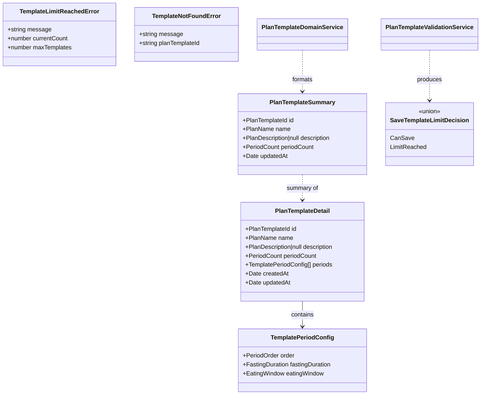

# Functional Domain Design (Web): Plan Templates

> **Source**: Plan Templates UI/UX Implementation Guide | **Generated**: 2026-02-09 | **Status**: Pending Review

## 1. Executive Summary

The Plan Templates feature allows users to save, browse, edit, duplicate, and delete reusable plan templates. Templates are independent from active plans — editing a template never affects an active or past plan. The web feature consumes the existing plan-template API endpoints (CRUD, duplicate) and introduces a gateway service to decode API DTOs into domain types, plus a multi-screen UI with list, edit, and "Save as Template" flows.

## 2. Design Principles

This design adheres to the following functional domain modeling principles:

### 2.1 Closed World Assumption

All possible states are explicitly modeled. The compiler enforces completeness.

| Principle               | Implementation                                                  |
| ----------------------- | --------------------------------------------------------------- |
| Exhaustive matching     | All pattern matches use `Match.exhaustive` - no `default` cases |
| No stringly-typed enums | All enums use `S.Literal` union, never `S.String`               |
| Compile-time safety     | Adding a variant causes compile errors at all switch sites      |
| No hidden states        | No `else` branches that hide bugs                               |

### 2.2 Functional Core / Imperative Shell (Web)

Separation of pure business logic from I/O and UI operations. The web adaptation has 4 shell types:

| Layer                    | Responsibility                                   | Characteristics                                      |
| ------------------------ | ------------------------------------------------ | ---------------------------------------------------- |
| **Functional Core**      | Business logic, validations, decisions           | Pure functions, no I/O, deterministic, testable      |
| **Shell: Gateway**       | HTTP services, API DTO → Domain mapping          | Effect-based, boundary mappers, domain error mapping |
| **Shell: Input**         | User input → Domain types, schema validation     | Composable validates before actor receives input     |
| **Shell: State Machine** | Orchestration (Collection → Logic → Persistence) | XState actor, FC guards, domain-typed context        |
| **Shell: View Model**    | Domain → UI translation, computed derivations    | Composable exposes FC as computeds, validates input  |

> **Clock Rule**: Shell code that needs the current time MUST use `DateTime.nowAsDate` from Effect,
> never `new Date()`. `new Date()` is an implicit side effect that breaks testability (cannot be controlled
> with `TestClock`). Core functions receive `now: Date` as a parameter — they never access the clock directly.

**Core functions in this design**:

- `isTemplateLimitReached(currentCount, maxTemplates): boolean` — check 20-template cap
- `buildDuplicateName(name): PlanName` — append " (copy)" with truncation
- `canSaveTemplate(templateCount): boolean` — guard for save/duplicate actions
- `formatPeriodCountLabel(count): string` — card label (e.g., "5 periods")
- `buildDeleteConfirmationMessage(name): string` — spec copy: "Are you sure you want to delete '[Plan Name]'? This can't be undone."
- `sortTemplatesByRecency(templates): PlanTemplateSummary[]` — sort by `updatedAt` descending

**Shell operations in this design**:

- Gateway: `listTemplates`, `getTemplate`, `createFromPlan`, `updateTemplate`, `deleteTemplate`, `duplicateTemplate`
- Input: `validateUpdateTemplateInput` (update-template-input.schema.ts), `validateCreateFromPlanInput` (create-from-plan-input.schema.ts)
- Actor: `loadTemplatesFlow`, `createFromPlanFlow`, `updateTemplateFlow`, `deleteTemplateFlow`, `duplicateTemplateFlow`
- View Model: `sortedTemplates`, `emptyStateVisible`, `limitReachedMessage`, `canSaveOrDuplicate`, `deleteConfirmationMessage`, `descriptionRemainingChars`, `hasError` + `retry()`

### 2.3 Validation Layers (Web)

> "Validate at the boundary, trust inside"

The web architecture defines **4 mandatory validation layers**:

| Layer                      | Location                           | Responsibility                                           | Validates                          |
| -------------------------- | ---------------------------------- | -------------------------------------------------------- | ---------------------------------- |
| **1. Input Schema**        | Composable (via `domain/schemas/`) | Validate user input → domain types, expose errors for UI | INPUT (raw form → branded types)   |
| **2. Domain Validation**   | Functional Core                    | Pure business rules (no I/O)                             | LOGIC (can X? is Y valid?)         |
| **3. Actor Orchestration** | State Machine                      | Coordinate FC + gateway, domain error handling           | FLOW (returns typed domain errors) |
| **4. Gateway Output**      | Gateway Service boundary mappers   | Validate API response → domain types (decode)            | OUTPUT (DTO → domain, may fail)    |

**Checklist**:

- [ ] Input schema validates raw form data before composable sends to actor
- [ ] Domain validation service contains pure business rules (testable)
- [ ] Actor coordinates gateway + FC, handles domain errors via catchTags
- [ ] Gateway boundary mappers decode API DTOs into domain types

### 2.4 Data Seams

Architectural boundaries where data transforms between layers.

| Seam                   | From                           | To                          | Transformation                                       |
| ---------------------- | ------------------------------ | --------------------------- | ---------------------------------------------------- |
| Gateway → Actor        | `PlanTemplateResponse` (DTO)   | `PlanTemplateSummary` (domain) | `fromTemplateListResponse()` in gateway              |
| Gateway → Actor        | `PlanTemplateWithPeriodsResponse` (DTO) | `PlanTemplateDetail` (domain) | `fromTemplateDetailResponse()` in gateway     |
| Actor → Gateway        | Domain update payload          | API PATCH payload           | `toUpdatePayload()` in gateway                       |
| Component → Composable | Raw form fields (strings)      | Domain types (branded)      | Input schema validation in composable                |
| Composable → Actor     | Domain-typed input             | Domain events               | `actorRef.send()` after validation                   |
| Actor → Composable     | Domain state (context)         | UI state (computeds)        | Computed derivation via selectors                    |

## 3. Type Justification

Each type must declare its category and justification using the Decision Flowchart:

```
Is it a single primitive with constraints?
→ YES: Brand.refined (dm-create-branded-type)

Is it multiple fields that always go together?
→ YES: S.Class Value Object (dm-create-value-object)

Are all variants the same shape?
→ YES: S.Literal Enum (dm-create-literal-enum)

Do variants have different data?
→ YES: Data.TaggedEnum (dm-create-tagged-enum)

Does it need identity and lifecycle?
→ YES: S.Class Entity (dm-create-entity)
```

| Type | Category | Skill | Justification |
|------|----------|-------|---------------|
| `PlanTemplateId` | Brand | `dm-create-branded-type` | Single primitive (string) with UUID constraint — identifies a template |
| `PlanName` | Brand | (reuse from plan) | Single primitive (string) 1–100 chars — already defined in plan domain |
| `PlanDescription` | Brand | (reuse from plan) | Single primitive (string) max 500 chars — already defined in plan domain |
| `FastingDuration` | Brand | (reuse from plan) | Single primitive (number) 1–168h, 15-min increments — already defined |
| `EatingWindow` | Brand | (reuse from plan) | Single primitive (number) 1–24h, 15-min increments — already defined |
| `PeriodCount` | Brand | (reuse from plan) | Single primitive (number) 1–31 integer — already defined |
| `PeriodOrder` | Brand | (reuse from plan) | Single primitive (number) 1–31 integer — already defined |
| `TemplatePeriodConfig` | Value Object | `dm-create-value-object` | Multiple fields (order, fastingDuration, eatingWindow) always together |
| `PlanTemplateSummary` | Value Object | `dm-create-value-object` | Multiple fields for list card display (id, name, description, periodCount) |
| `PlanTemplateDetail` | Value Object | `dm-create-value-object` | Full template with periods for edit screen |
| `SaveTemplateLimitDecision` | Tagged Enum | `dm-create-tagged-enum` | 2+ variants: `CanSave` vs `LimitReached` with different data |

**Smart Constructors Required**:

Types with validation MUST have smart constructors (`dm-create-smart-constructors`):

| Type | Validation | Smart Constructor |
|------|------------|-------------------|
| `PlanTemplateId` | UUID format | Reuse existing `S.UUID.pipe(S.brand(...))` |
| `PlanName` | 1–100 chars | Reuse from plan domain |
| `PlanDescription` | max 500 chars | Reuse from plan domain |
| `FastingDuration` | 1–168h, 15-min increments | Reuse from plan domain |
| `EatingWindow` | 1–24h, 15-min increments | Reuse from plan domain |

> **Note**: Most branded types are reused from the existing `api/src/features/plan/domain/plan.model.ts`. On the web side, we define lightweight equivalents referencing the same constants.

## 4. Domain Components

### 4.1 Entities

No new entities. Templates are represented as value objects on the web side — identity is managed by the API.

### 4.2 Value Objects

| Value Object | Fields | Validation | Smart Constructor |
|--------------|--------|------------|-------------------|
| `TemplatePeriodConfig` | `order: PeriodOrder`, `fastingDuration: FastingDuration`, `eatingWindow: EatingWindow` | Branded type constraints | No (fields are individually branded) |
| `PlanTemplateSummary` | `id: PlanTemplateId`, `name: PlanName`, `description: PlanDescription \| null`, `periodCount: PeriodCount`, `updatedAt: Date` | Branded types applied during gateway decode | No |
| `PlanTemplateDetail` | `id: PlanTemplateId`, `name: PlanName`, `description: PlanDescription \| null`, `periodCount: PeriodCount`, `periods: TemplatePeriodConfig[]`, `createdAt: Date`, `updatedAt: Date` | Branded types applied during gateway decode | No |

### 4.3 Enumerations

#### Literal Enums (same structure for all variants)

| Enum | Values | Metadata Shape | Notes |
|------|--------|----------------|-------|
| (none) | — | — | No literal enums in this feature |

#### Tagged Enums (different data per variant)

| Enum | Variants | Notes |
|------|----------|-------|
| `SaveTemplateLimitDecision` | `CanSave`, `LimitReached` | Gate for create/duplicate actions |

<details>
<summary>Tagged Enum Details</summary>

**SaveTemplateLimitDecision**:
- `CanSave`: `{}` — under limit, proceed
- `LimitReached`: `{ currentCount: number, maxTemplates: number }` — user hit 20-template cap

</details>

### 4.4 Domain Errors

| Error | Fields | Trigger |
|-------|--------|---------|
| `TemplateLimitReachedError` | `message: string`, `currentCount: number`, `maxTemplates: number` | Create or duplicate when at 20 templates |
| `TemplateNotFoundError` | `message: string`, `planTemplateId: string` | Get/update/delete a template that doesn't exist |
| `TemplateServiceError` | `message: string` | Generic gateway/HTTP failure |

### 4.5 Contracts (Use-Case Interfaces)

Each use case that crosses a domain boundary MUST have a contract defining its input, output, and decision ADT.

> **Input Type Rule**: Contract inputs MUST use `S.Struct` with branded types, not `interface`.

| Contract | Input Type | Decision ADT | Skill | File |
|----------|-----------|-------------|-------|------|
| `CreateFromPlanContract` | `CreateFromPlanInput` | `SaveTemplateLimitDecision` | `dm-create-contract` | `domain/contracts/create-from-plan.contract.ts` |
| `UpdateTemplateContract` | `UpdateTemplateInput` | N/A (validation only) | `dm-create-contract` | `domain/contracts/update-template.contract.ts` |
| `DuplicateTemplateContract` | `DuplicateTemplateInput` | `SaveTemplateLimitDecision` | `dm-create-contract` | `domain/contracts/duplicate-template.contract.ts` |
| `DeleteTemplateContract` | `DeleteTemplateInput` | N/A (unconditional) | `dm-create-contract` | `domain/contracts/delete-template.contract.ts` |

<details>
<summary>Contract Details</summary>

**CreateFromPlanContract**:
- Input: `CreateFromPlanInput` — `planId: S.UUID`, `currentCount: S.Number`, `maxTemplates: S.Number`
- Decision: `SaveTemplateLimitDecision` — reuses the limit check ADT
  - `CanSave`: proceed with API call
  - `LimitReached`: show limit message

> **Contract vs Input Schema**: The contract defines the full data the *decision function* needs — this includes `currentCount` and `maxTemplates` alongside `planId`. The input *schema* (`CreateFromPlanInputSchema`) only validates the user-provided subset (`planId`). The actor assembles the full contract input by merging validated user input with its own context:
> ```typescript
> // Actor fromCallback:
> const userInput = input.planId;           // from validated schema
> const currentCount = context.templates.length; // from actor context
> const decision = decideSaveTemplateLimit({ currentCount, maxTemplates: MAX_PLAN_TEMPLATES });
> ```
> This separation follows the same pattern as the API-side `PlanTemplateCreationInput`.

**UpdateTemplateContract**:
- Input: `UpdateTemplateInput` — `planTemplateId: PlanTemplateId`, `name: PlanName`, `description: PlanDescription | null`, `periods: TemplatePeriodConfig[]`
- No decision ADT — input schema validates all fields, actor sends directly to gateway

**DuplicateTemplateContract**:
- Input: `DuplicateTemplateInput` — `planTemplateId: PlanTemplateId`, `currentCount: S.Number`, `maxTemplates: S.Number`
- Decision: `SaveTemplateLimitDecision` — same limit check
  - `CanSave`: proceed with duplicate API call
  - `LimitReached`: show limit message

**DeleteTemplateContract**:
- Input: `DeleteTemplateInput` — `planTemplateId: PlanTemplateId`
- No decision ADT — deletion is unconditional on the web side (API handles not-found)

</details>

### 4.6 Services

#### Validation Services (Core — pure business rules)

| Service | Methods | Skill | Notes |
|---------|---------|-------|-------|
| `PlanTemplateValidationService` | `isTemplateLimitReached(currentCount, maxTemplates): boolean`, `decideSaveTemplateLimit(input): SaveTemplateLimitDecision` | `dm-create-validation-service` | Pure: boolean predicate + decision ADT |

#### Domain Services (Core — pure logic)

| Service | Methods | Skill | Notes |
|---------|---------|-------|-------|
| `PlanTemplateDomainService` | `buildDuplicateName(name): PlanName`, `formatPeriodCountLabel(count): string`, `buildDeleteConfirmationMessage(name): string`, `sortTemplatesByRecency(templates): PlanTemplateSummary[]` | `dm-create-domain-service` | Pure functions + Effect.Service wrapper |

### 4.7 Functional Core Flows (Three Phases)

Each operation that involves I/O → Logic → I/O MUST document its Three Phases pattern.

| Flow | Collection (Shell) | Logic (Core) | Persistence (Shell) | Orchestrator |
|------|-------------------|-------------|-------------------|--------------|
| `loadTemplates` | Gateway: `GET /v1/plan-templates` | — (pass-through) | — | Actor |
| `createFromPlan` | Gateway: `GET /v1/plan-templates` (count) | `decideSaveTemplateLimit` | Gateway: `POST /v1/plan-templates` | Actor |
| `updateTemplate` | — (input already validated) | — (validation in input schema) | Gateway: `PATCH /v1/plan-templates/:id` | Actor |
| `deleteTemplate` | — | — (unconditional) | Gateway: `DELETE /v1/plan-templates/:id` | Actor |
| `duplicateTemplate` | Gateway: count from context | `decideSaveTemplateLimit` | Gateway: `POST /v1/plan-templates/:id/duplicate` | Actor |

### 4.8 Additional Components

#### Boundary Mappers (Gateway)

| Mapper | API DTO (from `@ketone/shared`) | Domain Type | Direction | Notes |
|--------|---------------------------------|-------------|-----------|-------|
| `fromTemplateListResponse` | `PlanTemplateResponse[]` | `PlanTemplateSummary[]` | API → Domain | Decode with branded types |
| `fromTemplateDetailResponse` | `PlanTemplateWithPeriodsResponse` | `PlanTemplateDetail` | API → Domain | Decode with periods |
| `toUpdatePayload` | `PlanTemplateDetail` (partial) | API PATCH body | Domain → API | Pure mapping |

#### Input Schemas

| Schema | Raw Input | Domain Output | Location | Notes |
|--------|-----------|---------------|----------|-------|
| `UpdateTemplateInputSchema` | `{ name: string, description: string, periods: { fastingDuration: number, eatingWindow: number }[] }` | `UpdateTemplateInput` (branded) | `domain/schemas/update-template-input.schema.ts` | Name required, description optional (empty string → null), periods validated |
| `CreateFromPlanInputSchema` | `{ planId: string }` | `CreateFromPlanInput` (planId as UUID) | `domain/schemas/create-from-plan-input.schema.ts` | Validates UUID format before actor receives it |

## 5. Type Diagram



## 6. Architecture Phases

This design follows the **Web Functional Core / Imperative Shell** architecture. Implementation proceeds in 5 phases, each building on the previous.

### Phase 0: Scaffold

> Create `domain/` folder structure with mandatory barrel files

Use `dm-scaffold-domain-module` with web path (`web/src/views/planTemplates/domain/`).

| Step | Component        | File                        | Notes                                                   |
| ---- | ---------------- | --------------------------- | ------------------------------------------------------- |
| 0.1  | Domain directory | `domain/`                   | Module root                                             |
| 0.2  | Model file       | `domain/plan-template.model.ts` | Constants, types, enums                                |
| 0.3  | Errors file      | `domain/errors.ts`          | Domain errors                                           |
| 0.4  | Contracts barrel | `domain/contracts/index.ts` | Barrel for contracts                                    |
| 0.5  | Services barrel  | `domain/services/index.ts`  | Barrel for domain services                              |
| 0.6  | Schemas barrel   | `domain/schemas/index.ts`   | Barrel for input schemas                                |
| 0.7  | Domain barrel    | `domain/index.ts`           | Barrel: model + errors + contracts + services + schemas |

**Command**: `"implement phase 0"` or `"scaffold domain"`

### Phase 1: Functional Core (Pure Logic)

> Domain types, pure services, ADTs, contracts, reified decisions. **Identical to API Phase 1** — all 13 dm-\* skills apply unchanged.

Phase 1 steps MUST follow this order (dependencies flow top-to-bottom):

| Step | Component                 | Skill                          | File                                               | Notes                                                             |
| ---- | ------------------------- | ------------------------------ | -------------------------------------------------- | ----------------------------------------------------------------- |
| 1.a  | Constants + Branded Types | `dm-create-branded-type`       | `domain/plan-template.model.ts`                       | Reuse plan constants (`MIN_FASTING_DURATION`, etc.) + `MAX_PLAN_TEMPLATES = 20`, `MAX_PLAN_NAME_LENGTH = 100`, `MAX_PLAN_DESCRIPTION_LENGTH = 500`. Define `PlanTemplateId` brand. |
| 1.b  | Value Objects             | `dm-create-value-object`       | `domain/plan-template.model.ts`                       | `TemplatePeriodConfig`, `PlanTemplateSummary`, `PlanTemplateDetail` |
| 1.c  | Tagged Enums              | `dm-create-tagged-enum`        | `domain/plan-template.model.ts`                       | `SaveTemplateLimitDecision` ADT |
| 1.d  | Smart Constructors        | `dm-create-smart-constructors` | `domain/plan-template.model.ts`                       | For `PlanTemplateId` (UUID brand). Other branded types reused from plan domain already have constructors. |
| 1.e  | Domain Errors             | `dm-create-domain-error`       | `domain/errors.ts`                                 | `TemplateLimitReachedError`, `TemplateNotFoundError`, `TemplateServiceError` |
| 1.f  | Contracts                 | `dm-create-contract`           | `domain/contracts/create-from-plan.contract.ts`, `domain/contracts/update-template.contract.ts`, `domain/contracts/duplicate-template.contract.ts`, `domain/contracts/delete-template.contract.ts` | Use-case input/output + decision ADTs |
| 1.g  | Validation Services       | `dm-create-validation-service` | `domain/services/plan-template-validation.service.ts` | Pure business rules: limit check predicate + decision ADT |
| 1.h  | Domain Services           | `dm-create-domain-service`     | `domain/services/plan-template.service.ts`            | `buildDuplicateName`, `formatPeriodCountLabel`, `buildDeleteConfirmationMessage`, `sortTemplatesByRecency` |

**Shared Types** (pass the Orphan Test — would still make sense if this module is deleted):

| Type   | Location | Skill   | Reason   |
| ------ | -------- | ------- | -------- |
| `PlanTemplateResponseSchema` | `@ketone/shared` | (existing) | Wire format for API ↔ web |
| `PlanTemplateWithPeriodsResponseSchema` | `@ketone/shared` | (existing) | Wire format for API ↔ web |
| `PlanTemplatesListResponseSchema` | `@ketone/shared` | (existing) | Wire format for API ↔ web |
| Plan branded types (`FastingDuration`, `EatingWindow`, etc.) | `web/src/views/plan/constants.ts` + local model | (existing) | Constants already shared; branded type constructors are web-local |

**Command**: `"implement phase 1"`

### Phase 2: Shell — Gateway Service (Repository Equivalent)

> HTTP service with boundary mappers that decode API DTOs into domain types.

Uses `dm-create-gateway-service` skill (composes on `create-service` layout).

| Step | Component        | Skill                       | File                                        | Notes                                  |
| ---- | ---------------- | --------------------------- | ------------------------------------------- | -------------------------------------- |
| 2.a  | Boundary Mappers | `dm-create-boundary-mapper` | `services/plan-template.service.ts`            | `fromTemplateListResponse()`, `fromTemplateDetailResponse()`, `toUpdatePayload()` |
| 2.b  | Gateway Service  | `dm-create-gateway-service` | `services/plan-template.service.ts`            | Effect.Service + program exports for: `listTemplates`, `getTemplate`, `createFromPlan`, `updateTemplate`, `deleteTemplate`, `duplicateTemplate` |
| 2.c  | Error Mapping    | (part of gateway)           | `services/plan-template.service.ts`            | HTTP 404 → `TemplateNotFoundError`, 409 → `TemplateLimitReachedError`, 5xx → `TemplateServiceError` |

**API Endpoints Consumed**:

| Method | Endpoint | Gateway Method | Returns |
|--------|----------|---------------|---------|
| `GET` | `/v1/plan-templates` | `listTemplates()` | `PlanTemplateSummary[]` |
| `GET` | `/v1/plan-templates/:id` | `getTemplate(id)` | `PlanTemplateDetail` |
| `POST` | `/v1/plan-templates` | `createFromPlan(planId)` | `PlanTemplateDetail` |
| `PATCH` | `/v1/plan-templates/:id` | `updateTemplate(id, payload)` | `PlanTemplateDetail` |
| `DELETE` | `/v1/plan-templates/:id` | `deleteTemplate(id)` | `void` |
| `POST` | `/v1/plan-templates/:id/duplicate` | `duplicateTemplate(id)` | `PlanTemplateDetail` |

**Boundary Mapping Checklist**:

- [ ] `fromTemplateListResponse(dto[])` decodes API DTO array → `PlanTemplateSummary[]` (may fail with parse error)
- [ ] `fromTemplateDetailResponse(dto)` decodes API DTO → `PlanTemplateDetail` (may fail with parse error)
- [ ] `toUpdatePayload(domain)` maps domain update input → API PATCH payload (pure, always succeeds)
- [ ] DTO types are **never** exposed past the gateway service boundary
- [ ] Branded types are applied during decode (not after)
- [ ] All gateway methods return Domain Types, never raw DTOs
- [ ] HTTP errors are mapped to domain-tagged errors (`TemplateLimitReachedError`, `TemplateNotFoundError`, `TemplateServiceError`)
- [ ] Actor never interprets raw HTTP status codes

**Command**: `"implement phase 2"`

### Phase 3: Shell — Input Validation (API Handler Equivalent)

> Input schemas validate user form input and transform to domain types.

Uses `dm-create-input-schema-web` skill.

| Step | Component    | Skill                        | File                                              | Notes                   |
| ---- | ------------ | ---------------------------- | ------------------------------------------------- | ----------------------- |
| 3.a  | Update Template Input Schema | `dm-create-input-schema-web` | `domain/schemas/update-template-input.schema.ts` | Raw form → domain types (name, description, periods). Empty description string → `null`. |
| 3.b  | Create From Plan Input Schema | `dm-create-input-schema-web` | `domain/schemas/create-from-plan-input.schema.ts` | Validates `planId` as UUID before composable sends to actor. |

**Input Validation Flow**:

```
Component (raw form data: { name: string, description: string, periods: { fastingDuration: number, eatingWindow: number }[] })
    → Composable: validateUpdateInput(rawData)
        → Schema.decodeUnknownEither(UpdateTemplateInputSchema)(rawData)
            → Either<ParseError, UpdateTemplateInput>
                → Left: extractSchemaErrors() → Record<string, string[]> → UI errors
                → Right: actorRef.send({ type: Event.UPDATE, input: updateInput })
```

**Checklist**:

- [ ] Raw input schema defines what comes from UI (strings, numbers, no branded types)
- [ ] Domain input type has branded types and value objects
- [ ] `validateUpdateInput()` transforms and validates in one step
- [ ] `extractSchemaErrors()` produces standardized `Record<string, string[]>`
- [ ] Schema references constants from model (no magic numbers)
- [ ] Actor only receives validated domain-typed input from composable

**Command**: `"implement phase 3"`

### Phase 4: Orchestration — State Machine (Coordinator Equivalent)

> XState actor consuming FC for guards/actions, gateway for I/O.

Uses `create-actor` skill with FC-integration sections.

**Note**: This feature has two separate actors:

1. **`planTemplates.actor.ts`** — Main actor for the Plan Templates list page (load, duplicate, delete)
2. **`planTemplateEdit.actor.ts`** — Actor for the Plan Detail / Edit Screen (load single template, update)
3. **"Save as Template" integration** — Small addition to the existing `planEdit.actor.ts` (add CREATE_TEMPLATE event)

| Step | Component        | Skill                       | File                                            | Notes                                                                                               |
| ---- | ---------------- | --------------------------- | ----------------------------------------------- | --------------------------------------------------------------------------------------------------- |
| 4.a  | Plan Templates List Actor | `create-actor`        | `actors/planTemplates.actor.ts`                    | States: Idle → Loading → Ready → Duplicating/Deleting. FC guards for limit check. |
| 4.b  | Plan Template Edit Actor  | `create-actor`        | `actors/planTemplateEdit.actor.ts`                 | States: Idle → Loading → Ready → Updating. Input-validated events. |
| 4.c  | Save as Template (existing actor extension) | (manual) | `../plan/actors/planEdit.actor.ts`      | Add `SAVE_AS_TEMPLATE` event + `SavingTemplate` state to existing plan edit actor. |
| 4.d  | List Emission Handler | (see `create-actor` Step 3) | `composables/usePlanTemplatesEmissions.ts`  | Domain error → UI notification (toast). |
| 4.e  | Edit Emission Handler | (see `create-actor` Step 3) | `composables/usePlanTemplateEditEmissions.ts` | Domain error → UI notification (toast). |

**Actor FC-Integration Checklist**:

- [ ] Guards delegate to domain service pure functions (no inline business rules)
- [ ] Decision ADT transitions use `$match`/`$is` exhaustively
- [ ] Context uses domain types (`PlanTemplateId`, `PlanTemplateSummary[]`, `PlanTemplateDetail`)
- [ ] Events carry domain-typed payloads (validated by composable before send)
- [ ] No `Date.now()` in actor — use `DateTime.nowAsDate` in gateway, pass as input
- [ ] Error handling uses Domain Error ADTs from `domain/errors.ts`
- [ ] `Match.orElse` is PROHIBITED for decision matching (violates closed world)

**Plan Templates List Actor — State Machine Sketch**:

```
Idle → [LOAD] → Loading
Loading → [ON_LOAD_SUCCESS] → Ready
Loading → [ON_ERROR] → Error
Ready → [DUPLICATE] → Duplicating (guard: canSaveOrDuplicate via FC)
Ready → [DELETE] → Deleting
Duplicating → [ON_DUPLICATE_SUCCESS] → Ready (update list)
Duplicating → [ON_LIMIT_REACHED] → Ready (emit limit error)
Duplicating → [ON_ERROR] → Ready (emit error)
Deleting → [ON_DELETE_SUCCESS] → Ready (remove from list)
Deleting → [ON_ERROR] → Ready (emit error)
Error → [RETRY] → Loading
```

**Plan Template Edit Actor — State Machine Sketch**:

```
Idle → [LOAD] → Loading
Loading → [ON_LOAD_SUCCESS] → Ready
Loading → [ON_ERROR] → Error
Ready → [UPDATE] → Updating
Updating → [ON_UPDATE_SUCCESS] → Ready (update context)
Updating → [ON_ERROR] → Ready (emit error)
Error → [RETRY] → Loading
```

**Command**: `"implement phase 4"`

### Phase 5: Presentation — Composable + Component

> Composable as View Model + Component using composable.

Uses `web-create-composable` and `vue-props` skills.

| Step | Component               | Skill                   | File                                          | Notes                               |
| ---- | ----------------------- | ----------------------- | --------------------------------------------- | ----------------------------------- |
| 5.a  | Plan Templates List Composable | `web-create-composable` | `composables/usePlanTemplates.ts`          | List state, duplicate, delete, limit check |
| 5.b  | Plan Template Edit Composable  | `web-create-composable` | `composables/usePlanTemplateEdit.ts`       | Load, validate input, update |
| 5.c  | Save as Template Composable (extend) | (manual)    | `../plan/composables/usePlanEdit.ts`    | Add `saveAsTemplate` method |
| 5.d  | PlanTemplatesView          | `vue-props`             | `PlanTemplatesView.vue`                          | Card list, empty state, actions menu. **Error state**: show error message + **Retry button** (spec: "Something went wrong. Please try again." with Retry action). |
| 5.e  | PlanTemplateCard           | `vue-props`             | `components/PlanTemplateCard.vue`                | Card display with name, description, period count |
| 5.f  | PlanTemplateEditView       | `vue-props`             | `PlanTemplateEditView.vue`                       | Edit form: name, description (with character counter), periods |
| 5.g  | Router update           | (manual)                | `router/index.ts`                             | Add `/plan-templates` and `/plan-templates/:id/edit` routes |

**Composable Responsibilities**:

| Concern              | Implementation                                          |
| -------------------- | ------------------------------------------------------- |
| Domain computeds     | `computed(() => isTemplateLimitReached(templates.value.length, MAX_PLAN_TEMPLATES))` |
| Sorted templates     | `computed(() => sortTemplatesByRecency(templates.value))` — spec: "most recently modified or used (most recent first)" |
| Input validation     | `validateUpdateInput(rawData)` via domain schemas |
| UI state translation | `computed(() => formatPeriodCountLabel(template.value?.periodCount))` |
| Error display        | `errors: Ref<Record<string, string[]>>` |
| Delete confirmation  | `computed(() => buildDeleteConfirmationMessage(selectedTemplate.value?.name))` |
| Limit reached copy   | `computed(() => 'You have 20 saved plans—that\'s the limit! To save a new one, delete a plan you no longer use.')` — exact spec copy, derived from FC `isTemplateLimitReached` |
| Description counter  | `descriptionRemainingChars: computed(() => MAX_PLAN_DESCRIPTION_LENGTH - (description.value?.length ?? 0))` — spec: "Show character count or inline error near the limit" |

**Component Rules**:

- [ ] Component never contains business logic (`if (templates.length >= 20)` → composable computed)
- [ ] Component emits only validated domain input (raw data goes through composable first)
- [ ] All conditional rendering based on business rules uses composable computeds
- [ ] Component does not import from `domain/` directly — only through composable

**Command**: `"implement phase 5"`

### Implementation Order

```
Phase 0 (Scaffold)   ──────►
                      Directory structure + barrels

Phase 1 (Core)       ──────────────────────────────────►
                      Types, Errors, Pure Services

Phase 2 (Gateway)    ──────────────────────────────────►
                      HTTP + Boundary Mappers (depends on Core types)

Phase 3 (Input)      ──────────────────────────────────►
                      Input Schemas (depends on Core types)

Phase 4 (Actor)      ──────────────────────────────────►
                      State Machine (depends on Core + Gateway)

Phase 5 (Composable) ──────────────────────────────────►
                      View Model + Component (depends on Core + Actor)
```

### Files to Create

```
web/src/views/planTemplates/
├── domain/
│   ├── plan-template.model.ts                     # Constants, Branded Types, VOs, Tagged Enums
│   ├── errors.ts                               # Domain Errors (Data.TaggedError)
│   ├── index.ts                                # Barrel: model + errors + contracts + services + schemas
│   ├── contracts/
│   │   ├── index.ts                            # Barrel (mandatory)
│   │   ├── create-from-plan.contract.ts        # Create template from plan
│   │   ├── update-template.contract.ts         # Update template
│   │   ├── duplicate-template.contract.ts      # Duplicate template
│   │   └── delete-template.contract.ts         # Delete template
│   ├── services/
│   │   ├── index.ts                            # Barrel (mandatory)
│   │   ├── plan-template-validation.service.ts    # Pure limit check predicates
│   │   └── plan-template.service.ts               # Pure formatting/helper functions
│   └── schemas/
│       ├── index.ts                            # Barrel (mandatory)
│       ├── update-template-input.schema.ts     # Form input → domain types
│       └── create-from-plan-input.schema.ts    # planId validation → UUID
├── services/
│   └── plan-template.service.ts                   # Effect HTTP + boundary mappers (Phase 2)
├── actors/
│   ├── planTemplates.actor.ts                     # XState machine: list page (Phase 4)
│   └── planTemplateEdit.actor.ts                  # XState machine: edit page (Phase 4)
├── composables/
│   ├── usePlanTemplates.ts                        # View Model: list page (Phase 5)
│   ├── usePlanTemplateEdit.ts                     # View Model: edit page (Phase 5)
│   ├── usePlanTemplatesEmissions.ts               # Emission handler: list (Phase 4)
│   └── usePlanTemplateEditEmissions.ts            # Emission handler: edit (Phase 4)
├── components/
│   └── PlanTemplateCard.vue                       # Card component (Phase 5)
├── PlanTemplatesView.vue                          # List page (Phase 5)
└── PlanTemplateEditView.vue                       # Edit page (Phase 5)

# Modified existing files:
web/src/views/plan/actors/planEdit.actor.ts     # Add SAVE_AS_TEMPLATE event (Phase 4)
web/src/views/plan/composables/usePlanEdit.ts   # Add saveAsTemplate method (Phase 5)
web/src/views/plan/PlanEditView.vue             # Add "Save as Template" button (Phase 5)
web/src/router/index.ts                         # Add /plan-templates routes (Phase 5)
```

## 7. Closed World Checklist

Before implementation, verify:

- [ ] All enums use `S.Literal` union (not `S.String`) — `SaveTemplateLimitDecision` uses `Data.TaggedEnum`
- [ ] All pattern matches use `Match.exhaustive` — decision ADT matches in actor use `$match`
- [ ] No `default` or `else` cases that hide bugs — actors match all decision variants
- [ ] Adding a variant causes compile errors at all switch sites — TaggedEnum ensures this
- [ ] No optional fields that depend on other fields (use Tagged Enum instead) — `description` is independently optional
- [ ] No boolean discriminators with optional fields (use Tagged Enum instead) — limit check uses ADT

## 8. FC/IS Implementation Checklist

When implementing each phase, verify:

**Phase 1 — Functional Core:**

- [ ] **Constants** live in model file alongside their branded types (no magic numbers)
- [ ] **Branded types** reference named constants in predicates and error messages
- [ ] **Contracts** exist for each use case with input types and decision ADTs
- [ ] **Contract inputs** use `S.Struct` with branded types (not `interface`)
- [ ] **Contract ADT variants** use branded types for entity IDs (e.g., `PlanTemplateId` not `string`)
- [ ] **Domain services** include `FUNCTIONAL CORE` documentation header with Three Phases context
- [ ] **Domain services** export pure functions both as standalone AND inside Effect.Service wrapper
- [ ] **Domain service preconditions** use pure boolean predicates (2 outcomes) or TaggedEnum ADTs (3+ outcomes) — never `Effect<void, DomainError>`
- [ ] **Validation services** are separate from domain services (single responsibility)

**Phase 2 — Gateway Service:**

- [ ] **Boundary mappers** decode API DTOs into domain types (`fromTemplateListResponse`, `fromTemplateDetailResponse`)
- [ ] **Boundary mappers** encode domain types to API payloads (`toUpdatePayload`)
- [ ] **DTOs never leak** past the gateway service boundary
- [ ] **Gateway methods** return domain types, never raw API response types
- [ ] **HTTP errors** are mapped to domain-tagged errors (not raw HTTP status types)
- [ ] **program exports** provide the service layer for XState consumption

**Phase 3 — Input Validation:**

- [ ] **Input schemas** validate raw form data → domain types
- [ ] **Schema references** named constants (no magic numbers)
- [ ] **extractSchemaErrors** produces `Record<string, string[]>` for UI
- [ ] **Composable** executes validation, not the actor

**Phase 4 — State Machine:**

- [ ] **Guards** delegate to FC domain service pure functions
- [ ] **Decision ADT transitions** use `$match`/`$is` exhaustively
- [ ] **Context** uses domain types (branded IDs, value objects)
- [ ] **Events** carry domain-typed payloads (validated before send)
- [ ] **No `Date.now()`** in actor — clock accessed in gateway shell
- [ ] **Error handling** uses Domain Error ADTs

**Phase 5 — Composable + Component:**

- [ ] **Composable** exposes FC services as computeds
- [ ] **Composable** validates input with Schema before sending to actor
- [ ] **Composable** translates domain types to UI strings (only layer allowed)
- [ ] **Component** never contains business logic
- [ ] **Component** emits only validated domain input

## 9. Component Behavior Boundary

Documents which rules live in FC vs component.

| Rule / Behavior                         | Where                                                       | Why                              |
| --------------------------------------- | ----------------------------------------------------------- | -------------------------------- |
| Can user save/duplicate a template?     | FC: `isTemplateLimitReached()` → composable computed        | Business rule (20-template cap)  |
| Period count display label              | FC: `formatPeriodCountLabel()` → composable computed        | Domain formatting                |
| Duplicate name computation              | FC: `buildDuplicateName()` → used in actor                 | Business rule (name + " (copy)") |
| Delete confirmation message             | FC: `buildDeleteConfirmationMessage()` → composable computed | Domain-aware message            |
| Limit reached error message             | Composable: `limitReachedMessage` computed                  | UI translation (only composable) |
| Empty state visibility                  | Composable: `emptyStateVisible` computed                    | Derived from template count      |
| Card overflow menu                      | Component directly                                          | UI mechanics, not business       |
| Button loading spinner                  | Actor state → composable selector                           | Async state from actor           |
| Template list sort order                | FC: `sortTemplatesByRecency()` → composable computed        | Business rule (most recent first)|
| Description character counter           | Composable: `descriptionRemainingChars` computed            | UI feedback from domain constant |
| Limit reached exact copy                | Composable: `limitReachedMessage` computed (exact spec copy)| UI translation (only composable) |
| Error state with retry button           | Actor `Error` state → composable selector → component retry | Async state from actor           |
| Inline field validation errors          | Input schema → composable `errors` ref                      | Structural validation            |
| Toast notifications                     | Emission handler → toast service                            | Side effect in shell             |

**Rule**: If a component introduces business-driven conditional rendering or enabling/disabling, it MUST be derived from FC services via composable computed. No business rules in `<template>` or `<script setup>`.

## 10. Type Sharing Strategy

| What                                                | Where                                                 | Reason                                     |
| --------------------------------------------------- | ----------------------------------------------------- | ------------------------------------------ |
| Wire format schemas (`PlanTemplateResponseSchema`)  | `@ketone/shared`                                      | Define JSON shape for API ↔ web           |
| Wire format schemas (`PlanTemplateWithPeriodsResponseSchema`) | `@ketone/shared`                           | Define JSON shape for API ↔ web           |
| Plan validation constants (`MIN_FASTING_DURATION`)  | `web/src/views/plan/constants.ts`                     | Already exists, reuse in plan-template model  |
| Template-specific constant (`MAX_PLAN_TEMPLATES`)   | `web/src/views/planTemplates/domain/plan-template.model.ts` | Feature-specific, not shared               |
| Name/description length constants                   | `web/src/views/planTemplates/domain/plan-template.model.ts` | Feature-specific on web side               |
| Branded types (`PlanTemplateId`, `FastingDuration`)  | Feature `domain/plan-template.model.ts`                  | Compile-time construct, doesn't cross wire |
| Value objects (`PlanTemplateSummary`, `PlanTemplateDetail`) | Feature `domain/plan-template.model.ts`                 | Web-specific shapes for UI                 |
| Contracts, domain services                          | Feature `domain/`                                     | Feature-specific logic                     |

**Orphan Test**: If `@ketone/shared` is deleted, both sides can redefine wire schemas. If `web/src/views/planTemplates/domain/` is deleted, only the Plan Templates feature breaks.

## 11. Warning Signs Detected

- [x] **Reuse vs duplication of branded types**: Plan domain already defines `FastingDuration`, `EatingWindow`, `PlanName`, etc. on the API side. The web planTemplates module should import constants from `web/src/views/plan/constants.ts` and define its own branded type constructors locally (branded types are compile-time constructs that don't cross the wire).
- [x] **"Save as Template" crosses feature boundaries**: The button lives in `PlanEditView` but creates a template. This is handled by extending the existing plan edit actor with a new event, keeping the template creation logic in the plan templates gateway service.
- [x] **No business logic in empty state**: Empty state rendering (`templates.length === 0`) is a simple derived check, but it should still come from a composable computed, not inline in the template.
- [x] **Description nullable vs empty string**: The spec says "If the user clears the field, it is stored as null." The input schema must transform empty strings to `null` during validation.
- [x] **Delete is unconditional on web side**: No decision ADT needed — the API handles not-found errors, which the gateway maps to `TemplateNotFoundError`.

## 12. Open Questions

1. **"Save as Template" — which plan ID?** The Plan Edit screen shows an active plan. The create-from-plan API requires a `planId`. Should `saveAsTemplate` use the currently loaded plan's ID from the plan edit actor context? (Assumed: yes, from `route.params.planId`)
2. **Navigation after save-as-template**: After successfully saving as template, should the user stay on the plan edit screen (with toast) or navigate to the Plan Templates page? (Spec says: toast only, stay on page)
3. **Plan Templates page location in navigation**: Where does the Plan Templates page appear in the app navigation? Is it a tab/link from the Plans section, a menu item, or a dedicated route? (Assumed: `/plan-templates` route, accessible from plans section)
4. **Sort order for list**: Spec says "most recently modified or used." → Resolved: FC pure function `sortTemplatesByRecency()` sorts by `updatedAt` desc. Composable exposes `sortedTemplates` computed.

## 13. Next Steps

1. **Review** this document for correctness and completeness
2. **Verify** Type Justification table (Section 3) - each type has correct category
3. **Verify** Closed World Checklist (Section 7) - all items will be satisfied
4. **Verify** FC/IS Implementation Checklist (Section 8) - all layers covered
5. **Verify** Component Behavior Boundary (Section 9) - business rules in FC, not components
6. **Verify** Type Sharing Strategy (Section 10) - nothing in `@ketone/shared` that should be local
7. **Resolve** any open questions above
8. **Implement by phase**:
   - `"implement phase 0"` → Scaffold domain directory
   - `"implement phase 1"` → Functional Core
   - `"implement phase 2"` → Gateway Service
   - `"implement phase 3"` → Input Validation
   - `"implement phase 4"` → State Machine
   - `"implement phase 5"` → Composable + Component
   - Or `"implement all"` / `"implement the plan"` → All phases in order

Each phase builds on the previous. Phase 0 (Scaffold) and Phase 1 (Core) should be implemented first as they define the domain types used by all other phases.

---

<details>
<summary>Analysis YAML (reference)</summary>

```yaml
feature: PlanTemplates
description: >
  Web feature for managing reusable plan templates. Users can save plan configurations
  as templates, browse them in a card list, edit template details and periods, duplicate
  templates, and delete them. Integrates with existing plan-template API endpoints.

entities: []
  # No new entities — template identity managed by API

value_objects:
  - name: TemplatePeriodConfig
    fields: [order: PeriodOrder, fastingDuration: FastingDuration, eatingWindow: EatingWindow]
    validation: branded type constraints on each field
    source: reuse from API domain model

  - name: PlanTemplateSummary
    fields: [id: PlanTemplateId, name: PlanName, description: PlanDescription|null, periodCount: PeriodCount, updatedAt: Date]
    validation: branded types applied during gateway decode

  - name: PlanTemplateDetail
    fields: [id: PlanTemplateId, name: PlanName, description: PlanDescription|null, periodCount: PeriodCount, periods: TemplatePeriodConfig[], createdAt: Date, updatedAt: Date]
    validation: branded types applied during gateway decode

branded_types:
  - name: PlanTemplateId
    base: string (UUID)
    constraint: UUID format
    source: new (web-local)

  - name: PlanName
    base: string
    constraint: 1-100 chars
    source: reuse plan constants

  - name: PlanDescription
    base: string
    constraint: max 500 chars
    source: reuse plan constants

  - name: FastingDuration
    base: number
    constraint: 1-168h, 15-min increments
    source: reuse plan constants

  - name: EatingWindow
    base: number
    constraint: 1-24h, 15-min increments
    source: reuse plan constants

  - name: PeriodCount
    base: number
    constraint: 1-31 integer
    source: reuse plan constants

  - name: PeriodOrder
    base: number
    constraint: 1-31 integer
    source: reuse plan constants

tagged_enums:
  - name: SaveTemplateLimitDecision
    variants:
      - CanSave: {}
      - LimitReached: { currentCount: number, maxTemplates: number }

domain_errors:
  - name: TemplateLimitReachedError
    fields: { message: string, currentCount: number, maxTemplates: number }
    trigger: create or duplicate at 20-template cap

  - name: TemplateNotFoundError
    fields: { message: string, planTemplateId: string }
    trigger: get/update/delete non-existent template

  - name: TemplateServiceError
    fields: { message: string }
    trigger: generic HTTP/gateway failure

contracts:
  - name: CreateFromPlanContract
    input: { planId: UUID, currentCount: number, maxTemplates: number }
    decision: SaveTemplateLimitDecision
    notes: contract has full decision input; input schema validates only planId; actor merges from context

  - name: UpdateTemplateContract
    input: { planTemplateId: PlanTemplateId, name: PlanName, description: PlanDescription|null, periods: TemplatePeriodConfig[] }
    decision: null

  - name: DuplicateTemplateContract
    input: { planTemplateId: PlanTemplateId, currentCount: number, maxTemplates: number }
    decision: SaveTemplateLimitDecision

  - name: DeleteTemplateContract
    input: { planTemplateId: PlanTemplateId }
    decision: null

services:
  validation:
    - name: PlanTemplateValidationService
      methods:
        - isTemplateLimitReached(currentCount, maxTemplates): boolean
        - decideSaveTemplateLimit(input): SaveTemplateLimitDecision

  domain:
    - name: PlanTemplateDomainService
      methods:
        - buildDuplicateName(name): PlanName
        - formatPeriodCountLabel(count): string
        - buildDeleteConfirmationMessage(name): string
        - sortTemplatesByRecency(templates): PlanTemplateSummary[]

boundary_mappers:
  - name: fromTemplateListResponse
    from: PlanTemplateResponse[] (DTO)
    to: PlanTemplateSummary[] (domain)
    direction: API → Domain

  - name: fromTemplateDetailResponse
    from: PlanTemplateWithPeriodsResponse (DTO)
    to: PlanTemplateDetail (domain)
    direction: API → Domain

  - name: toUpdatePayload
    from: UpdateTemplateInput (domain)
    to: API PATCH body
    direction: Domain → API

input_schemas:
  - name: UpdateTemplateInputSchema
    raw: { name: string, description: string, periods: { fastingDuration: number, eatingWindow: number }[] }
    domain: UpdateTemplateInput (branded types)
    notes: empty description string → null

  - name: CreateFromPlanInputSchema
    raw: { planId: string }
    domain: CreateFromPlanInput (planId as UUID)
    notes: validates UUID format before actor

shared_types:
  - type: PlanTemplateResponseSchema
    location: "@ketone/shared"
    reason: wire format

  - type: PlanTemplateWithPeriodsResponseSchema
    location: "@ketone/shared"
    reason: wire format

  - type: Plan validation constants
    location: "web/src/views/plan/constants.ts"
    reason: already exists, reuse

warning_signs:
  - reuse_vs_duplication: branded types reused from plan, constants imported
  - cross_feature: save-as-template extends plan edit actor
  - nullable_description: empty string → null transformation in input schema
  - unconditional_delete: no decision ADT, API handles not-found
```

</details>

<details>
<summary>Plan YAML (reference)</summary>

```yaml
implementation_plan:
  feature: PlanTemplates
  base_path: web/src/views/planTemplates

  shared_types:
    - type: PlanTemplateResponseSchema
      location: "@ketone/shared"
      skill: existing
      reason: wire format already published

    - type: PlanTemplateWithPeriodsResponseSchema
      location: "@ketone/shared"
      skill: existing
      reason: wire format already published

    - type: Plan constants
      location: "web/src/views/plan/constants.ts"
      skill: existing
      reason: reuse MIN/MAX values

  phases:
    - phase: 0
      name: Scaffold
      steps:
        - skill: dm-scaffold-domain-module
          file: domain/
          reason: create directory structure + barrels

    - phase: 1
      name: Functional Core
      steps:
        - step: 1.a
          skill: dm-create-branded-type
          file: domain/plan-template.model.ts
          args: PlanTemplateId (UUID), reuse plan constants
          reason: template identity + reuse plan branded types

        - step: 1.b
          skill: dm-create-value-object
          file: domain/plan-template.model.ts
          args: TemplatePeriodConfig, PlanTemplateSummary, PlanTemplateDetail
          reason: domain representations for gateway output

        - step: 1.c
          skill: dm-create-tagged-enum
          file: domain/plan-template.model.ts
          args: SaveTemplateLimitDecision { CanSave, LimitReached }
          reason: reified decision for save/duplicate guard

        - step: 1.d
          skill: dm-create-smart-constructors
          file: domain/plan-template.model.ts
          args: PlanTemplateId (UUID brand)
          reason: smart constructors for types with validation

        - step: 1.e
          skill: dm-create-domain-error
          file: domain/errors.ts
          args: TemplateLimitReachedError, TemplateNotFoundError, TemplateServiceError
          reason: typed errors for gateway error mapping

        - step: 1.f
          skill: dm-create-contract
          files:
            - domain/contracts/create-from-plan.contract.ts
            - domain/contracts/update-template.contract.ts
            - domain/contracts/duplicate-template.contract.ts
            - domain/contracts/delete-template.contract.ts
          reason: use-case interfaces with decision ADTs

        - step: 1.g
          skill: dm-create-validation-service
          file: domain/services/plan-template-validation.service.ts
          args: isTemplateLimitReached, decideSaveTemplateLimit
          reason: pure business rule predicates

        - step: 1.h
          skill: dm-create-domain-service
          file: domain/services/plan-template.service.ts
          args: buildDuplicateName, formatPeriodCountLabel, buildDeleteConfirmationMessage, sortTemplatesByRecency
          reason: pure helper functions

    - phase: 2
      name: Gateway Service
      steps:
        - step: 2.a
          skill: dm-create-boundary-mapper
          file: services/plan-template.service.ts
          args: fromTemplateListResponse, fromTemplateDetailResponse, toUpdatePayload
          reason: API DTO ↔ domain type mapping

        - step: 2.b
          skill: dm-create-gateway-service
          file: services/plan-template.service.ts
          args: listTemplates, getTemplate, createFromPlan, updateTemplate, deleteTemplate, duplicateTemplate
          reason: Effect HTTP service + error mapping

    - phase: 3
      name: Input Validation
      steps:
        - step: 3.a
          skill: dm-create-input-schema-web
          file: domain/schemas/update-template-input.schema.ts
          args: name (1-100), description (opt 0-500, empty→null), periods (1-31 items with fasting/eating)
          reason: raw form → domain types with inline error support

        - step: 3.b
          skill: dm-create-input-schema-web
          file: domain/schemas/create-from-plan-input.schema.ts
          args: planId (UUID)
          reason: validate planId before save-as-template flow

    - phase: 4
      name: State Machines
      steps:
        - step: 4.a
          skill: create-actor
          file: actors/planTemplates.actor.ts
          args: list page states (Idle, Loading, Ready, Duplicating, Deleting, Error)
          reason: list page orchestration

        - step: 4.b
          skill: create-actor
          file: actors/planTemplateEdit.actor.ts
          args: edit page states (Idle, Loading, Ready, Updating, Error)
          reason: edit page orchestration

        - step: 4.c
          skill: manual
          file: ../plan/actors/planEdit.actor.ts
          args: add SAVE_AS_TEMPLATE event + SavingTemplate state
          reason: integrate save-as-template into existing plan edit flow

        - step: 4.d
          skill: create-actor (emission handler)
          file: composables/usePlanTemplatesEmissions.ts
          reason: toast notifications for list page

        - step: 4.e
          skill: create-actor (emission handler)
          file: composables/usePlanTemplateEditEmissions.ts
          reason: toast notifications for edit page

    - phase: 5
      name: Composable + Component
      steps:
        - step: 5.a
          skill: web-create-composable
          file: composables/usePlanTemplates.ts
          reason: list page view model

        - step: 5.b
          skill: web-create-composable
          file: composables/usePlanTemplateEdit.ts
          reason: edit page view model

        - step: 5.c
          skill: manual
          file: ../plan/composables/usePlanEdit.ts
          reason: add saveAsTemplate method

        - step: 5.d
          skill: vue-props
          file: PlanTemplatesView.vue
          reason: list page UI

        - step: 5.e
          skill: vue-props
          file: components/PlanTemplateCard.vue
          reason: card component

        - step: 5.f
          skill: vue-props
          file: PlanTemplateEditView.vue
          reason: edit page UI

        - step: 5.g
          skill: manual
          file: router/index.ts
          reason: add routes

  summary:
    total_phases: 6 (0-5)
    total_skills: ~15 invocations
    total_files_created: ~20
    total_files_modified: 4 (planEdit actor, usePlanEdit composable, PlanEditView, router)
    dependencies:
      - Phase 0 → no deps
      - Phase 1 → Phase 0
      - Phase 2 → Phase 1
      - Phase 3 → Phase 1
      - Phase 4 → Phase 1 + Phase 2
      - Phase 5 → Phase 1 + Phase 4
```

</details>
