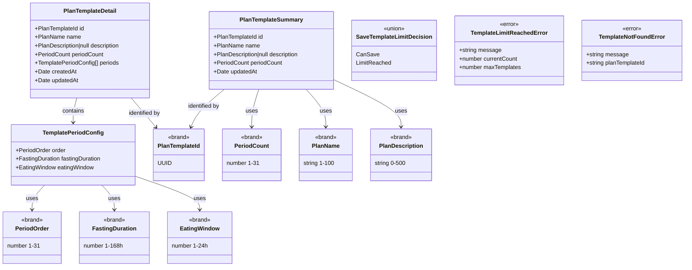

# Functional Domain Design (Web): Plans & Plan Templates

> **Source**: `web/docs/plans-and-templates.md` | **Generated**: 2026-02-12 | **Status**: Implemented

## 1. Executive Summary

Plans & Plan Templates models the structured fasting plan lifecycle in Ketone. Users create fasting plans (from presets or reusable templates) composed of consecutive fasting-eating periods, track progress in real time, and manage a library of up to 20 saved plan templates. The domain enforces exclusivity rules (one active plan/cycle at a time), duration constraints (1-168h fasting, 1-24h eating, 15-minute increments), and template limit caps.

The **Plan Templates** subdomain follows the full FC/IS architecture on the web side. The **Plan** subdomain has a separate FC/IS design document at `web/src/views/plan/domain/functional-domain-design.md` that covers aligning the plan feature to the same architecture.

## 2. Design Principles

This design adheres to the following functional domain modeling principles:

### 2.1 Closed World Assumption

All possible states are explicitly modeled. The compiler enforces completeness.

| Principle               | Implementation                                                  |
| ----------------------- | --------------------------------------------------------------- |
| Exhaustive matching     | All pattern matches use `Match.exhaustive` - no `default` cases |
| No stringly-typed enums | All enums use `S.Literal` union, never `S.String`               |
| Compile-time safety     | Adding a variant causes compile errors at all switch sites      |
| No hidden states        | No `else` branches that hide bugs                               |

### 2.2 Functional Core / Imperative Shell (Web)

Separation of pure business logic from I/O and UI operations. The web adaptation has 4 shell types:

| Layer                    | Responsibility                                               | Characteristics                                                       |
| ------------------------ | ------------------------------------------------------------ | --------------------------------------------------------------------- |
| **Functional Core**      | Business logic, validations, decisions                       | Pure functions, no I/O, deterministic, testable                       |
| **Shell: Gateway**       | HTTP services, API DTO → Domain mapping                      | Effect-based, boundary mappers, domain error mapping                  |
| **Shell: Input**         | User input → Domain types, schema validation                 | Composable validates before actor receives input                      |
| **Shell: Application**   | Three Phases coordination (Collection → Logic → Persistence) | Effect.Service, composes API Client + FC, single entrypoint for actor |
| **Shell: State Machine** | State transitions, invoke application service programs       | XState actor, FC guards, domain-typed context, emissions              |
| **Shell: View Model**    | Domain → UI translation, computed derivations                | Composable exposes FC as computeds, validates input                   |

> **Clock Rule**: Shell code that needs the current time MUST use `DateTime.nowAsDate` from Effect,
> never `new Date()`. `new Date()` is an implicit side effect that breaks testability (cannot be controlled
> with `TestClock`). Core functions receive `now: Date` as a parameter — they never access the clock directly.

**Core functions in this design**:

- `isTemplateLimitReached(currentCount, maxTemplates)` — boolean predicate for template cap
- `decideSaveTemplateLimit(input)` — ADT decision for save/duplicate operations

**Shell operations in this design**:

- Gateway: `listTemplates`, `getTemplate`, `createFromPlan`, `updateTemplate`, `deleteTemplate`, `duplicateTemplate`
- Application Service: `programSaveAsTemplate (Three Phases)`, `programDuplicateTemplate (Three Phases)`, `programListTemplates`, `programGetTemplate`, `programCreateFromPlan`, `programUpdateTemplate`, `programDeleteTemplate`
- Input validations: `validateUpdateTemplateInput`, `validateCreateFromPlanInput`
- Actor orchestrations: `planTemplates.actor` (list/duplicate/delete), `planTemplateEdit.actor` (load/update)
- View Model derivations: `cards` (sorted, formatted), `isLimitReached`, `limitReachedMessage`, `pendingDelete`, `emptyStateVisible`

### 2.3 Validation Layers (Web)

> "Validate at the boundary, trust inside"

The web architecture defines **4 mandatory validation layers**:

| Layer                      | Location                                  | Responsibility                                           | Validates                           |
| -------------------------- | ----------------------------------------- | -------------------------------------------------------- | ----------------------------------- |
| **1. Input Schema**        | `domain/schemas/*.schema.ts`              | Validate user input → domain types, expose errors for UI | INPUT (raw form → branded types)    |
| **2. Domain Validation**   | `domain/services/*-validation.service.ts` | Pure business rules (no I/O)                             | LOGIC (can save? is limit reached?) |
| **3. Application Service** | `services/*-application.service.ts`       | Coordinate FC + API client, domain error handling        | FLOW (returns typed domain errors)  |
| **4. Gateway Output**      | `services/*-api-client.service.ts`        | Validate API response → domain types (decode)            | OUTPUT (DTO → domain, may fail)     |

**Checklist**:

- [x] Input schema validates raw form data before composable sends to actor
- [x] Domain validation service contains pure business rules (testable)
- [x] Application service coordinates API client + FC; actor invokes application service programs
- [x] Gateway boundary mappers decode API DTOs into domain types

### 2.4 Data Seams

Architectural boundaries where data transforms between layers.

| Seam                     | From                         | To                                           | Transformation                                                          |
| ------------------------ | ---------------------------- | -------------------------------------------- | ----------------------------------------------------------------------- |
| API Client → Application | `PlanTemplateResponse` (DTO) | `PlanTemplateSummary` / `PlanTemplateDetail` | `fromTemplateResponse()` / `fromTemplateDetailResponse()` in API client |
| Application → API Client | Domain contract input        | API payload                                  | `toUpdatePayload()` in API client                                       |
| Actor → Application      | Domain events                | Program input                                | Actor passes domain-typed input to `programXxx()`                       |
| Application → API Client | Program calls                | API Client calls                             | Application service yields API client methods in `Effect.gen`           |
| Application → FC         | Domain types                 | Decision ADTs                                | Application service calls `decideSaveTemplateLimit()` for logic         |
| Component → Composable   | Raw form input               | Domain types                                 | `validateUpdateTemplateInput()` schema validation in composable         |
| Composable → Actor       | Domain types                 | Domain events                                | `actorRef.send()` after validation                                      |
| Actor → Composable       | Domain state                 | UI state                                     | Computed derivation via selectors                                       |

## 3. Type Justification

Each type declares its category and justification using the Decision Flowchart:

```
Is it a single primitive with constraints?
→ YES: Brand.refined (dm-create-branded-type)

Is it multiple fields that always go together?
→ YES: S.Class Value Object (dm-create-value-object)

Are all variants the same shape?
→ YES: S.Literal Enum (dm-create-literal-enum)

Do variants have different data?
→ YES: Data.TaggedEnum (dm-create-tagged-enum)

Does it need identity and lifecycle?
→ YES: S.Class Entity (dm-create-entity)
```

| Type                        | Category       | Skill                    | Justification                                                                               |
| --------------------------- | -------------- | ------------------------ | ------------------------------------------------------------------------------------------- |
| `PlanTemplateId`            | Brand (Schema) | `dm-create-branded-type` | Single primitive (string) with UUID constraint via `S.UUID.pipe(S.brand())`                 |
| `FastingDuration`           | Brand          | `dm-create-branded-type` | Single primitive (number) with range 1-168h + 15-min increment constraint                   |
| `EatingWindow`              | Brand          | `dm-create-branded-type` | Single primitive (number) with range 1-24h + 15-min increment constraint                    |
| `PeriodOrder`               | Brand          | `dm-create-branded-type` | Single primitive (number) with integer range 1-31                                           |
| `PeriodCount`               | Brand          | `dm-create-branded-type` | Single primitive (number) with integer range 1-31                                           |
| `PlanName`                  | Brand          | `dm-create-branded-type` | Single primitive (string) with length 1-100                                                 |
| `PlanDescription`           | Brand          | `dm-create-branded-type` | Single primitive (string) with max length 500                                               |
| `TemplatePeriodConfig`      | Value Object   | `dm-create-value-object` | Multiple fields (order, fastingDuration, eatingWindow) always together                      |
| `PlanTemplateSummary`       | Value Object   | `dm-create-value-object` | Multiple fields for list card display (id, name, description, periodCount, updatedAt)       |
| `PlanTemplateDetail`        | Value Object   | `dm-create-value-object` | Full template with child periods for edit screen                                            |
| `SaveTemplateLimitDecision` | Tagged Enum    | `dm-create-tagged-enum`  | Variants have different data: `CanSave {}` vs `LimitReached { currentCount, maxTemplates }` |

**Smart Constructors Required**:

| Type             | Validation  | Smart Constructor                                               |
| ---------------- | ----------- | --------------------------------------------------------------- |
| `PlanTemplateId` | UUID format | `createPlanTemplateId` (Effect) / `makePlanTemplateId` (Option) |

## 4. Domain Components

### 4.1 Entities

No entities in the plan templates web domain. `PlanTemplateDetail` is a Value Object — identity is meaningful only in the API layer (lifecycle managed server-side).

### 4.2 Value Objects

| Value Object           | Fields                                                                                                                                                                              | Validation         | Smart Constructor |
| ---------------------- | ----------------------------------------------------------------------------------------------------------------------------------------------------------------------------------- | ------------------ | ----------------- |
| `TemplatePeriodConfig` | order: `PeriodOrder`, fastingDuration: `FastingDuration`, eatingWindow: `EatingWindow`                                                                                              | All fields branded | No                |
| `PlanTemplateSummary`  | id: `PlanTemplateId`, name: `PlanName`, description: `PlanDescription \| null`, periodCount: `PeriodCount`, updatedAt: `Date`                                                       | Via S.Class        | No                |
| `PlanTemplateDetail`   | id: `PlanTemplateId`, name: `PlanName`, description: `PlanDescription \| null`, periodCount: `PeriodCount`, periods: `TemplatePeriodConfig[]`, createdAt: `Date`, updatedAt: `Date` | Via S.Class        | No                |

### 4.3 Enumerations

#### Literal Enums (same structure for all variants)

| Enum               | Values                                       | Location         | Notes                                                |
| ------------------ | -------------------------------------------- | ---------------- | ---------------------------------------------------- |
| `PlanStatusSchema` | `'InProgress'`, `'Completed'`, `'Cancelled'` | `@ketone/shared` | Part of API wire format, not redefined in web domain |

#### Tagged Enums (different data per variant)

| Enum                        | Variants                  | Notes                               |
| --------------------------- | ------------------------- | ----------------------------------- |
| `SaveTemplateLimitDecision` | `CanSave`, `LimitReached` | Guard for save/duplicate operations |

<details>
<summary>Tagged Enum Details</summary>

**SaveTemplateLimitDecision**:

- `CanSave`: (empty — no additional data needed)
- `LimitReached`: `currentCount: number`, `maxTemplates: number`

</details>

### 4.4 Domain Errors

| Error                       | Fields                              | Trigger                                                 |
| --------------------------- | ----------------------------------- | ------------------------------------------------------- |
| `TemplateLimitReachedError` | message, currentCount, maxTemplates | Saving/duplicating at 20-template cap                   |
| `TemplateNotFoundError`     | message, planTemplateId             | Accessing a deleted or non-existent template (HTTP 404) |
| `TemplateServiceError`      | message                             | Generic gateway/HTTP failure                            |

### 4.5 Contracts (Use-Case Interfaces)

| Contract                 | Input Type                                                | Decision ADT                | Skill                | File                                              |
| ------------------------ | --------------------------------------------------------- | --------------------------- | -------------------- | ------------------------------------------------- |
| `CreateFromPlanInput`    | `S.Struct { planId, currentCount, maxTemplates }`         | `SaveTemplateLimitDecision` | `dm-create-contract` | `domain/contracts/create-from-plan.contract.ts`   |
| `DuplicateTemplateInput` | `S.Struct { planTemplateId, currentCount, maxTemplates }` | `SaveTemplateLimitDecision` | `dm-create-contract` | `domain/contracts/duplicate-template.contract.ts` |
| `UpdateTemplateInput`    | `S.Struct { planTemplateId, name, description, periods }` | None (direct update)        | `dm-create-contract` | `domain/contracts/update-template.contract.ts`    |
| `DeleteTemplateInput`    | `S.Struct { planTemplateId }`                             | None (unconditional)        | `dm-create-contract` | `domain/contracts/delete-template.contract.ts`    |

<details>
<summary>Contract Details</summary>

**CreateFromPlanInput**:

- Input: `{ planId: S.UUID, currentCount: S.Number, maxTemplates: S.Number }`
- Decision: `SaveTemplateLimitDecision`
  - `CanSave`: proceed to create template from plan
  - `LimitReached`: fail with `TemplateLimitReachedError`

**DuplicateTemplateInput**:

- Input: `{ planTemplateId: PlanTemplateId, currentCount: S.Number, maxTemplates: S.Number }`
- Decision: `SaveTemplateLimitDecision`
  - `CanSave`: proceed to duplicate
  - `LimitReached`: fail with `TemplateLimitReachedError`

**UpdateTemplateInput**:

- Input: `{ planTemplateId: PlanTemplateId, name: PlanName, description: PlanDescription | null, periods: TemplatePeriodConfig[] }`
- No decision ADT — input schema validates all fields

**DeleteTemplateInput**:

- Input: `{ planTemplateId: PlanTemplateId }`
- No decision ADT — deletion is unconditional (API handles not-found)

</details>

### 4.6 Services

> Domain services contain ONLY pure business rules (boolean predicates, decision ADTs, calculations).
> Functions that produce user-facing strings (labels, messages, display sorting) belong in Section 4.9 (Presentation Utils), not here.

#### Validation Services (Core — pure business rules)

| Service                         | Methods                                             | Skill                          | Notes                                  |
| ------------------------------- | --------------------------------------------------- | ------------------------------ | -------------------------------------- |
| `PlanTemplateValidationService` | `isTemplateLimitReached`, `decideSaveTemplateLimit` | `dm-create-validation-service` | Pure: boolean predicate + ADT decision |

#### Domain Services (Core — pure logic)

No additional domain services beyond validation. Plan-specific logic (period calculations, cancellation classification) lives in the API-side domain services.

### 4.7 Functional Core Flows (Three Phases)

| Flow               | Collection (Shell)                          | Logic (Core)                                     | Persistence (Shell)                  | Application Service                                |
| ------------------ | ------------------------------------------- | ------------------------------------------------ | ------------------------------------ | -------------------------------------------------- |
| Save as Template   | Gateway: `listTemplates()` → count          | `decideSaveTemplateLimit` → CanSave/LimitReached | Gateway: `createFromPlan(planId)`    | `PlanTemplateApplicationService.saveAsTemplate`    |
| Duplicate Template | From caller: `currentCount`, `maxTemplates` | `decideSaveTemplateLimit` → CanSave/LimitReached | Gateway: `duplicateTemplate(id)`     | `PlanTemplateApplicationService.duplicateTemplate` |
| Create from Plan   | From caller: `currentCount`, `maxTemplates` | `decideSaveTemplateLimit` → CanSave/LimitReached | Gateway: `createFromPlan(planId)`    | `PlanTemplateApplicationService.createFromPlan`    |
| List Templates     | Gateway: `listTemplates()`                  | (pass-through)                                   | —                                    | `PlanTemplateApplicationService.listTemplates`     |
| Get Template       | Gateway: `getTemplate(id)`                  | (pass-through)                                   | —                                    | `PlanTemplateApplicationService.getTemplate`       |
| Update Template    | —                                           | —                                                | Gateway: `updateTemplate(id, input)` | `PlanTemplateApplicationService.updateTemplate`    |
| Delete Template    | —                                           | —                                                | Gateway: `deleteTemplate(id)`        | `PlanTemplateApplicationService.deleteTemplate`    |

> The application service is the **single entrypoint** for all actor operations — even simple reads (list, get). This keeps imports consistent and makes it easy to add business logic later without changing the actor.

### 4.8 Additional Components

#### Boundary Mappers (Gateway)

| Mapper                       | API DTO (from `@ketone/shared`)            | Domain Type                      | Direction    | Notes                                                           |
| ---------------------------- | ------------------------------------------ | -------------------------------- | ------------ | --------------------------------------------------------------- |
| `fromTemplateResponse`       | `PlanTemplateResponse`                     | `PlanTemplateSummary`            | API → Domain | Applies branded types during mapping                            |
| `fromTemplateListResponse`   | `PlanTemplateResponse[]`                   | `PlanTemplateSummary[]`          | API → Domain | Maps array of DTOs                                              |
| `fromPeriodConfigResponse`   | `{ order, fastingDuration, eatingWindow }` | `TemplatePeriodConfig`           | API → Domain | Applies `PeriodOrder`, `FastingDuration`, `EatingWindow` brands |
| `fromTemplateDetailResponse` | `PlanTemplateWithPeriodsResponse`          | `PlanTemplateDetail`             | API → Domain | Full detail with child periods                                  |
| `toUpdatePayload`            | `PlanTemplateDetail` (domain)              | `{ name, description, periods }` | Domain → API | Pure, always succeeds                                           |

#### Input Schemas

| Schema                   | Raw Input                                      | Domain Output                                  | Location                                          | Notes                   |
| ------------------------ | ---------------------------------------------- | ---------------------------------------------- | ------------------------------------------------- | ----------------------- |
| `UpdateTemplateRawInput` | name (string), description (string), periods[] | `UpdateTemplateDomainInput` with branded types | `domain/schemas/update-template-input.schema.ts`  | Composable validates    |
| `CreateFromPlanRawInput` | planId (string)                                | `CreateFromPlanDomainInput` with UUID          | `domain/schemas/create-from-plan-input.schema.ts` | Validates planId format |

### 4.9 Presentation Utils

Formatting and display-ordering functions that produce user-facing strings.
These belong in `utils/`, NOT in domain services or actor emissions.

| Function                                  | Purpose                       | Notes                                                                             |
| ----------------------------------------- | ----------------------------- | --------------------------------------------------------------------------------- |
| `formatPeriodCountLabel(count)`           | "1 period" / "5 periods"      | Singular/plural label                                                             |
| `buildDeleteConfirmationMessage(name)`    | Confirmation dialog text      | Spec copy: "Are you sure you want to delete '[Plan Name]'? This can't be undone." |
| `sortTemplatesByRecency(templates)`       | Sort by most recently updated | Descending `updatedAt` for display ordering                                       |
| `formatLimitReachedMessage(maxTemplates)` | Toast message at template cap | Spec copy: "You have N saved plans -- that's the limit!..."                       |

> **Rule**: If a function produces user-facing strings (not domain values), it belongs in `utils/`.

## 5. Type Diagram



## 6. Architecture Phases

This design follows the **Web Functional Core / Imperative Shell** architecture. All phases are **implemented**.

### Phase 0: Scaffold

| Step | Component        | File                            | Status |
| ---- | ---------------- | ------------------------------- | ------ |
| 0.1  | Domain directory | `domain/`                       | Done   |
| 0.2  | Model file       | `domain/plan-template.model.ts` | Done   |
| 0.3  | Errors file      | `domain/errors.ts`              | Done   |
| 0.4  | Contracts barrel | `domain/contracts/index.ts`     | Done   |
| 0.5  | Services barrel  | `domain/services/index.ts`      | Done   |
| 0.6  | Schemas barrel   | `domain/schemas/index.ts`       | Done   |
| 0.7  | Domain barrel    | `domain/index.ts`               | Done   |

### Phase 1: Functional Core (Pure Logic)

| Step | Component                 | Skill                          | File                                                  | Status |
| ---- | ------------------------- | ------------------------------ | ----------------------------------------------------- | ------ |
| 1.a  | Constants + Branded Types | `dm-create-branded-type`       | `domain/plan-template.model.ts`                       | Done   |
| 1.b  | Value Objects             | `dm-create-value-object`       | `domain/plan-template.model.ts`                       | Done   |
| 1.c  | Tagged Enums              | `dm-create-tagged-enum`        | `domain/plan-template.model.ts`                       | Done   |
| 1.d  | Smart Constructors        | `dm-create-smart-constructors` | `domain/plan-template.model.ts`                       | Done   |
| 1.e  | Domain Errors             | `dm-create-domain-error`       | `domain/errors.ts`                                    | Done   |
| 1.f  | Contracts                 | `dm-create-contract`           | `domain/contracts/*.contract.ts`                      | Done   |
| 1.g  | Validation Services       | `dm-create-validation-service` | `domain/services/plan-template-validation.service.ts` | Done   |

**Shared Types** (reused from `web/src/views/plan/constants.ts`):

| Type                         | Location            | Reason                    |
| ---------------------------- | ------------------- | ------------------------- |
| `MIN_FASTING_DURATION_HOURS` | `plan/constants.ts` | Shared fasting constraint |
| `MAX_FASTING_DURATION_HOURS` | `plan/constants.ts` | Shared fasting constraint |
| `MIN_EATING_WINDOW_HOURS`    | `plan/constants.ts` | Shared eating constraint  |
| `MAX_EATING_WINDOW_HOURS`    | `plan/constants.ts` | Shared eating constraint  |
| `MIN_PERIODS`                | `plan/constants.ts` | Shared period range       |
| `MAX_PERIODS`                | `plan/constants.ts` | Shared period range       |

### Phase 2: Shell — Gateway Service (Repository Equivalent)

| Step | Component        | Skill                       | File                                           | Status |
| ---- | ---------------- | --------------------------- | ---------------------------------------------- | ------ |
| 2.a  | Boundary Mappers | `dm-create-boundary-mapper` | `services/plan-template-api-client.service.ts` | Done   |
| 2.b  | Gateway Service  | `dm-create-gateway-service` | `services/plan-template-api-client.service.ts` | Done   |
| 2.c  | Error Mapping    | (part of gateway)           | `services/plan-template-api-client.service.ts` | Done   |

### Phase 2b: Shell — Application Service (Three Phases Coordinator)

| Step | Component           | File                                            | Status |
| ---- | ------------------- | ----------------------------------------------- | ------ |
| 2b.a | Application Service | `services/plan-template-application.service.ts` | Done   |
| 2b.b | Program Exports     | (same file)                                     | Done   |

### Phase 2c: Presentation Utils

| Step | Component        | File                                | Status |
| ---- | ---------------- | ----------------------------------- | ------ |
| 2c.a | Formatting Utils | `utils/plan-template-formatting.ts` | Done   |

### Phase 3: Shell — Input Validation (API Handler Equivalent)

| Step | Component              | Skill                        | File                                              | Status |
| ---- | ---------------------- | ---------------------------- | ------------------------------------------------- | ------ |
| 3.a  | Update Template Input  | `dm-create-input-schema-web` | `domain/schemas/update-template-input.schema.ts`  | Done   |
| 3.b  | Create From Plan Input | `dm-create-input-schema-web` | `domain/schemas/create-from-plan-input.schema.ts` | Done   |

### Phase 4: State Machine (Actor)

| Step | Component               | Skill                | File                                          | Status |
| ---- | ----------------------- | -------------------- | --------------------------------------------- | ------ |
| 4.a  | Templates List Actor    | `create-actor`       | `actors/planTemplates.actor.ts`               | Done   |
| 4.b  | Template Edit Actor     | `create-actor`       | `actors/planTemplateEdit.actor.ts`            | Done   |
| 4.c  | Templates Emissions     | (see `create-actor`) | `composables/usePlanTemplatesEmissions.ts`    | Done   |
| 4.d  | Template Edit Emissions | (see `create-actor`) | `composables/usePlanTemplateEditEmissions.ts` | Done   |

### Phase 5: Presentation — Composable + Component

| Step | Component                 | Skill                   | File                                 | Status |
| ---- | ------------------------- | ----------------------- | ------------------------------------ | ------ |
| 5.a  | Templates List Composable | `web-create-composable` | `composables/usePlanTemplates.ts`    | Done   |
| 5.b  | Template Edit Composable  | `web-create-composable` | `composables/usePlanTemplateEdit.ts` | Done   |
| 5.c  | Template Edit Form        | (input shell)           | `composables/useTemplateEditForm.ts` | Done   |
| 5.d  | Template Card Component   | `vue-props`             | `components/PlanTemplateCard.vue`    | Done   |
| 5.e  | Template Edit View        | `vue-props`             | `PlanTemplateEditView.vue`           | Done   |

### Files Created

```
web/src/views/planTemplates/
├── domain/
│   ├── plan-template.model.ts              # Constants, Branded Types, VOs, ADTs, Smart Constructors
│   ├── errors.ts                           # Domain Errors (Data.TaggedError)
│   ├── functional-domain-design.md         # This document
│   ├── index.ts                            # Barrel: model + errors + contracts + services + schemas
│   ├── contracts/
│   │   ├── index.ts                        # Barrel
│   │   ├── create-from-plan.contract.ts    # Save plan as template input
│   │   ├── duplicate-template.contract.ts  # Duplicate template input
│   │   ├── update-template.contract.ts     # Update template input
│   │   └── delete-template.contract.ts     # Delete template input
│   ├── services/
│   │   ├── index.ts                        # Barrel
│   │   └── plan-template-validation.service.ts  # FC: isTemplateLimitReached, decideSaveTemplateLimit
│   └── schemas/
│       ├── index.ts                        # Barrel
│       ├── update-template-input.schema.ts # Form → domain types (name, description, periods)
│       └── create-from-plan-input.schema.ts # planId UUID validation
├── services/
│   ├── plan-template-api-client.service.ts      # Gateway: HTTP + boundary mappers (Phase 2)
│   └── plan-template-application.service.ts     # Application Service: Three Phases (Phase 2b)
├── utils/
│   └── plan-template-formatting.ts         # Presentation text + display sorting (Phase 2c)
├── actors/
│   ├── planTemplates.actor.ts              # List/duplicate/delete state machine (Phase 4)
│   └── planTemplateEdit.actor.ts           # Load/update single template (Phase 4)
├── composables/
│   ├── usePlanTemplates.ts                 # List View Model (Phase 5)
│   ├── usePlanTemplateEdit.ts              # Edit View Model (Phase 5)
│   ├── useTemplateEditForm.ts              # Input validation form (Phase 5)
│   ├── usePlanTemplatesEmissions.ts        # List emission handler (Phase 4)
│   └── usePlanTemplateEditEmissions.ts     # Edit emission handler (Phase 4)
├── components/
│   └── PlanTemplateCard.vue                # Template card for list (Phase 5)
└── PlanTemplateEditView.vue                # Edit template view (Phase 5)
```

## 7. Closed World Checklist

- [x] All enums use `S.Literal` union (not `S.String`) — `PlanStatusSchema` in shared
- [x] All pattern matches use `Match.exhaustive` — error handlers in gateway/actor
- [x] No `default` or `else` cases that hide bugs — `$match` for `SaveTemplateLimitDecision`
- [x] Adding a variant causes compile errors at all switch sites
- [x] No optional fields that depend on other fields — description is nullable, not conditional
- [x] No boolean discriminators with optional fields

## 8. FC/IS Implementation Checklist

**Phase 1 — Functional Core:**

- [x] **Constants** live in model file alongside their branded types (`MAX_PLAN_TEMPLATES`, `MIN_PLAN_NAME_LENGTH`, etc.)
- [x] **Branded types** reference named constants in predicates and error messages
- [x] **Contracts** exist for each use case with input types
- [x] **Contract inputs** use `S.Struct` with branded types (not `interface`)
- [x] **Domain services** include `FUNCTIONAL CORE` documentation header with Three Phases context
- [x] **Domain services** export pure functions both as standalone AND inside Effect.Service wrapper
- [x] **Domain service preconditions** use pure boolean predicates (`isTemplateLimitReached`) and TaggedEnum ADTs (`decideSaveTemplateLimit`)
- [x] **Validation services** are separate from domain services (single responsibility)

**Phase 2 — Gateway Service:**

- [x] **Boundary mappers** decode API DTOs into domain types (`fromTemplateResponse`, `fromTemplateDetailResponse`)
- [x] **Boundary mappers** encode domain types to API payloads (`toUpdatePayload`)
- [x] **DTOs never leak** past the gateway service boundary
- [x] **Gateway methods** return domain types, never raw API response types
- [x] **HTTP errors** are mapped to domain-tagged errors (`TemplateLimitReachedError`, `TemplateNotFoundError`)
- [x] **Program exports** provide the service layer for application service consumption

**Phase 2b — Application Service:**

- [x] **Application service** imports API Client + FC validation service
- [x] **Each method** documents its Three Phases (even if Logic phase is empty for pass-through reads)
- [x] **Application service** is the single entrypoint for all actor operations (even simple reads)
- [x] **Simple reads** pass through to gateway (keeps imports consistent)
- [x] **Mutations** apply FC validation/decisions between Collection and Persistence
- [x] **Program exports** provide the full layer stack for `runWithUi`

**Phase 2c — Presentation Utils:**

- [x] **All functions** produce user-facing strings (labels, messages, display sorting)
- [x] **No domain logic** in utils
- [x] **Functions are pure** — no I/O, no state, no side effects
- [x] **Referenced** by composable for presentation text computeds

**Phase 3 — Input Validation:**

- [x] **Input schemas** validate raw form data → domain types
- [x] **Schema references** named constants (no magic numbers)
- [x] **extractSchemaErrors** produces `Record<string, string[]>` for UI
- [x] **Composable** executes validation, not the actor

**Phase 4 — State Machine:**

- [x] **Guards** delegate to FC domain service pure functions (`canDuplicate` uses `MAX_PLAN_TEMPLATES`)
- [x] **Context** uses domain types (`PlanTemplateSummary`, `PlanTemplateDetail`, `PlanTemplateId`)
- [x] **Events** carry domain-typed payloads (validated before send)
- [x] **fromCallback** actors call application service `programXxx()` (single entrypoint)
- [x] **Emissions** carry domain-typed payloads but NO user-facing text

**Phase 5 — Composable + Component:**

- [x] **Composable** exposes FC services as computeds (`isLimitReached`, `cards`)
- [x] **Composable** validates input with Schema before sending to actor
- [x] **Composable** uses formatting utils from `utils/plan-template-formatting.ts`
- [x] **Component** never contains business logic
- [x] **Component** emits only validated domain input

## 9. Component Behavior Boundary

| Rule / Behavior                      | Where                                                                            | Why                                    |
| ------------------------------------ | -------------------------------------------------------------------------------- | -------------------------------------- |
| Can user save/duplicate template?    | FC: `isTemplateLimitReached()` → composable `isLimitReached` computed            | Business rule (20-template cap)        |
| Template limit decision              | FC: `decideSaveTemplateLimit()` → application service                            | 2-variant ADT for save/duplicate guard |
| Period count label (singular/plural) | Utils: `formatPeriodCountLabel()` → composable `cards` computed                  | Presentation text                      |
| Delete confirmation message          | Utils: `buildDeleteConfirmationMessage()` → composable `pendingDelete` computed  | Presentation text                      |
| Template sort order                  | Utils: `sortTemplatesByRecency()` → composable `cards` computed                  | Display ordering                       |
| Limit reached toast text             | Utils: `formatLimitReachedMessage()` → composable `limitReachedMessage` computed | Presentation text                      |
| Empty state visibility               | Composable: `emptyStateVisible` computed                                         | UI derivation from actor state         |
| Save Timeline button disabled        | Component: `:disabled="!hasTimelineChanges \|\| !isValid"`                       | UI mechanics from composable booleans  |
| Loading spinner                      | Actor state → composable `loading` selector                                      | Async state from actor                 |

## 10. Type Sharing Strategy

| What                                                                                  | Where                                         | Reason                                        |
| ------------------------------------------------------------------------------------- | --------------------------------------------- | --------------------------------------------- |
| Wire format schemas (`PlanTemplateResponseSchema`, `PlanTemplatesListResponseSchema`) | `@ketone/shared`                              | Define JSON shape for API ↔ web              |
| Wire format schemas (`PlanResponseSchema`, `PlanWithPeriodsResponseSchema`)           | `@ketone/shared`                              | Plan API response contract                    |
| Status enum in wire format (`PlanStatusSchema`)                                       | `@ketone/shared`                              | Part of API response contract                 |
| Plan constraints (`MIN_FASTING_DURATION_HOURS`, etc.)                                 | `web/src/views/plan/constants.ts`             | Shared between plan and planTemplate features |
| Template-specific constants (`MAX_PLAN_TEMPLATES`, `MAX_PLAN_NAME_LENGTH`)            | `planTemplates/domain/plan-template.model.ts` | Feature-specific limits                       |
| Branded types (`FastingDuration`, `PlanTemplateId`)                                   | `planTemplates/domain/plan-template.model.ts` | Compile-time construct, doesn't cross wire    |
| Value objects (`PlanTemplateSummary`, `PlanTemplateDetail`)                           | `planTemplates/domain/plan-template.model.ts` | Web-specific shapes                           |
| Contracts, validation services                                                        | `planTemplates/domain/`                       | Feature-specific logic                        |

**Orphan Test**: If `@ketone/shared` is deleted, both sides can redefine wire schemas. If `planTemplates/domain/` is deleted, only the template feature breaks. Plan constraints in `plan/constants.ts` would survive independently.

## 11. Warning Signs Detected

- [x] **Plan feature FC/IS design created** — A separate design document at `web/src/views/plan/domain/functional-domain-design.md` covers aligning the plan feature to full FC/IS. Key issues addressed: raw DTOs in actor context, missing gateway/application service, `Match.orElse` in error handlers, business logic in views, `new Date()` clock rule violations, missing input validation.
- [x] **`Match.orElse` used in plan actor error handler** — `handlePlanError()` in `plan.actor.ts` uses `Match.orElse` as a catch-all for unknown error types. The plan FC/IS design replaces this with `Match.exhaustive` using typed domain error unions.
- [x] **Plan service returns raw DTOs** — `plan.service.ts` returns `@ketone/shared` schema types directly (no boundary mapper layer). The plan FC/IS design splits this into gateway (boundary mappers) + application service.

## 12. Open Questions

None — all planTemplates features are implemented and reviewed.

## 13. Next Steps

All planTemplates phases are **implemented**. This document serves as living architectural documentation.

1. **Maintain** this document when domain rules change
2. **Reference** during code reviews to verify FC/IS compliance
3. **Implement** the plan feature FC/IS design at `web/src/views/plan/domain/functional-domain-design.md`
4. **Update** when new use cases are added (e.g., template sharing, template categories)

---

<details>
<summary>Analysis YAML (reference)</summary>

```yaml
domain_analysis:
  feature: Plans & Plan Templates
  context: Web FC/IS architecture for template management

  branded_types:
    - name: PlanTemplateId
      base: string (UUID)
      constraint: UUID format via S.UUID.pipe(S.brand())
      file: domain/plan-template.model.ts

    - name: FastingDuration
      base: number
      constraint: 1-168h, 15-min increments (n*4 is integer)
      constants: [MIN_FASTING_DURATION_HOURS, MAX_FASTING_DURATION_HOURS]
      file: domain/plan-template.model.ts

    - name: EatingWindow
      base: number
      constraint: 1-24h, 15-min increments (n*4 is integer)
      constants: [MIN_EATING_WINDOW_HOURS, MAX_EATING_WINDOW_HOURS]
      file: domain/plan-template.model.ts

    - name: PeriodOrder
      base: number
      constraint: integer 1-31
      constants: [MIN_PERIODS, MAX_PERIODS]
      file: domain/plan-template.model.ts

    - name: PeriodCount
      base: number
      constraint: integer 1-31
      constants: [MIN_PERIODS, MAX_PERIODS]
      file: domain/plan-template.model.ts

    - name: PlanName
      base: string
      constraint: 1-100 characters
      constants: [MIN_PLAN_NAME_LENGTH, MAX_PLAN_NAME_LENGTH]
      file: domain/plan-template.model.ts

    - name: PlanDescription
      base: string
      constraint: 0-500 characters
      constants: [MAX_PLAN_DESCRIPTION_LENGTH]
      file: domain/plan-template.model.ts

  value_objects:
    - name: TemplatePeriodConfig
      fields: [order (PeriodOrder), fastingDuration (FastingDuration), eatingWindow (EatingWindow)]
      file: domain/plan-template.model.ts

    - name: PlanTemplateSummary
      fields: [id, name, description, periodCount, updatedAt]
      purpose: List page card display
      file: domain/plan-template.model.ts

    - name: PlanTemplateDetail
      fields: [id, name, description, periodCount, periods[], createdAt, updatedAt]
      purpose: Edit page full representation
      file: domain/plan-template.model.ts

  tagged_enums:
    - name: SaveTemplateLimitDecision
      variants:
        - CanSave: {}
        - LimitReached: { currentCount, maxTemplates }
      purpose: Guard for save/duplicate operations
      file: domain/plan-template.model.ts

  domain_errors:
    - name: TemplateLimitReachedError
      trigger: Save/duplicate at 20-template cap
      fields: [message, currentCount, maxTemplates]

    - name: TemplateNotFoundError
      trigger: Access deleted template (HTTP 404)
      fields: [message, planTemplateId]

    - name: TemplateServiceError
      trigger: Generic gateway/HTTP failure
      fields: [message]

  contracts:
    - name: CreateFromPlanInput
      use_case: Save plan as template
      decision: SaveTemplateLimitDecision

    - name: DuplicateTemplateInput
      use_case: Duplicate template
      decision: SaveTemplateLimitDecision

    - name: UpdateTemplateInput
      use_case: Update template name/description/periods
      decision: none

    - name: DeleteTemplateInput
      use_case: Delete template
      decision: none

  validation_services:
    - name: PlanTemplateValidationService
      methods:
        - isTemplateLimitReached: boolean predicate
        - decideSaveTemplateLimit: ADT decision

  boundary_mappers:
    - fromTemplateResponse: PlanTemplateResponse → PlanTemplateSummary
    - fromTemplateDetailResponse: PlanTemplateWithPeriodsResponse → PlanTemplateDetail
    - fromPeriodConfigResponse: DTO → TemplatePeriodConfig
    - toUpdatePayload: Domain → API patch payload

  presentation_utils:
    - formatPeriodCountLabel: period count → "N period(s)"
    - buildDeleteConfirmationMessage: name → confirmation text
    - sortTemplatesByRecency: templates → sorted by updatedAt desc
    - formatLimitReachedMessage: max → toast text

  shared_types:
    from_shared_package:
      - PlanTemplateResponseSchema
      - PlanTemplateWithPeriodsResponseSchema
      - PlanTemplatesListResponseSchema
      - PlanStatusSchema
    from_plan_constants:
      - MIN_FASTING_DURATION_HOURS
      - MAX_FASTING_DURATION_HOURS
      - MIN_EATING_WINDOW_HOURS
      - MAX_EATING_WINDOW_HOURS
      - MIN_PERIODS
      - MAX_PERIODS

  warning_signs:
    - plan_feature_no_web_domain_modeling: true
    - plan_actor_uses_match_orElse: true
    - plan_service_returns_raw_dtos: true
```

</details>

<details>
<summary>Plan YAML (reference)</summary>

```yaml
implementation_plan:
  status: fully_implemented
  feature: planTemplates

  phases:
    phase_0_scaffold:
      status: done
      files:
        - domain/
        - domain/plan-template.model.ts
        - domain/errors.ts
        - domain/contracts/index.ts
        - domain/services/index.ts
        - domain/schemas/index.ts
        - domain/index.ts

    phase_1_core:
      status: done
      steps:
        - skill: dm-create-branded-type
          file: domain/plan-template.model.ts
          types: [PlanTemplateId, FastingDuration, EatingWindow, PeriodOrder, PeriodCount, PlanName, PlanDescription]

        - skill: dm-create-value-object
          file: domain/plan-template.model.ts
          types: [TemplatePeriodConfig, PlanTemplateSummary, PlanTemplateDetail]

        - skill: dm-create-tagged-enum
          file: domain/plan-template.model.ts
          types: [SaveTemplateLimitDecision]

        - skill: dm-create-smart-constructors
          file: domain/plan-template.model.ts
          types: [PlanTemplateId]

        - skill: dm-create-domain-error
          file: domain/errors.ts
          types: [TemplateLimitReachedError, TemplateNotFoundError, TemplateServiceError]

        - skill: dm-create-contract
          files:
            - domain/contracts/create-from-plan.contract.ts
            - domain/contracts/duplicate-template.contract.ts
            - domain/contracts/update-template.contract.ts
            - domain/contracts/delete-template.contract.ts

        - skill: dm-create-validation-service
          file: domain/services/plan-template-validation.service.ts

    phase_2_gateway:
      status: done
      file: services/plan-template-api-client.service.ts
      boundary_mappers:
        - fromTemplateResponse
        - fromTemplateListResponse
        - fromPeriodConfigResponse
        - fromTemplateDetailResponse
        - toUpdatePayload

    phase_2b_application:
      status: done
      file: services/plan-template-application.service.ts
      programs:
        - programSaveAsTemplate
        - programListTemplates
        - programGetTemplate
        - programCreateFromPlan
        - programDuplicateTemplate
        - programUpdateTemplate
        - programDeleteTemplate

    phase_2c_utils:
      status: done
      file: utils/plan-template-formatting.ts
      functions:
        - formatPeriodCountLabel
        - buildDeleteConfirmationMessage
        - sortTemplatesByRecency
        - formatLimitReachedMessage

    phase_3_input:
      status: done
      files:
        - domain/schemas/update-template-input.schema.ts
        - domain/schemas/create-from-plan-input.schema.ts

    phase_4_actor:
      status: done
      files:
        - actors/planTemplates.actor.ts
        - actors/planTemplateEdit.actor.ts
        - composables/usePlanTemplatesEmissions.ts
        - composables/usePlanTemplateEditEmissions.ts

    phase_5_composable:
      status: done
      files:
        - composables/usePlanTemplates.ts
        - composables/usePlanTemplateEdit.ts
        - composables/useTemplateEditForm.ts
        - components/PlanTemplateCard.vue
        - PlanTemplateEditView.vue

  summary:
    total_skills_used: 9
    total_files: 23
    all_phases_complete: true
```

</details>
